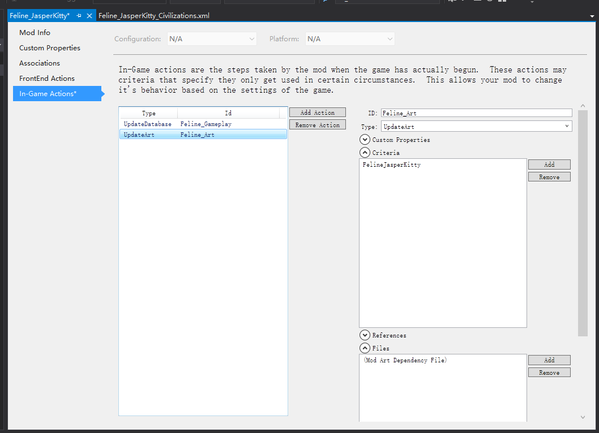
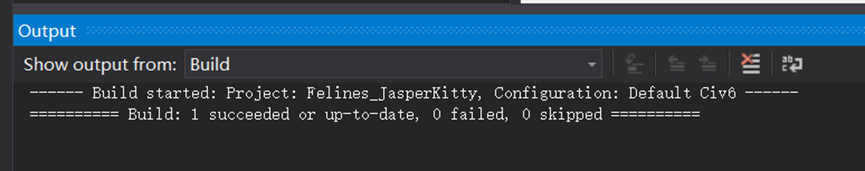

# 小优妮的文明6模组笔记

## 02 建立新领袖

所有新人的旅途都从启动开发工具包（ SDK 开始）。当你成功配置完毕所有软件后，正式启程的第一步在于启动 ModBuddy 。

>**笔记笔记**：什么是 ModBuddy ？
>
>文明6使用的 ModBuddy 是 Firaxis Games（网络用语中通称F社）基于 Visual Studio 2013 Isolated Shell 开发的模组制作工具，因此当你第一次启动 ModBuddy 时，你需要按照屏幕上出现的安装程序安装后者。它提供了一定程度的开发辅助功能（语法高亮、解决方案管理等），以及将美术素材打包为游戏使用的二进制包（ BLP 格式）的功能。你可以使用其它文本编辑器制作你的模组，但推荐你使用它的素材编辑器等功能简化作品制作。


你接下来会看到的就是它的界面，如下所示。绝大多数的文明6模组都会使用这个工具进行汇总性质的工作。尽管有些人认为给这个界面装个汉化包好像比较好，但是英文版通常问题少一些。别担心，它不会很难理解。


要开始制作一个新 mod ，点击 `New Mod...` 开始。此时你会看到下图所示的画面。


你看到的情况可能会有所不同，有些人不会看到所有的 Starter 模板，而 Advanced Starter 则是笔者自己编写的模板。不用单行，这些官方的模板早已过旧，因此如今我们最好使用空mod模板开始制作。考虑到我们的受众（以及我们自己）几乎都会安装风云变幻资料片，我们在本案例中将创建一个在风云变幻规则集下才能运行的模组。有关规则集兼容性的具体知识，我们将在以后另行叙述。

选择 “空模组（风云变幻）” （Empty Mod (Gathering Storm)） ，然后在这个界面填写你的mod的工程名称。请注意在将来更改它可能会比较麻烦，所以如果可以的话不如现在就行动。

>**最佳实践**：工程名称
>
>一个好的工程名称一般简洁易认。一个好的做法是使用“文明_领袖”，例如 `Landsol_Yuni`, `Mondstadt_Klee`, 或者`Feline_JasperKitty`。你也可以使用开发代号，这会让你看起来很酷，不是吗😀
>
>不要使用下划线以外的符号，不要使用空格（以免一些程序错误解读），尤其不要使用汉语或者其他语言（这些符号不在ASCII字符集中，比前面说的几个情况更加容易引发问题）。如果你打算做其他类型的作品，也可参照执行，用几个词语简单概括模组的主要内容。

点击“确定”（OK）后，这一界面中填写的是你的模组的基本信息。在制作的早期，无需担心这个问题，因为我们将来才需要专门再改动它。现在点击“完成”（Finish）。


接下来的界面便是你新创建的工程了。


一个空工程仅仅包括一个美术引用规则文件（ Mod.art.xml ）。在接下来的流程中，我们将以最快的速度编写一个能进入游戏的空领袖。
在左侧栏可以看到解决方案浏览器（ Solution Explorer ），右键点击它可以看到一系列有用的选项，在这里，我们选择“添加-新文件”（ Add-New Item... ）新建一个新项目。界面如下：


游戏性改动的主心骨便是这些文件： SQL 数据库指令、  XML 数据库指令、Lua 脚本。最后一项是文本文件，它则没有什么用处。对新手而言，以这种方式新建的文件基本上都是 XML 文件，就像我们这次要选择的一样。在将来，也许你会使用其他类型的文件。

>**笔记笔记**：文件类型及其作用
>
>数据库指令和脚本是文明6mod中进行游戏性改动的主要文件类型。这两者是不可以相互替代的。不过，数据库指令文件则分为SQL和XML两种，后者撰写更方便，但前者支持更多功能。对文明6游戏而言，SQL指令是XML指令的超集——这意味着，XML能做的事情，SQL全部都能做，反过来则未必是这样。新手学习XML即可，但如果你有相关经验，直接上手SQL也无妨。

>**注意脚下**：文件编码（仅限SQL和Lua）
>
>ModBuddy 经常生成把中文变成乱码的SQL和Lua文件。这是由于 ModBuddy 在简体中文系统中默认对这些文件使用 GB2312 编码，但游戏本身需要的是 UTF-8 编码。使用其他文本编辑器来创建正确编码的 .sql 和 .lua 文件再通过新建已有文件功能加入到 ModBuddy 有时是更好的选择，但你也可以使用其他编辑器来重新设置编码为 UTF-8 。下图中展示了如何在 Visual Studio Code 中修改文件的编码。文明6不支持带有 BOM 的 UTF-8 。不要选错哦。
>
>

下面让我们开始填充这个空模组。本教程中我们要制作一个猫咪贾斯伯的的猫猫文明。

>**小道消息**：为什么是贾斯伯猫（Jasper Kitty）？
>
>Jasper Kitty 是 Firaxis 官方给我们准备的模板中写入的领袖。它在官方文件中是这个样子：
>
>
>
>真是只丑猫啊！它也完全不符合领袖肖像的一般规则，因此我们在后面的过程中会换个更加可爱的。

制作的第一步，我们将新建几个XML文件，分别用来放置不同的游戏信息。为了避免查错时一片混乱，非常建议作者在制作的过程中学习官方是如何摆放数据的。我们现在立即要新建的几个文件是这些：
- `Feline_JasperKitty_Config.xml`  —— 定义如何在选择领袖界面显示这个领袖
- `Feline_JasperKitty_Leaders.xml`  —— 定义领袖本身的信息
- `Feline_JasperKitty_Civilizations.xml`  —— 定义领袖所属的文明的信息

>**最佳实践**：摆放新建的文件
>
>你可以在工程下新建一个Data文件夹来摆放这些影响游戏性的文件，并再新建一个Text文件夹摆放将来用于存放文本翻译的文件。在Solution Explorer中右键选择新建-文件夹（Add-Folder），然后把这些对应的文件使用剪切和粘贴移动进去。

>**最佳实践**：文件命名
>
>非常建议你的文件名以你的工程名称为前缀。这样将来如果出错，很容易定位到问题所在。不过，如果名字太长了，倒也不一定就必须这么做。

按照上面的内容设置完成后，你的Solution Explorer看起来会像这样。


 
我们打开其中一个 XML 文件。现在这个文件内还没有实际进入游戏数据库的内容。我们逐行来看：

```xml
<?xml version="1.0" encoding="utf-8"?>
```
第一行表示这是一个XML文件，以及其使用的编码。它是每个 XML 文件的开头，在任何时候都不要动这一行。

```xml
<!-- Feline_JasperKitty_Civilizations -->
<!-- Author: Admin -->
<!-- DateCreated: 6/19/2022 11:01:36 PM -->
```

被标记为绿色的行是注释（comment）。游戏在运行时会自动跳过这些行，但合适的注释有助于你自己和其他人理解你写的东西。注释结构是\<!--  注释内容  -->。只要文字在注释起止点之间，ModBuddy就会给它上绿色，表示这是注释。你可以安全地删掉注释而不影响游戏运行，但如果将来的你看不懂自己写的东西，那你也许就要怪自己当初没写好注释了。

对绝大部分 XML 指令而言，所有你要编写的内容都处于`GameData`范围内。尖括号标记（`<GameData>`）表示这个范围的开始，带有斜杠的标记（`</GameData>`）表示它的结束。也就是说，接下来所有的内容都要填写在`<GameData>`和`</GameData>`两行之间。否则，游戏将无法认出你所写的内容。

让我们从 `Config` 文件开始。你可以在 `Feline_JasperKitty_Config.xml` （接下来在其他地方，我们将会使用简称，称作 `Config.xml` 。） 中写入以下内容：

```xml
	<Players>  
	    <Row>  
	        <Domain>Players:Expansion2_Players</Domain>  
	        <CivilizationType>CIVILIZATION_FELINE</CivilizationType>  
	        <LeaderType>LEADER_JASPER_KITTY</LeaderType>  
	        <CivilizationName>LOC_CIVILIZATION_FELINE_NAME</CivilizationName>  
	        <CivilizationIcon>ICON_CIVILIZATION_FELINE</CivilizationIcon>  
	        <LeaderName>LOC_LEADER_JASPER_KITTY_NAME</LeaderName>  
	        <LeaderIcon>ICON_LEADER_JASPER_KITTY</LeaderIcon>  
	        <CivilizationAbilityName>LOC_TRAIT_CIVILIZATION_FELINE_NAME</CivilizationAbilityName>  
	        <CivilizationAbilityDescription>LOC_TRAIT_CIVILIZATION_FELINE_DESCRIPTION</CivilizationAbilityDescription>  
            <CivilizationAbilityIcon>ICON_CIVILIZATION_FELINE</CivilizationAbilityIcon>  
	        <LeaderAbilityName>LOC_TRAIT_LEADER_JASPER_KITTY_NAME</LeaderAbilityName>  
	        <LeaderAbilityDescription>LOC_TRAIT_LEADER_JASPER_KITTY_DESCRIPTION</LeaderAbilityDescription>  
	        <LeaderAbilityIcon>ICON_LEADER_JASPER_KITTY</LeaderAbilityIcon>  
	        <Portrait>LEADER_JASPER_KITTY_NEUTRAL</Portrait>  
	    </Row>  
	</Players> 
``` 

一整段内容被包含在了<Players>和</Players>之间，这意味着这段内容将会被填入游戏数据库的Players数据表。<Row>和</Row>之间的数据表示这是一条新的记录（表中的行），记载了在领袖选择界面所需要显示的新领袖的有关信息。别忘了，这些内容都要填在GameData里。下面我们逐行看下这些内容都代表什么意思。

>**笔记笔记**：标签嵌套
>
>在一个标签内可以嵌套一个标签（表示这个被嵌套在内的标签是嵌套它的数据标签的一部分）。在上面的例子中，标签是这样嵌套的：<Players><Row></Row></Players>，Row数据的头尾都包含在Players数据内，也就使得新的一行被加入到Players数据表之中。像下面这样的交叉嵌套则无法看出它们之间的关系，因而也是不允许出现的：<Players><Row></Players></Row>。非常推荐在自行尝试编写mod之前了解数据库系统的基础知识，如你所见，其实外行也可以做到！


>**最佳实践**：趁手的文本编辑器
>
>正所谓工欲善其事，必先利其器。一款好的文本编辑器有助于你编写这些数据，也方便你查阅各种游戏内资料。一些优秀的适合程序员（是的，制作mod和编程有许多共同之处，需要的工具也非常相似）的文本编辑器的例子有：Visual Studio Code、Sublime Text、Notepad3，等等。尽管记事本可以临时顶替，但它非常不适合。千万不要使用富文本字处理程序（Word、WPS文字）！
 
```xml
	<Players>
		<Row>
			<Domain>Players:Expansion2_Players</Domain>
```

Domain字段（“字段”也就是数据表的列）用来表示这个领袖所允许的规则集。官方游戏模式下，规则集共有三种：原版游戏、迭起兴衰、风云变幻。目前，绝大多数玩家会在风云变幻规则集下进行游戏，这也是我们一开始就建立了一个只能在风云变幻规则集下运行的模组的原因之一。

>**笔记笔记**：资料片的别名
>
>迭起兴衰（Rise & Fall）是游戏的第一个资料片，因此有时被称作Expansion1，缩写XP1。对应的，风云变幻（Gathering Storm）是第二个，因此被叫做Expansion2或者XP2。新纪元季票（New Frontier Pass）在部分游戏文件中被称作XP3，但是并不正式被认为是资料片。

```xml
			<CivilizationType>CIVILIZATION_FELINE</CivilizationType>
```

CivilizationType字段表示的是你正在加入游戏的这个领袖的所属文明的内部变量名。游戏引擎不会接触到你编写的文明的显示名称，而是与这样的内部名称打交道。因此，需要注意内部名称不可以和其他任何作品重复。现在你还尚未真正开始编写这个文明，稍后你就可以亲手试一试。

>**最佳实践**：避免重复的方式
>
>一个很好的避免变量名重复的方式是在取名时署上作者的名字。例如：CIVILIZATION_FELINE_SHIMAMURA。本教程中为了方便起见，暂时不做如此处理。

>**注意脚下**：命名规则
>
>强烈建议在取名时遵守所有同类对象的命名传统。例如，文明的名字总是以CIVILIZATION_开头，使用下划线做分割，并且全部使用大写。在一些场合，不遵守命名惯例会导致问题。（排版人举例：比如资源图标命名不规范会导致UImod无法读取你设置的图标）


```xml
			<LeaderType>LEADER_JASPER_KITTY</LeaderType>
```

和CivilizationType类似，LeaderType字段表示的则是领袖的内部变量名。

```xml
			<CivilizationName>LOC_CIVILIZATION_FELINE_NAME</CivilizationName>
```

CivilizationName字段记载的是CIVILIZATION_FELINE这个文明的*显示*名称。你可能会稍微觉得有些奇怪，因为应该没有在游戏中见到过这串字符。确实如此——游戏在设置成不同的语言的时候，会利用这个内部变量作为线索找到正确的文本。将来将会介绍如何给这个变量准备玩家能看到的文本。


>**笔记笔记**：本地化变量
>
>用来显示正确的文本的本地化变量通常以LOC_开头。诸如某个文明的名称或者描述这样的本地化变量的命名规范通常都有容易理解的格式（例如LOC_CIVILIZATION_FELINE_NAME就是LOC_ 加上 文明的内部变量名 加上 _NAME （名称））。

```xml
			<CivilizationIcon>ICON_CIVILIZATION_FELINE</CivilizationIcon>
```

CivilizationIcon字段为该文明设置一个选择领袖界面下显示的图标。游戏内的图标遵循另一种显示方式。目前我们还没有导入图标——那将会在我们确认游戏正常加载后才会进行。

```xml
			<LeaderName>LOC_LEADER_JASPER_KITTY_NAME</LeaderName>
			<LeaderIcon>ICON_LEADER_JASPER_KITTY</LeaderIcon>
```

和CivilizationName以及CivilizationIcon字段一样，这两个字段设置的是领袖的名称和图标。

```xml
			<CivilizationAbilityName>LOC_TRAIT_CIVILIZATION_FELINE_NAME</CivilizationAbilityName>
			<CivilizationAbilityDescription>LOC_TRAIT_CIVILIZATION_FELINE_DESCRIPTION</CivilizationAbilityDescription>
			<CivilizationAbilityIcon>ICON_CIVILIZATION_FELINE</CivilizationAbilityIcon>
```

以上三个字段配置文明特性的名称、描述和图标。

```xml
			<LeaderAbilityName>LOC_TRAIT_LEADER_JASPER_KITTY_NAME</LeaderAbilityName>
			<LeaderAbilityDescription>LOC_TRAIT_LEADER_JASPER_KITTY_DESCRIPTION</LeaderAbilityDescription>
			<LeaderAbilityIcon>ICON_LEADER_JASPER_KITTY</LeaderAbilityIcon>
```

以上三个字段配置领袖特性的名称、描述和图标。


>**笔记笔记**：文明特性和领袖特性
>
>如你所见，在领袖选择页面，只能容许放置一条文明特性和一条领袖特性。通常，你的领袖也只会包含各一条特性。有关设计领袖方面建议考虑的问题，将在将来详述。


```xml
			<Portrait>LEADER_JASPER_KITTY_NEUTRAL</Portrait>
```

Portrait字段配置领袖在选择界面的肖像。将来我们再设置它。领袖肖像是左对齐的，图像最左一列像素将会出现在肖像窗格的最左边。

```xml
		</Row>
	</Players>
```

填写以上内容之后，我们就暂时完成了`Config.xml`文件的配置。将来我们将会填补更多信息（比如领袖背景），不过目前这些就足够了。完成之后，我们继续另外两个文件的编写。
 

Leaders.xml的编写和Config.xml很相似，目前我们立即要做的也更简单。

```xml
	<Types>  
	    <Row Type="LEADER_JASPER_KITTY" Kind="KIND_LEADER" />  
	</Types>  
	  
	<Leaders>  
	    <Row>  
	        <LeaderType>LEADER_JASPER_KITTY</LeaderType>  
	        <Name>LOC_LEADER_JASPER_KITTY_NAME</Name>  
	        <InheritFrom>LEADER_DEFAULT</InheritFrom>  
	    </Row>  
	</Leaders>  
```

```xml
	<Types>
		<Row Type="LEADER_JASPER_KITTY" Kind="KIND_LEADER" />
	</Types>
```

Types表中记录的是一系列游戏中使用的对象。诸如文明、领袖、特性、建筑……许许多多类别的对象都必须在Types表中进行声明，然后才可被使用。

```xml
	<Leaders>
		<Row>
			<LeaderType>LEADER_JASPER_KITTY</LeaderType>
			<Name>LOC_LEADER_JASPER_KITTY_NAME</Name>
			<InheritFrom>LEADER_DEFAULT</InheritFrom>
		</Row>
	</Leaders>
```

Leaders表中记载的则是关于这个领袖的信息。LeaderType是领袖的内部变量名（你必须在Types表中先声明它是一个领袖），Name决定了它在游戏界面中被显示的名字（别忘了本地化变量），InheritFrom则是领袖信息的特殊内容，表示“其他未定事项遵从”LEADER_DEFAULT。通常你的领袖不应该改动这一行。
 

建立完领袖，下一步是文明。

```xml
	<Types>  
	    <Row Type="CIVILIZATION_FELINE" Kind="KIND_CIVILIZATION" />  
	</Types>  
	  
	<Civilizations>  
	    <Row>  
	        <CivilizationType>CIVILIZATION_FELINE</CivilizationType>  
	        <Name>LOC_CIVILIZATION_FELINE_NAME</Name>  
	        <Description>LOC_CIVILIZATION_FELINE_DESCRIPTION</Description>  
	        <Adjective>LOC_CIVILIZATION_FELINE_ADJECTIVE</Adjective>  
	        <StartingCivilizationLevelType>CIVILIZATION_LEVEL_FULL_CIV</StartingCivilizationLevelType>  
	    </Row>  
	</Civilizations>  
	  
	<CivilizationLeaders>  
	    <Row CivilizationType="CIVILIZATION_FELINE" LeaderType="LEADER_JASPER_KITTY" CapitalName="LOC_CITY_NAME_PAWTIMORE" />  
	</CivilizationLeaders> 
```

和领袖一样，文明也需要先在Types表中进行声明。我们来看Civilizations表。CivilizationType是文明的变量名，Name和Description则分别是名称和描述。

和领袖不尽相同的是Adjective，是这个文明的形容词形式（对于汉语而言这可能不是非常需要，但许多语言的形容词和名词之间存在不规则的对应方式，例如England/English），以及StartingCivilizationLevelType，决定了这个文明是一个主要文明（CIVILIZATION_LEVEL_FULL_CIV）还是城邦。

>**笔记笔记**：大文明，小文明
>
>主要文明（Major Civ）也叫做帝国（Empire），指的是由人类或AI玩家操控的，有机会获得胜利的文明。游戏中也存在一些无法获得胜利的文明，包括城邦（City-State，也叫做“次要文明”Minor Civ）、野蛮人和自由城市（是的，它们在游戏内部也被算作是单独的文明）。简体中文版的游戏在翻译时错误处理了这个词，造成了许多混乱，例如将苏格兰“帝国”翻译作“王国”。历史上苏格兰从未成为帝国，但作为游戏术语，苏格兰在文明6游戏中是一个帝国。


CivilizationLeaders表定义了一个文明和它的领袖的关系。
在本案例中，CIVILIZATION_FELINE有一个领袖可供使用，也就是LEADER_JASPER_KITTY，当他领导这个文明时，文明的首都将是LOC_CITY_NAME_PAWTIMORE（有些领袖会使用不同的首都，例如戈尔戈的首都就是斯巴达而不是雅典）。

现在，我们已经建立了一个文明及其领袖的最基础数据，接下来我们将需要让游戏读取它们。

在解决方案浏览器中右键点击你的项目，然后选择Properties开启项目属性。

（上图所示，被选中的这一项是你的项目，它的上一行是解决方案，而以下所有都是属于项目的文件）


项目属性面板看起来如下图所示。目前我们无需完全理解所有内容，转到前端动作（FrontEnd Actions）选项卡即可。


前端动作决定了当你启用这个mod时立即会加载的文件。在这个选项卡，你需要配置一些文件的加载。目前生成的文件中，美术定义文件和Config文件需要在此时被加载。点击Add Action，新建一个动作，然后点击这个新生成的动作。


为了方便起见，将这个动作的ID命名为`Feline_Config`。Type，也即动作类型，则是更新数据库（`UpdateDatabase`）。相信你可以想到，这个动作我们将要让游戏加载Config.xml（选择领袖界面的配置）。在文件（Files）选项卡，点按添加（Add）。

>**小心脚下**：动作ID的命名
>
>动作ID只要在本mod内不重复，且你自己看得方便即可。本教程中，作者按照官方的习惯进行命名。你也可以把它称作Feline_ConfigDatabase或者其他名字，只要自己不感到混乱就行。

选中刚刚写下的Config.xml。无需在意Priority，然后点击确定。


仿照以上模式再建立一个Action。这次ID叫做`Feline_ConfigArt`，而Type选择更新美术（UpdateArt）。UpdateArt是一个非常特殊的动作，它加载的文件应该有且只该有一个：(Mod Art Dependency File)。完成以上操作之后，界面看起来像这样。


要实现一个完整的mod，将来我们还会回来，添加图标（Icons）、文本（Text）以及颜色（Colors）。现在做到这个程度就好了。完成之后，我们保存（可千万别忘了）并退出项目，进入下一部分。

要进行下一步，编写对局内动作（In-game Actions），我们需要先为我们的项目填写一些进行动作的准则（Criteria，单数criterion）。由于Modbuddy工具本身的问题，它无法生成正确的准则，因此我们必须手动添加一个。不添加动作准则可能导致你的mod文件在不该加载时被加载，进而导致你无法进入游戏，在少数情况下，甚至还会导致游戏直接崩溃。在文件资源管理器中找到你创建的解决方案文件夹（一般位于文档\Firaxis ModBuddy\Civilization VI\文件夹下。在本例中解决方案名称是Feline_JasperKitty），然后从中找到和你的项目同名的文件夹（本例中，项目名称同样是Feline_JasperKitty。除非改名，解决方案和项目一般都是同名的）。


使用文本编辑器打开项目.civ6proj，然后找到RootNamespace下方的第一个```</PropertyGroup>```一行（这之间可能有多行，例如`FrontEndActionData`或者`InGameActionData`。
按教程操作到目前一步的话，应该有前者而没有后者。别担心，不用在意它们现在是否存在。我们稍后会好好配置它们）。
在它的上方另起一行，然后填写以下内容。

```xml
    <ActionCriteriaData><![CDATA[<ActionCriteria><Criteria id="FelineJasperKitty"><LeaderPlayable>Players:Expansion2_Players::LEADER_JASPER_KITTY</LeaderPlayable></Criteria></ActionCriteria>]]></ActionCriteriaData>
```

以上内容定义了一条id为FelineJasperKitty的准则，其具体要求是：在风云变幻规则集（Players:Expansion2_Players::）的LEADER_JASPER_KITTY领袖处于可玩状态（LeaderPlayable）时加载。如上文所示，起始数据标签和结束数据标签（带斜杠）依然是嵌套关系，具体的嵌套关系实际上是这样：


	<![CDATA[
```xml
	<ActionCriteria>  
	    <Criteria id="FelineJasperKitty">  
	        <LeaderPlayable>Players:Expansion2_Players::LEADER_JASPER_KITTY</LeaderPlayable>  
	     </Criteria>  
	</ActionCriteria>
```
	]]


>**笔记笔记**：指定多种准则条件
>
>LeaderPlayable准则类型中可以填入多个领袖，其他准则类型也可以填入多个条件，用半角（英文）逗号分开即可。一个准则可以包含一个准则类型，其中写下的任意一个条件被满足都会导致这一准则生效（如果包含多个准则类型，则需要专门配置是多个类型的条件都要符合时才满足这个准则，还是仅需要一个。这是通过准则定义时填写`any="1"`与否来控制的）。然而，一个动作可以要求多个准则，只有在它要求的全部准则都生效时，这个动作才会被真正执行。

CDATA是一种特殊的数据类型，表示被其包含的数据采用特殊的处理方式，不由XML解析器处理。正确粘贴之后，civ6proj文件看起来就像这样（部分）：


保存并退出文本编辑器，回到ModBuddy。
继续打开项目属性，这次开启对局内动作（In-game Actions）选项卡。
和刚才在FrontEnd Actions选项卡所做的类似，我们新建两个动作：
一个是数据库更新（它的ID可以取Gameplay或者Database之类的名字）
一个是美术文件更新。
不同的地方在于：
（1）数据库更新不加入Config.xml，而是加入其他数据库配置文件（目前我们已经写了Leaders和Civilizations两个XML）；
（2）在Criteria选项卡中，别忘了给两个动作添加上我们编写的动作准则（点击Add，然后选择我们刚刚写下的准则再点确定，如下图所示）。


这样，In-game Actions面板看起来像这样：





完成之后，按Ctrl+S保存你的项目。
现在，这个领袖的基础骨架已经搭建完成：尽管它还没有任何能力、图标、文本，但已经是一个可以运行的领袖了！点击构建（Build）菜单的构建解决方案（Build Solution），然后你就能在界面下方看到构建成功的通知：




如此，你便能进入游戏看到你新加入的领袖：


你可以选择它，并试着进入游戏。如果加载遇到问题，便重新检查之前的每一个步骤（我们以后将用一个单独的章节介绍如何使用日志文件查错）。因为我们没有定义图标，因此图标不会被更新，它会显示成上一个你的鼠标悬停过的领袖所使用的图标。在接下来的几个教程章节中，我们将一点点将其变成完整的领袖！
