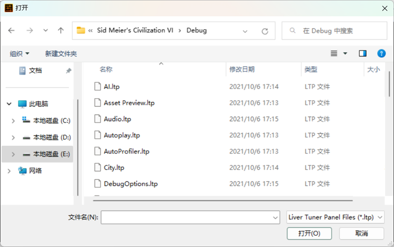
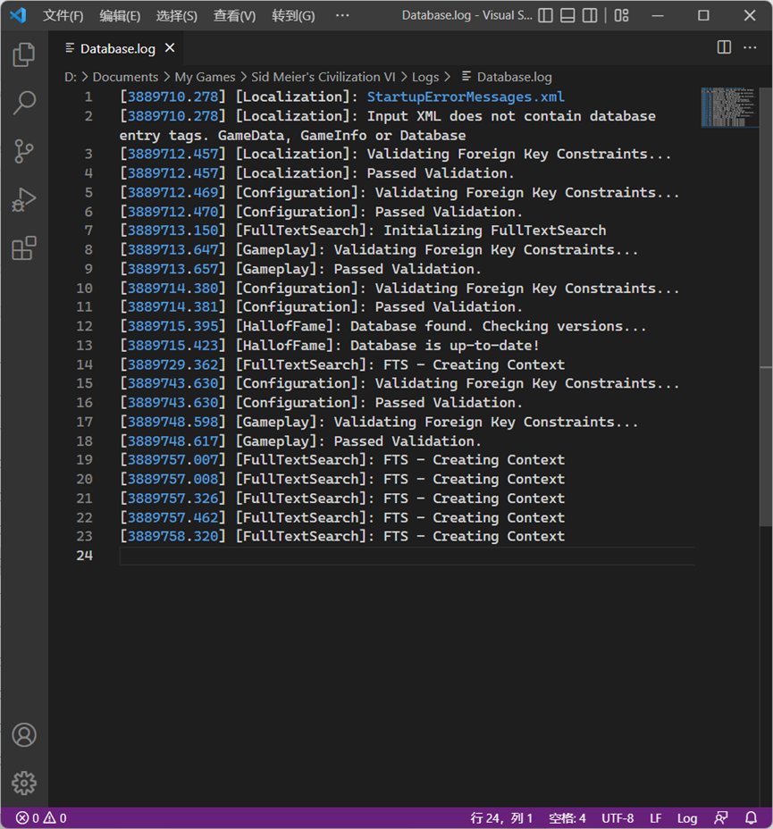

# 小优妮的文明6模组笔记

## 03 修正与特性

在上一章节中，我们已创建了一个文明及其领袖的框架——现在我们将使他成为一个真正有实际效果的领袖。本章教程需要你已经完成了第一章的内容。

当你建立完成一个新的领袖之后，接下来你所要做的就是要为这个领袖编写特性了。在开始之前，你可能已经有了一个关于这个想制作的领袖的设计稿。如果没有的话，现在就快来试试吧。设计一个有趣的领袖经常是一件极端花费心思的事情。在我们的教程中，我们不把它作为重点，而是着重介绍如何实现你的想法。不过，以下栏目为你提供了一些值得考虑的问题。

>最佳实践：设计文明及其领袖
>
>一组完整的文明/领袖特性可以包含以下内容：
>
>1. 一条领袖特性。有些领袖特性可以解锁专属于领袖的单位（伟人也是单位的一种）；
>2. 一条文明特性。无论是领袖特性还是文明特性都只有一条，但一条可以提供多个加成；
>3. 一项文明特色单位。特色单位宜包含两项加成（特定情况下或者任何时候的战斗力加成、建造更便宜或无需资源、提前解锁、可建造特殊改良设施……等等），或者三项加成及一项减益（建造更贵、解锁较晚，等等）；
>4. 一项文明特色基础设施。可以是特色建筑、特色改良设施或者特色区域三者之一，有些文明的特色城区还提供对应的水上版本（比如巴西）；
>5. （可选）额外的一个领袖特色单位，或者特色单位修建的改良设施。
>
>在设计特性时，考虑以下内容：
>1. 尝试让各项特性相互配合，相得益彰。例如，秦始皇的领袖特性提供了额外的建造者使用次数，使得特色改良设施“长城”的收益进一步增加；
>2. 不要填写超出游戏规则框架的数值，除非你确信这个数字非常有必要。例如，相邻加成通常只有三种：少量（每2个+1）、标准（每个+1）、大量（每个+2）。不宜为你的特色基础设施填写“每个+3”这样的相邻加成（如果你想要更高的数值，不妨使其从更多的地形地貌中获得大量加成）。
>3. 选取领袖的一个重要方面来进行抽象，宜精不宜多。例如，秦始皇的特性编写主要集中在他大兴土木的方面，对他如何扫清六合则没有着墨。很多尝试编写自己的领袖的新手都急于给领袖设置一大堆不同名字的特性，这在技术上是可行的，设计上却非常糟糕。
>4. 尽可能让不同人群感受到乐趣。一个适合世界级的竞速玩家的特性，可能会让一位新手倍感无聊，反之亦然。
>5. 不宜片面追求强度。文明6是一款休闲玩家居多的游戏，不是所有领袖都应该极其强大。在设计时，不妨更多考虑特性是否符合你要做的领袖的风貌、性格、历史功绩等等，而不是单纯地设计一种新的游戏套路。
>6. 制造些新意。玩家通常都会更喜欢玩法和常规稍有不同的领袖，不过如果过于不同甚至专门为一个领袖引入新机制，则容易使人困惑。

将来，你将会实现你的设计计划。但在目前，你可以先用草稿纸或者文本文档记录下你的想法。

出于教学方便，在这里我将跳过设计这一步，转而通过几个制作过程上有代表性的特性来启发你创造自己的特性组。它可能玩起来不太有趣，但对新手开始制作自己的模组而言非常好用。


设计草稿：**猫咪贾斯伯领导的猫猫族** Jasper Kitty leads the Felines

领袖特性：**猫猫爪击** Kitty Claws

所有陆地单位获得+10战斗力。

在编写这个特性时，我们将学习如何创建一个默认不活动的单位能力，并将其赋予给你的所有陆地单位（或者你的某些类型的单位）。

文明特性：**猫式迅捷** Cat-Like Reflexes

首都的所有产出翻倍。

在编写这个特性时，我们将介绍修正（modifiers）和条件集（requirement sets）。将修正和领袖特性绑定起来，便构成了一条有实际效果的特性。

特色单位：**猫咪** Kitten

替代侦察兵。比侦察兵的行动力更高，且可以无视树林地形的移动力惩罚。

单位和建筑物不同，主要通过单位的能力（abilities）来接受修正提供的加成。编写这个特性时，我们将学习如何新建一个单位并将能力通过类型标签（type tags）赋予给这个单位。

特色基础设施：**猫砂盆** Litter Box

一种特色建筑，替代纪念碑。提供2点文化产出和2点忠诚度。如果忠诚度满，额外产出2点文化。

在编写这个特性时，我们将学习如何编写一个特色建筑，并使其拥有一些使用修正实现的特性。

笔者在此处事先注明了英文，以便稍后你在阅读时可以回忆起我们在编写过程中使用的变量名所对应的内容。实际上，变量名的命名只有一些非常建议遵守的规则（例如，`UNIT_`或者`LEADER_`前缀——我们将来还会提到为什么需要遵守这些规则），而至于可自由发挥的部分，你可以自由地使用大写字母（不宜使用小写）、数字和下划线。你完全可以把`UNIT_KITTEN`写成`UNIT_MAO_MI`（汉语拼音）或者是`UNIT_KONEKO`（日语罗马字）！接下来就让我们开始吧。这些能力中，最适合新手初步上手的是文明特性。

在编写文明特性时，第一步是在Types表中声明这个特性的存在。打开你的`Civilizations.xml`，并在`<Types>`和`</Types>`之间填入这一行内容：

```xml
	<Row Type="TRAIT_CIVILIZATION_CAT_LIKE_REFLEXES" Kind="KIND_TRAIT" /> 
```

就像这样：


在完成声明之后，这个特性还没有被正式定义，它还是空白的。因此，我们需要一些额外的数据使其正常显示。我们需要在`Traits`表中添加数据条目（专业的说法叫“记录（record）”）：

```xml
	<Traits>  
	    <Row TraitType="TRAIT_CIVILIZATION_CAT_LIKE_REFLEXES" Name="LOC_TRAIT_CIVILIZATION_FELINE_NAME" Description="LOC_TRAIT_CIVILIZATION_FELINE_DESCRIPTION" />  
	</Traits>  
```

注意到这条特性的名字和描述有些似曾相识了吗？是的，你可以指定它的名称和描述，不过最方便的方式是使用`Config.xml`中为你的文明指定的文明特性的名字和描述。`Traits`表要记录的东西就是这些。

接下来，我们需要让这个文明拥有这条特性。这一步通过`CivilizationTraits`表完成。请看：

```xml
	<CivilizationTraits>  
	    <Row CivilizationType="CIVILIZATION_FELINE" TraitType="TRAIT_CIVILIZATION_CAT_LIKE_REFLEXES" />  
	</CivilizationTraits>  
```

就像CivilizationTraits表把特性赋予给文明一样。 这个时候你可能会猜想是否有LeaderTraits表——完全正确！
不过我们会在以后再讨论它。

下一步，我们将给这个特性赋予真——正——的——力量。

在文明6游戏中，许许多多的加成是以修正形式赋予给游戏内实体（例如：特性、建筑、改良设施，甚至玩家和整局游戏！）的。我们接下来就将给这个特性赋予属于它的修正。

还记得我们要实现的内容吗？首都产出翻倍。（回忆一下，游戏中，产出有6种类型：食物、科技值、文化值、信仰值、金币、生产力。）我们先从食物的产出开始赋予起，这样简单一些。从这一步开始，你就应该给你的新建修正取名了。

在这个例子中，将使得这个新文明的首都食物产出翻倍的修正命名为TRAIT_CAPITAL_DOUBLE_FOOD_YIELD。要让拥有这个修正属于我们新写的特性，同样只需要短短几行。先试着猜测这次得放在哪个表里：

```xml
	<TraitModifiers>  
	    <Row TraitType="TRAIT_CIVILIZATION_CAT_LIKE_REFLEXES" ModifierId="TRAIT_CAPITAL_DOUBLE_FOOD_YIELD"/>  
	</TraitModifiers>  
```

`TraitModifiers`表，顾名思义，将修正（Modifiers）赋予给特性（Trait）。大多数数据表的名字都可以使你可以很轻易地猜出它的用途，同时往往只有最后一个词是复数形式。不要忘记了，我们虽然刚刚赋予了一个修正给一条特性，但这条修正还没有被明确定义**要做什么**。这便是我们接下来要做的。

>**笔记笔记**：顺序无关
>
>我们现在使用的是自上而下的，先使用再定义的方式。如果你更喜欢先定义再使用，也完全可以。XML指令是顺序无关的，只要你没有写错就行。但是，在写错的时候就完全不同了！

>**小心脚下**：指令错误
>
>一旦你填写的指令有错，从出错的那一行指令开始，整个指令文件的剩余部分都会被游戏引擎视作不存在。
>有时候，游戏会因此提示你的模组存在问题无法加载，但有些时候，游戏会正常进入，正常运行——只是你出错的那一行，到这个文件的最后一行，这部分内容被抛弃了。好在，游戏在遇上这种情况的时候仍然会在日志中记录你的错误，因此去看一看一般总会有收获。

我们来定义TRAIT_CAPITAL_DOUBLE_FOOD_YIELD。

```xml
	<Modifiers>  
	    <Row>  
	        <ModifierId>TRAIT_CAPITAL_DOUBLE_FOOD_YIELD</ModifierId>  
	        <ModifierType>MODIFIER_PLAYER_CITIES_ADJUST_CITY_YIELD_MODIFIER</ModifierType>  
	    </Row>  
	</Modifiers>  
	  
	<ModifierArguments>  
	    <Row>  
	        <ModifierId>TRAIT_CAPITAL_DOUBLE_FOOD_YIELD</ModifierId>  
	        <Name>YieldType</Name>  
	        <Value>YIELD_FOOD</Value>  
	    </Row>  
	    <Row>  
	        <ModifierId>TRAIT_CAPITAL_DOUBLE_FOOD_YIELD</ModifierId>  
	        <Name>Amount</Name>  
	        <Value>100</Value>  
	    </Row>  
	</ModifierArguments>  
```

这次看起来是不是有些晕乎乎的？如果把它变成一张供人类查看的表格形式，或许会好一些：

修正（Modifiers）表：

| 修正ID（ModifierID） | 修正类型（ModifierType） |
| --- | --- | 
| 首都双倍食物产出（TRAIT_CAPITAL_DOUBLE_FOOD_YIELD） | 玩家城市按百分比调整产出（MODIFIER_PLAYER_CITIES_ADJUST_CITY_YIELD_MODIFIER） |

修正参数（ModifierArguments）表：

| 修正ID（ModifierID） | 参数名（Name） | 参数值（Value） |
| --- | --- | --- |
| 首都双倍食物产出（TRAIT_CAPITAL_DOUBLE_FOOD_YIELD） | 产出类型（YieldType） | 食物（YIELD_FOOD） |
| 首都双倍食物产出（TRAIT_CAPITAL_DOUBLE_FOOD_YIELD） | 数量（Amount） | 100 |

没那么复杂，对吧？把它丢入你的XML文件中，这时候你的Civilizations.xml大概看起来像这样：

```xml
<?xml version="1.0" encoding="utf-8"?>
<GameData>
	<Types>
		<Row Type="CIVILIZATION_FELINE" Kind="KIND_CIVILIZATION" />
		<Row Type="TRAIT_CIVILIZATION_CAT_LIKE_REFLEXES" Kind="KIND_TRAIT" />
	</Types>

	<Civilizations>
		<Row>
			<CivilizationType>CIVILIZATION_FELINE</CivilizationType>
			<Name>LOC_CIVILIZATION_FELINE_NAME</Name>
			<Description>LOC_CIVILIZATION_FELINE_DESCRIPTION</Description>
			<Adjective>LOC_CIVILIZATION_FELINE_ADJECTIVE</Adjective>
			<StartingCivilizationLevelType>CIVILIZATION_LEVEL_FULL_CIV</StartingCivilizationLevelType>
		</Row>
	</Civilizations>

	<CivilizationLeaders>
		<Row CivilizationType="CIVILIZATION_FELINE" LeaderType="LEADER_JASPER_KITTY" CapitalName="LOC_CITY_NAME_PAWTIMORE" />
	</CivilizationLeaders>

	<Traits>
		<Row TraitType="TRAIT_CIVILIZATION_CAT_LIKE_REFLEXES" Name="LOC_TRAIT_CIVILIZATION_FELINE_NAME" Description="LOC_TRAIT_CIVILIZATION_FELINE_DESCRIPTION" />
	</Traits>

	<CivilizationTraits>
		<Row CivilizationType="CIVILIZATION_FELINE" TraitType="TRAIT_CIVILIZATION_CAT_LIKE_REFLEXES" />
	</CivilizationTraits>

	<TraitModifiers>
		<Row TraitType="TRAIT_CIVILIZATION_CAT_LIKE_REFLEXES" ModifierId="TRAIT_CAPITAL_DOUBLE_FOOD_YIELD" />
	</TraitModifiers>

	<Modifiers>
		<Row>
			<ModifierId>TRAIT_CAPITAL_DOUBLE_FOOD_YIELD</ModifierId>
			<ModifierType>MODIFIER_PLAYER_CITIES_ADJUST_CITY_YIELD_MODIFIER</ModifierType>
		</Row>
	</Modifiers>

	<ModifierArguments>
		<Row>
			<ModifierId>TRAIT_CAPITAL_DOUBLE_FOOD_YIELD</ModifierId>
			<Name>YieldType</Name>
			<Value>YIELD_FOOD</Value>
		</Row>
		<Row>
			<ModifierId>TRAIT_CAPITAL_DOUBLE_FOOD_YIELD</ModifierId>
			<Name>Amount</Name>
			<Value>100</Value>
		</Row>
	</ModifierArguments>
</GameData>
```

看起来，第一条修正好像已经写得非常好了，我们让城市的食物产出翻倍了！在完成一条修正之后，我们不妨构建你的工程，然后试试看。


说到这儿！如果你还没有在游戏设置中启用调谐器支持，那么最好启用一下。我们将来会使用它来加速测试流程。在一局完整的游戏中测试固然也很有趣味……但是要花的时间有时就是十倍百倍了。需要注意的是，一旦调试器开启，你就无法获得游戏成就了，所以也许你什么时候还会想关闭它。


那么，让我们加载进入游戏！


你的加载界面看起来应该像这样，注意到你的第一个特性已经显示了出来。如果没有，就应该检查一下之前的绑定过程。如果很不巧，你看到的是这个：


也不要担心，反正无论是新手还是老手，在将来都会无数次地看到它。至于现在，你可以重新检查你的指令有没有哪里写错了。
如果你对数据库基础知识有所了解，可以到`%LOCALAPPDATA%\Firaxis Games\Sid Meier's Civilization VI\Logs`中查看究竟出了什么问题。

>**笔记笔记**：环境变量
>
>`%LOCALAPPDATA%`表示你当前的用户文件夹下的`\AppData\Local\`目录。

总之，经过仔细检查，也许有查漏补缺，我们终于进入了游戏。快建立一座城市试试看效果吧。


食物产出增加了100%！真是太棒了。不过，这项任务真的已经完美完成了吗？

>**笔记笔记**：测试过程中的要点
>
>在测试你的特性是否正确实现的时候，别忘了测试这些内容：
>1. **有效性**：我是否真的获得了这项加成？
>2. **限定范围**：这个加成是否只在我设计的情况出现了？它是否被加给了我不希望加的城市，甚至加给了其他玩家？它是否在不该触发的时候触发了，或者在该失效的时候没有失效？（如果你写的是Lua脚本，这尤其重要！）
>3. **兼容性**：这个加成在各种条件下都能正常生效吗？会不会导致其他东西（包括官方的DLC和别人的作品中的各种内容）出问题？其他东西又会不会导致这个加成本身出问题？在你希望它正常运行的规则集下，它是否都能正常工作，而在你不希望它运行的规则集下，它是否确实完全不加载而不会导致游戏无法进入？
>4. **用户界面（UI）**：加成数字能否被正确地显示出来？其他玩家会不会看到不该出现的文字、图案或者其它说明？
>
>一般不需要测试性能，因为通常模组不会导致严重的性能问题。不过，如果你是一位程序设计的爱好者，在写Lua脚本的时候，优化一点也没有坏处。

让我们开始随意进行游戏，然后寻找测试机会。别忘了我们刚刚完成的任务应该是首都食物产出翻倍。我们已经确认了食物可以获得产出翻倍，但首先应该确认其他产出是否被不正确地影响了，或者其他玩家是否错误地得到了这个加成。倒不用太过担心，如果你按前面的内容做到现在，并且没有把TraitModifiers写成GameModifiers（这个表里的修正将会应用到整局游戏的所有人），那就不会有这些问题。

不过等等！我们是不是写的是**玩家的所有城市**而不是**玩家的首都**？

你急忙试着造一个新的开拓者来测试这一点。正是让调试器来加速测试的好机会！。从开发工具中选择`FireTuner`（此前我们已经用过其中的`ModBuddy`）。

选择文件（File）-打开面板（Open Panel），然后找到游戏安装目录下的`Debug`文件夹，选择里面的`City.ltp`。




这个面板显示了目前游戏中的所有城市。由于我们在第一回合，所以目前只有我们刚刚建立的城市存在。选中它。建造开拓者需要至少2人口。所以我们点击增加人口（Increase Pop）。

接下来，迅速获得一个移民的方法是购买它，所以我们需要获得一些金币。用同样的方法打开Player.ltp（注意没有s！），选择我们自己的文明，然后点击画面右侧的1000金币（1000 Gold）按钮。


回到游戏，购买你的开拓者吧（你可能需要重新开关购买面板，让面板刷新）。

为了进一步节省时间，你还可以打开Unit.ltp，点击回复所有移动力（Restore Movement All）让你新买的开拓者可以立即行动。

反复使用这个功能未必能节省多少时间，你可以选择过回合或者在行动力耗尽时继续使用调试器恢复行动力。

如果你安装有别人的作弊mod，毫无疑问你也可以利用它们进行加速测试，不过这里我们不使用其他人的作品。

总之，现在的问题是：第二座城市的情况会是怎样？


好吧，看来我们发现了一个错误。

目前你给游戏提供的数据库指令在语法上是完全正确的，因此日志文件无法给你提供任何有效的帮助。因此，很多时候，你需要自行测试每一个功能是不是都像你想的那样工作。

所幸，发现问题是解决问题的一半——我们得回到编辑器界面，思考一下：这下该做什么好呢？

要解决这个问题，我们需要新的工具：一个前置条件集（requirement set）。

一个修正可以拥有两个条件集：主体条件集（subject requirement set）和所有者条件集（owner requirement set）。

前者用来规定“符合什么样的条件的对象会受到本修正的加成”
后者用来规定“修正所挂载的对象应该符合什么样的条件，才会生效”。

在本例中，我们编写的修正的类型是`MODIFIER_PLAYER_CITIES_ADJUST_CITY_YIELD_MODIFIER`（玩家城市调整城市产出百分比），且通过`CivilizationTraits`绑定到文明因此它的主体是“本玩家的城市”，而所有者是“本文明”（需要注意的是，“文明”或者“领袖”，都适用于对“玩家”本身的修正）。

为了让我们的效果正确地应用到“本玩家的首都”，我们需要编写一个条件集，以使它仅能在首都上成立。要做到这一点，最好的方法是通过判断宫殿建筑。一个文明只能有一座城市，也就是它的首都，拥有宫殿。现在，我们给这个条件集取名为`FELINE_CAPITAL_REQUIREMENTS`。

修改我们之前已经写下的Modifiers表。它上次看起来像这样。

```xml
    <Modifiers>  
        <Row>  
            <ModifierId>TRAIT_CAPITAL_DOUBLE_FOOD_YIELD</ModifierId>  
            <ModifierType>MODIFIER_PLAYER_CITIES_ADJUST_CITY_YIELD_MODIFIER</ModifierType>  
        </Row>  
    </Modifiers>  
```

我们为它加上一行，使其成为这样：

```xml
    <Modifiers>  
        <Row>  
            <ModifierId>TRAIT_CAPITAL_DOUBLE_FOOD_YIELD</ModifierId>  
            <ModifierType>MODIFIER_PLAYER_CITIES_ADJUST_CITY_YIELD_MODIFIER</ModifierType>
			<SubjectRequirementSetId>FELINE_CAPITAL_REQUIREMENTS</SubjectRequirementSetId>
        </Row>  
    </Modifiers>  
```

接下来，我们开始定义这个条件集。

```xml
<RequirementSets>  
    <Row>  
        <RequirementSetId>FELINE_CAPITAL_REQUIREMENTS</RequirementSetId>  
        <RequirementSetType>REQUIREMENTSET_TEST_ALL</RequirementSetType>  
    </Row>  
</RequirementSets>  
  
<RequirementSetRequirements>  
    <Row>  
        <RequirementSetId>FELINE_CAPITAL_REQUIREMENTS</RequirementSetId>  
        <RequirementId>REQUIRES_CITY_HAS_PALACE</RequirementId>  
    </Row>  
</RequirementSetRequirements>  
  
<Requirements>  
    <Row>  
        <RequirementId>REQUIRES_CITY_HAS_PALACE</RequirementId>  
        <RequirementType>REQUIREMENT_CITY_HAS_BUILDING</RequirementType>  
    </Row>  
</Requirements>  
  
<RequirementArguments>  
    <Row>  
        <RequirementId>REQUIRES_CITY_HAS_PALACE</RequirementId>  
        <Name>BuildingType</Name>  
        <Value>BUILDING_PALACE</Value>  
    </Row>  
</RequirementArguments>  
```

把这些内容写在</GameData>之前。同文明、特性、修正和参数之间的关系类似，条件集由条件组成，而条件又有自己的参数。如果现在还没有清晰的印象的话，稍后我们还会再次强调这一点。

特别需要注意的是`RequirementSets`表中设置的条件集类型（requirement set type）。在本例中，它的值是`REQUIREMENTSET_TEST_ALL`，满足所有下属条件时，条件集才被满足。另一个同样常用的条件集类型是`REQUIREMENTSET_TEST_ANY`，只要一个下属条件满足，整个条件集即视作被满足。
绝大部分情况下，条件集就只有这两种类型。

`RequirementSetRequirements`表将条件集和下属条件绑定起来。本例中，`FELINE_CAPITAL_REQUIREMENTS`条件集的下属条件是`REQUIRES_CITY_HAS_PALACE`。

往下看`Requirements`表，`REQUIRES_CITY_HAS_PALACE`是一个类型为`REQUIREMENT_CITY_HAS_BUILDING`（城市拥有建筑）的条件，
而`RequirementArguments`表中记述了它的参数：`REQUIRES_CITY_HAS_PALACE`这个条件要求城市拥有`BUILDING_PALACE`建筑，也即宫殿（你可以查阅游戏原始文件的Buildings.xml查看建筑的变量名，但不是所有建筑都在一个地方，有些建筑是DLC加入的。使用文本编辑器的跨文件查找功能来找到你想要的建筑）。

看起来一切已经设置完毕了，让我们构建并开始测试吧。

如果你没有犯错，乍一看，一切似乎工作得非常正常。不过，要真正验证你的mod是不是存在问题，查看日志文件也是重要的一部分。务必注意，一个合格的作品不应该在数据库中制造任何错误。

怎么强调数据库指令应该全程保持正确也不为过。如果你写的东西存在错误，整个文件都将被游戏引擎抛弃，因而往往会引发更大的问题。

同时，如果你写的文件存在错误，还会在日志中留下大量的垃圾信息，影响其他人查找错误。因此，**在任何情况下，一个合格的作品不应该在数据库中制造任何错误。**

从文件资源管理器中寻找：`%LOCALAPPDATA%\Firaxis Games\Sid Meier's Civilization VI\Logs`，然后找到数据库日志，Database.log。


使用一款带有语法高亮的文本编辑器，并把文件语言调为日志文件（Log），它就能忠实地为我们指出了日志中存在的错误，类似这样：

```log
[3887972.302] [Gameplay] ERROR: UNIQUE constraint failed: Requirements.RequirementId
[3887972.302] [Gameplay]: While executing - 'insert into Requirements('RequirementId', 'RequirementType') values (?, ?);'
[3887972.302] [Gameplay]: In XMLSerializer while inserting row into table insert into Requirements('RequirementId', 'RequirementType') with  values (REQUIRES_CITY_HAS_PALACE, REQUIREMENT_CITY_HAS_BUILDING, ).
[3887972.302] [Gameplay]: In XMLSerializer while updating table Requirements from file Feline_JasperKitty_Civilizations.xml.
[3887972.302] [Gameplay] ERROR: UNIQUE constraint failed: Requirements.RequirementId
```

尽管游戏看起来还能运行，但如果你的`Civilizations.xml`在`<Requirements>`之后还写了东西的话，后面的内容就不会生效了。你可以自己试试看。

回到日志文件来，我们制造了一个错误，因此必须设法修复它。在修复错误时，务必从第一个错误检查起。由于前述的读取机制，一个错误可能会导致出错文件的后续内容不再被读取，进而在其它文件中因为数据缺失而触发更多雪崩式的错误。如果盯着后面的错误不放，也许什么问题都没法解决！

我们首先简单地研究一下这个错误。

每一行开头的数字都是时间戳，对于我们而言这个信息并不重要。`[Gameplay]`指示出了发生错误的环境。

第一行显示了错误的类型和出错的数据表。`Requirements`表的`RequirementId`字段出现了错误。错误的类型是`UNIQUE constraint failed`，“`UNIQUE`约束验证失败”。

`UNIQUE`约束是一部分数据表对数据的要求，要求数据不得重复。
我们在`Requirements`表中填入的数据和已有的数据重复了，因此导致这一约束验证失败。

常见的导致问题的约束还有`FOREIGN KEY`约束（引用一个来自其他数据表的数据，这个数据必须存在），以及`NOT NULL`约束（数据不得为空）。

第二行显示的是错误的具体位置，在进行“向`Requirements`表插入一个有`RequirementId`和`RequirementType`的数据” 时出现了这个错误。

第三行的内容和第二行几乎一致，但显示了错误是在填写`REQUIRES_CITY_HAS_PALACE`，也就是我们刚刚填入的条件时发生的。
这个条件和游戏中已经被写过的条件重名了，因此导致了这个错误（别忘了，错误的类型是UNIQUE约束验证失败）。

第四行指示了出错的文件：`Feline_JasperKitty_Civilizations.xml`。

第五行的内容和第一行一致，此处不再赘述。

既然问题已经被发现了，那么我们就可以上手解决它。

最简单的方式就是给我们编写的条件换个名字。为了避免和其他人的作品冲突，不妨为这个条件的内部名称增加一个领袖、文明或者作者的名字。

在这里我们将文件中出现的所有`REQUIRES_CITY_HAS_PALACE`替换为`REQUIRES_CITY_HAS_PALACE_FELINE`。


读者也许会问：既然游戏已经有了`REQUIRES_CITY_HAS_PALACE`，我们能不能直接使用它呢？这个条件（requirement）是在迭起兴衰资料片中增加的，在风云变幻规则集下几乎一直可用。但如果你要适配标准规则集，那么它就不存在于游戏中了。

这时你可能会想到，我们单独设置一个自己的条件，是为了避免游戏环境的变化引发我们作品出错。当你无法确保你需要的条件（或者修正、特性，等等一切其他东西）一定存在于游戏中时，可以采用这种防御性写法。

别忘了一共有三处地方需要修改。完成之后，我们完全退出游戏（这样日志文件就会清空），然后构建（Build）mod，重新检查日志。



>笔记笔记：日志的清空
>
>每次重启游戏都会让日志清空。并不是每次重新测试都需要完全退出游戏，但也别忘了如果不退出，你就应该每次都检查日志新生成的部分，而不再是从上往下看了。

错误消失了！这样，我们就可以继续接下来的操作了。

在之前的工作中，我们实现了首都的食物产出翻倍。
其他产出的调整和食物非常相似，此处不过多着墨。
不过需要额外说明的是，MODIFIER_PLAYER_CITIES_ADJUST_CITY_YIELD_MODIFIER这个修正类型允许你在参数中设置多个产出，因此你可以做一个这样的修正：

```xml
	<Modifiers>
		<Row>
			<ModifierId>TRAIT_CAPITAL_DOUBLE_NONFOOD_YIELD</ModifierId>
			<ModifierType>MODIFIER_PLAYER_CITIES_ADJUST_CITY_YIELD_MODIFIER</ModifierType>
			<SubjectRequirementSetId>FELINE_CAPITAL_REQUIREMENTS</SubjectRequirementSetId>
		</Row>
	</Modifiers>
	<ModifierArguments>
		<Row>
			<ModifierId>TRAIT_CAPITAL_DOUBLE_NONFOOD_YIELD</ModifierId>
			<Name>YieldType</Name>
			<Value>YIELD_GOLD,YIELD_SCIENCE,YIELD_CULTURE,YIELD_FAITH,YIELD_PRODUCTION</Value>
		</Row>
		<Row>
			<ModifierId>TRAIT_CAPITAL_DOUBLE_NONFOOD_YIELD</ModifierId>
			<Name>Amount</Name>
			<Value>100,100,100,100,100</Value>
		</Row>
	</ModifierArguments>
```

来一次性解决剩下的五种产出。不过遗憾的是，并不是所有修正类型都允许这么做！还有就是，别忘了`TraitModifiers`：

```xml
	<Row TraitType="TRAIT_CIVILIZATION_CAT_LIKE_REFLEXES" ModifierId="TRAIT_CAPITAL_DOUBLE_NONFOOD_YIELD" />
```

在编写之后，一定要进行测试，确保你的特性全部工作正常。

>**笔记笔记**：进一步修改
>
>XML指令文件中，并不要求你在文件中不重复使用标签。你可以找到之前写的<Modifiers>和<ModifierArguments>部分并增补上新写入的修正的相关内容，也可以把上面这一段内容直接粘贴到你刚写的内容之下。
 
接下来，让我们来总结一下整个文件的脉络：


文明6游戏中，绝大多数特殊效果是通过一条或多条“修正”（modifier）来产生效果的。当我们编写一个文明的特性的时候，我们首先编写一条特性并通过CivilizationTraits表定义你的文明拥有这条特性。

接下来，我们定义这个特性的实际效果，也即一条或多条修正。许多修正需要配置参数才能正常工作（道理很明显，假如我对你说“我需要你提升首都的产出”，但没有说提升多少，那你也无法正常执行），不过有些修正则不需要参数，例如MODIFIER_ADJUST_OPEN_BORDERS_FROM_INFLUENCE（开放边界）。

有时候，我们只希望符合一定条件的对象能够获得效果。在我们这次编写的案例中，我们给文明挂载了“本文明的玩家”为所有者，“玩家的所有城市”为主体的修正，但我们只希望有宫殿的城市能够获得实际效果。

要做到这一点，我们编写了一个条件集以及所属与它的条件。如果你正在尝试编写自己的特性，这个层次关系非常重要。如果你尚不能很好地理清关系，请务必从这一点开始思考：**修正是游戏内效果的核心**。它不仅可以挂载在一条特性（trait）上，还可以挂载在建筑、单位能力、改良设施、项目完成奖励、世界议会过程和世界议会奖励、单位晋升和总督晋升……务必抓住它所处的中心地位。


如果你的测试成功了，我们就完成了文明特性的编写。祝贺！不过，未来的路还很长。接下来的教程中，我们将继续编写这个文明的其他特色内容。
