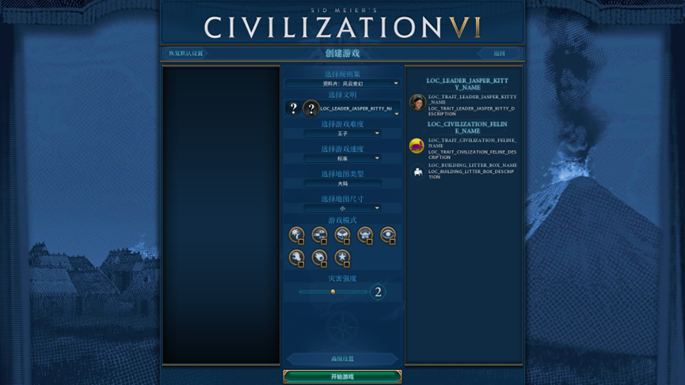
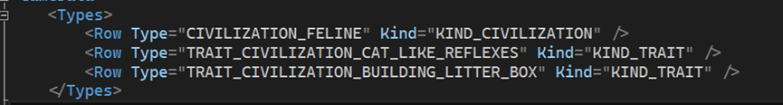
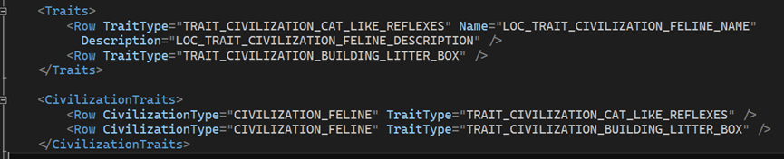
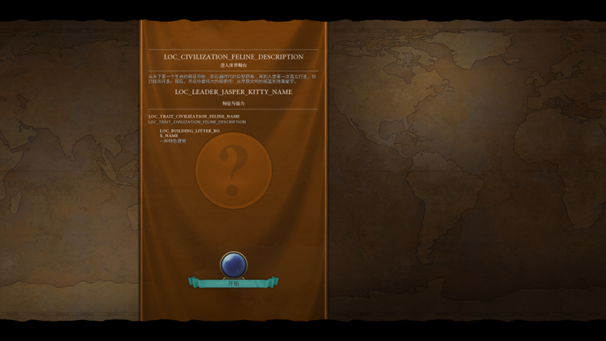
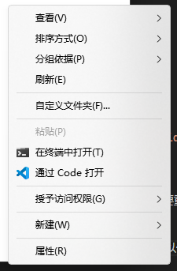
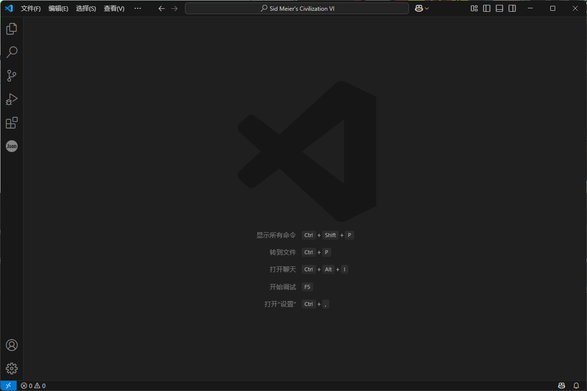
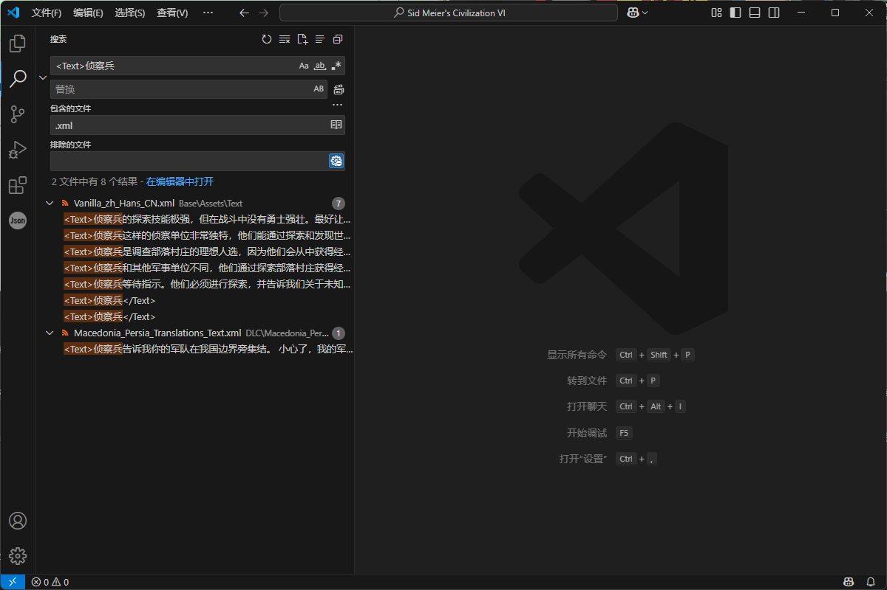

# 小优妮的文明6模组笔记

## 04 其它特色项目和单位能力

在上一章节中，我们已创建了一个文明的特性，不过距离完成我们的整个领袖的游戏性部分还有一段十足的距离。本教程中我们将继续完成一个简单的特色建筑。本章需要你已经完成了之前的部分。如果你还没有完成，请务必先看一看你的文明是否已经配置完毕！让我们翻回我们的设定草稿： 

**猫咪贾斯伯领导的猫猫族** Jasper Kitty leads the Felines

<input type="checkbox" > 领袖特性：**猫猫爪击** Kitty Claws

所有陆地单位获得+10战斗力。

<input type="checkbox" checked> 文明特性：**猫式迅捷** Cat-Like Reflexes

首都的所有产出翻倍。

<input type="checkbox" > 特色单位：**猫咪** Kitten

替代侦察兵。比侦察兵的行动力更高，且可以无视树林地形的移动力惩罚。

<input type="checkbox" > 特色基础设施：**猫砂盆** Litter Box

一种特色建筑，替代纪念碑。提供2点文化产出和2点忠诚度。如果忠诚度满，额外产出2点文化。

在本章中，我们需要完成剩下的三个项目。这次我们将从特色基础设施入手，然后再提到特色单位和领袖专属的单位加成特性。

如果担心代码混乱的话，非常推荐将建筑放在单独的XML数据库指令文件中，可以取名为`Feline_JasperKitty_Buildings.xml`（下面我们也会略去前缀部分）。同时，别忘了这个文件也需要被游戏在运行时加载，因此需要将其放入我们之前定义的Feline_Gameplay游戏内动作（in-game action）。（如果你不记得如何设置游戏内动作，请参阅02章）。

在本章中，我们将介绍Buildings等数据表的使用，建立一个新的建筑并使其成为特色建筑。我们的第一步是编写出猫砂盆建筑本身。参照下面的内容完成吧——此时，我们的Buildings.xml文件中应该写出这些东西：

```xml
<?xml version="1.0" encoding="utf-8"?>  
<GameData>  
    <Types>  
        <Row Type="BUILDING_LITTER_BOX" Kind="KIND_BUILDING" />  
    </Types>  
    <Buildings>  
        <Row BuildingType="BUILDING_LITTER_BOX" Name="LOC_BUILDING_LITTER_BOX_NAME" Description="LOC_BUILDING_LITTER_BOX_DESCRIPTION" PrereqDistrict="DISTRICT_CITY_CENTER"  PurchaseYield="YIELD_GOLD" Cost="60" AdvisorType="ADVISOR_CULTURE"/>  
    </Buildings>  
    <Building_YieldChanges>  
        <Row BuildingType="BUILDING_LITTER_BOX" YieldType="YIELD_CULTURE" YieldChange="2"/>  
    </Building_YieldChanges>  
    <BuildingModifiers>  
        <Row BuildingType="BUILDING_LITTER_BOX" ModifierId="LITTER_BOX_LOYALTY"/>  
        <Row BuildingType="BUILDING_LITTER_BOX" ModifierId="LITTER_BOX_CULTURE_AT_FULL_LOYALTY"/>  
    </BuildingModifiers>  
    <Modifiers>  
        <Row>  
            <ModifierId>LITTER_BOX_LOYALTY</ModifierId>  
            <ModifierType>MODIFIER_SINGLE_CITY_ADJUST_IDENTITY_PER_TURN</ModifierType>  
        </Row>  
        <Row>  
            <ModifierId>LITTER_BOX_CULTURE_AT_FULL_LOYALTY</ModifierId>  
            <ModifierType>MODIFIER_SINGLE_CITY_ADJUST_YIELD_CHANGE</ModifierType>  
            <SubjectRequirementSetId>MONUMENT_FULL_LOYALTY_REQUIREMENTS</SubjectRequirementSetId>  
        </Row>  
    </Modifiers>  
    <ModifierArguments>  
        <Row>  
            <ModifierId>LITTER_BOX_LOYALTY</ModifierId>  
            <Name>Amount</Name>  
            <Value>2</Value>  
        </Row>  
        <Row>  
            <ModifierId>LITTER_BOX_CULTURE_AT_FULL_LOYALTY</ModifierId>  
            <Name>Amount</Name>  
            <Value>2</Value>  
        </Row>  
        <Row>  
            <ModifierId>LITTER_BOX_CULTURE_AT_FULL_LOYALTY</ModifierId>  
            <Name>YieldType</Name>  
            <Value>YIELD_CULTURE</Value>  
        </Row>  
    </ModifierArguments>  
</GameData>  
```

我们来详细解说一下这段内容。和其他文件一样，所有你做出的指令都必须在GameData的起终点之间。

和很多其他游戏内元素一样，新建建筑也需要你在`Types`表中进行声明。建筑物的基本信息是记录在`Buildings`表中的。

`BuildingType`是这个建筑的内部名称，它也是这个建筑的唯一标识符。

`Name`和`Description`是它的名称和说明的本地化变量。

`PrereqDistrict`指示它的前置区域，此处是市中心。

`PurchaseYield`表示购买本建筑使用的产出类型，许多建筑都使用金币（`YIELD_GOLD`），不过也有一些使用的是信仰（`YIELD_FAITH`）。

`Cost`是其基本成本（标准速度下，没有任何其它加成时的生产力造价）。

`AdvisorTyoe`是旧作的遗留产物，也许会影响AI建造它的方式，原本的意思是游戏内顾问为你进行推荐时选择的推荐类型（在文明5中，游戏会显示“您的经济/军事/文化顾问推荐您建造这个”，但如今不会了）。

>**笔记笔记**：参照官方数据
>
>在编写属于你自己的内容的时候，官方的文件是非常好的参考。他们实现一样东西的方法有可能对你也适用。尝试着模仿官方文件吧！
Building_YieldChanges表记载本建筑的基础产出类型。这一建筑的基础产出是2点文化。你可能会说，“那满忠诚度时的额外2点文化在哪里呢“——它是以修正的形式存在的。BuildingModifiers表将这一建筑与修正绑定起来，也就是，这一建筑自带的一部分特殊效果。本建筑自带了两个修正：LITTER_BOX_LOYALTY（单城增加忠诚度，每回合2点），以及LITTER_BOX_CULTURE_AT_FULL_LOYALTY（单城，满忠诚度时，增加产出，每回合2点文化）。

现在你就可以构建你的作品，试试看它的效果是否可用。你此时应该会注意到新建筑已经出现，但它并没有像我们设想的那样成为本文明的专属建筑，也没有替代纪念碑！别着急，你可以先确认建筑本身是否可用，我们接下来就要谈到这一点。

在文明6中，建筑物、城区、改良设施或者单位可以被设置为必须要有某种特性（trait）才能使用。特性本身也可以和修正进行绑定（也就是文明/领袖特性），但有些特性本身没有绑定修正，而是作为领袖/文明和特色项目的纽带存在（也就是特色物件）。

设置一个特色物件的第一步是使其出现在领袖选择界面。在领袖选择界面，我们的这个建筑实际上根本就还未被游戏读取（别忘了，`Buildings.xml`仅仅被放置在游戏内动作而不是前端动作中读取），因此我们需要在`Config.xml`中提前报告它的存在。在这个过程中，我们需要使用的是`PlayerItems`表。在`Config.xml`中试试看吧！

```xml
<PlayerItems>  
    <Row>  
        <Domain>Players:Expansion2_Players</Domain>  
        <CivilizationType>CIVILIZATION_FELINE</CivilizationType>  
        <LeaderType>LEADER_JASPER_KITTY</LeaderType>  
        <Type>BUILDING_LITTER_BOX</Type>  
        <Name>LOC_BUILDING_LITTER_BOX_NAME</Name>  
        <Description>LOC_BUILDING_LITTER_BOX_DESCRIPTION</Description>  
        <Icon>ICON_BUILDING_LITTER_BOX</Icon>  
        <SortIndex>10</SortIndex>  
    </Row>  
</PlayerItems>  
```

很容易理解这其中的大多数内容：Domain代表显示此条目的游戏规则集，紧接着的是文明、领袖、特色物件的类型、其名称、描述和图标。特别需要注意的是SortIndex，这个属性决定这一项特色物件在领袖选择界面的排序。数字越小，它会越靠前。不过，它不会显示在文明特性之前。

设置完成后，可以在领袖选择界面看到你设置的条目。文本和图标目前还尚未设置完毕，我们将会在将来提及，因此下图就是正确的模样了。



不过我们还是得继续设置，才能让这个建筑变成我们文明的专属建筑。

回到Buildings表，这个表是建筑物的基础信息的记录处。如果你试着自由地翻找文明6原版游戏的Buildings.xml，你可能会注意到这些记录包含了一些并不是所有建筑都有的字段——比如说TraitType——也就是建设此建筑的玩家必须拥有的特性（trait）。

<Row BuildingType="BUILDING_LITTER_BOX" Name="LOC_BUILDING_LITTER_BOX_NAME" Description="LOC_BUILDING_LITTER_BOX_DESCRIPTION" PrereqDistrict="DISTRICT_CITY_CENTER"  PurchaseYield="YIELD_GOLD" Cost="60" AdvisorType="ADVISOR_CULTURE"/>  

我们需要做的，就是给我们的新建筑补上关于TraitType的数据——这样这个建筑就只能由拥有拥有该特性的玩家建造。另一方面，我们要给我们的文明赋予这个特性，于是我们的新文明便成为了唯一能建造这种建筑的文明（“玩家”可以获得文明以及领袖两者的特性）。

试着改写Buildings表里关于这个新建筑的数据吧，下面是参考答案（XML的同一条数据内，字段顺序没有影响。需要注意的是使用SQL的话则有影响）：

<Row BuildingType="BUILDING_LITTER_BOX" Name="LOC_BUILDING_LITTER_BOX_NAME" Description="LOC_BUILDING_LITTER_BOX_DESCRIPTION" PrereqDistrict="DISTRICT_CITY_CENTER" PurchaseYield="YIELD_GOLD" Cost="60" TraitType="TRAIT_CIVILIZATION_BUILDING_LITTER_BOX" AdvisorType="ADVISOR_CULTURE"/>  

现在，还没有任何人能够建造这个建筑。因为还没有任何文明或者领袖拥有这个特性。实际上，如果你现在就急急忙忙地生成你的作品的话，你将会得到一个错误，显示你添加的这个建筑物的数据库信息不符合外键（FOREIGN KEY）约束——因为甚至这个特性还没有被声明呢！
在任何游戏内动作中被加载的数据库指令文件里面都可以声明这个特性并把其绑定给文明或领袖。我们在此处按照惯例，将特性放在Civilizations.xml中进行声明，如图所示，自行添加新条目。




  
我们来复习一下，我们在Types表中声明这个特性，并在Traits表中描述其详细信息。特别的是，特色建筑、特色单位等等特色物件所依附的特性不需要名称和描述，因此只要写一行没有额外信息的条目，表示这个东西确实存在即可。遗憾的是，这个形式主义味道满满的“画蛇添足”是不能省略的。
接下来，我们在CivilizationTraits表中将这个特性与我们的文明绑定。接下来试着生成你的作品并进行测试吧。

这次我们看到了“一种特色建筑”，这就代表这个建筑和文明的绑定成功了。



特色基础设施：猫砂盆 Litter Box

不过，我们似乎还有一些事情要做……回忆一下我们的设计稿。

一种特色建筑，**替代纪念碑**。提供2点文化产出和2点忠诚度。如果忠诚度满，额外产出2点文化。
 
是的，替代！我们需要在BuildingReplaces表中记录它是纪念碑的替代。回到Buildings.xml，补上： 

```xml
<BuildingReplaces>  
    <Row CivUniqueBuildingType="BUILDING_LITTER_BOX" ReplacesBuildingType="BUILDING_MONUMENT"/>  
</BuildingReplaces>  
```

到这里，特色建筑的游戏数值就正式编写完成。生成你的mod并进行测试——你应该能看到你的文明现在有一个替代纪念碑的特色建筑了（在百科中可以重点关注它是否已经取代了纪念碑且特属于你所写的文明）。如果有什么无法生效，就回到上一步试试吧！
 
完成这一步之后，我们随即要来制作特色单位。如同建筑一样，我们给单位也准备一个新的 XML 文件 `Feline_JasperKitty_Units.xml` 为宜。别忘了在游戏内动作（In-game Actions）中加载它。和建筑一样，特色单位需要在以下地方补充定义：

1. 一条用于获得这个特色单位的特性（trait），放在`Civilizations.xml`；
2. 在领袖选择界面的说明内容，放在`Config.xml`的`PlayerItems`表。

你现在就可以补上它了。

`Civilizations.xml`：

```xml
<Types>
    <Row Type="TRAIT_CIVILIZATION_UNIT_FELINE_KITTEN" Kind="KIND_TRAIT" />
</Types>
<Traits>
    <Row TraitType="TRAIT_CIVILIZATION_UNIT_FELINE_KITTEN" />
</Traits>
<CivilizationTraits>
    <Row CivilizationType="CIVILIZATION_FELINE" TraitType="TRAIT_CIVILIZATION_UNIT_FELINE_KITTEN" />
</CivilizationTraits>
```

`Config.xml`：

```xml
	<PlayerItems>
		<Row>
			<Domain>Players:Expansion2_Players</Domain>
			<CivilizationType>CIVILIZATION_FELINE</CivilizationType>
			<LeaderType>LEADER_JASPER_KITTY</LeaderType>
			<Type>UNIT_FELINE_KITTEN</Type>
			<Name>LOC_UNIT_FELINE_KITTEN_NAME</Name>
			<Description>LOC_UNIT_FELINE_KITTEN_DESCRIPTION</Description>
			<Icon>ICON_UNIT_FELINE_KITTEN</Icon>
			<SortIndex>8</SortIndex>
		</Row>
	</PlayerItems>
```

以上内容的含义我们在配置特色建筑时已经介绍过，我们在此不再赘述。完成这些先头工作之后，我们正式开始编写特色单位：

<input type="checkbox" > 特色单位：**猫咪** Kitten

替代侦察兵。比侦察兵的行动力更高，且可以无视树林地形的移动力惩罚。

要完成这个单位，我们需要完成3个步骤：

1. 制作一个和侦察兵相同的单位
2. 提升它的行动力
3. 令它在树林中无视移动力惩罚

要做到这一点，我们需要先前往游戏官方的文件之中，查找他们是如何定义侦察兵的。侦察兵是一个在无DLC的游戏中也存在的单位，因此我们前往游戏安装目录的`Sid Meier's Civilization VI\Base\Assets\Gameplay\Data\Units.xml`查找它的相关定义。

>**小心脚下**：不要变动官方文件
>
>直接修改游戏本身的文件将导致它在无模组情况下的行为与其它人的游戏不一致。你可能会因此难以进行多人游戏。一旦你的修改造成了难以恢复的错误，你可能需要重新检查游戏文件完整性才能解决问题。除非你明确地了解自己在做什么（例如，更换游戏字体，或清除原版游戏存在的日志报错问题），否则切记不要对原始文件做出任何改动！

如果你的英语水平不错，可以很容易地看出`UNIT_SCOUT`就是游戏定义的侦察兵单位。如果你的英语不太好，或者是你不确定一个单位在什么DLC中出现，则我们可以使用跨文件查找法。在本教程中，我们使用`Visual Studio Code`。回到游戏安装目录，右键点击并选择“通过 Code 打开”。



然后单击左侧栏的“搜索”按钮。



我们知道侦察兵单位的全名就是“侦察兵”，因此一定有一个内容是“侦察兵”的本地化变量（也即这个单位的名称）。因此我们搜索`<Text>侦察兵`，“包含的文件”填写`.xml`。结果如下



`<Text>侦察兵</Text>`看起来就是我们需要的线索。但这里有两个一样的条目。我们点开看看。

```xml
    <Replace Tag="LOC_UNIT_SCOUT_NAME" Language="zh_Hans_CN">
      <Text>侦察兵</Text>
    </Replace>
```

```xml
    <Replace Tag="LOC_UNITNAME_SUFFIX_RECON" Language="zh_Hans_CN">
      <Text>侦察兵</Text>
    </Replace>
```

一个是`LOC_UNIT_SCOUT_NAME`，`UNIT_SCOUT`单位的名称；一个是`LOC_UNITNAME_SUFFIX_RECON`，单位随机命名时，前半部分的随机项之一。显然，我们找到了`UNIT_SCOUT`就是我们要的单位内部名称。

以下是我们节选出来的，关于侦察兵单位的信息：

```xml
	<Types>
		<Row Type="UNIT_SCOUT" Kind="KIND_UNIT"/>
	</Types>
	<UnitAiInfos>
        <Row UnitType="UNIT_SCOUT" AiType="UNITAI_EXPLORE"/>
		<Row UnitType="UNIT_SCOUT" AiType="UNITTYPE_LAND_COMBAT"/>
	</UnitAiInfos>
	<TypeTags>
		<Row Type="UNIT_SCOUT" Tag="CLASS_RECON"/>
		<Row Type="UNIT_SCOUT" Tag="CLASS_REVEAL_STEALTH"/>
	</TypeTags>
	<Units>
		<Row UnitType="UNIT_SCOUT" Cost="30" BaseMoves="3" BaseSightRange="2" ZoneOfControl="true" Domain="DOMAIN_LAND" Combat="10" FormationClass="FORMATION_CLASS_LAND_COMBAT" PromotionClass="PROMOTION_CLASS_RECON" AdvisorType="ADVISOR_GENERIC" Name="LOC_UNIT_SCOUT_NAME" Description="LOC_UNIT_SCOUT_DESCRIPTION" PurchaseYield="YIELD_GOLD" PseudoYieldType="PSEUDOYIELD_UNIT_EXPLORER"/>
	</Units>
	<UnitUpgrades>
		<Row Unit="UNIT_SCOUT" UpgradeUnit="UNIT_RANGER"/>
	</UnitUpgrades>
```

有些比较机敏的新手可能已经初步看懂了这些内容，并且想问“侦察兵不是应该升级为散兵吗，为什么这里写的是游骑兵呢？”这是个好问题！但我们以后才会重新讨论它。现在，让我们聚焦在这些内容上。

同建筑物一样，单位的定义也需要在`Types`表声明。但在那之后，情况就开始有所不同了。尽管在表中居于较前的位置，但`UnnitAiInfos`表并不如其它表重要。它记载的是AI会如何使用这个单位。是的，很遗憾，AI对任何单位的使用都很差！但这个表会让它们稍微了解一点点。`UNITAI_EXPLORE`表示这是一个用于探索地图的单位，`UNITTYPE_LAND_COMBAT`表示它是一个陆地战斗单位。

`TypeTags`表则重要得多，也稍难理解一些。，它为**单位**和**能力**分别贴上**标签**（tag）。拥有某一个标签的单位会获得贴有这个标签的所有能力。举例：

单位A、单位B、单位C都有标签A。能力A和能力B都有标签A。

此时，单位A、单位B、单位C**都会**获得能力A和能力B。

`Units`表则是重头戏。下面我们介绍那些在设计建筑时没有见过的字段：

`BaseMoves`：单位的基础移动力。在没有其它特殊能力加成时的移动力。

`BaseSightRange`：单位的基础视野。

`ZoneOfControl`：单位是否直接获得控制区域（ZOC）能力。一个单位处于敌方单位的ZOC范围内时，如果它没有无视ZOC的能力（骑兵通常有这个能力），那么走入另一个有敌方ZOC的单元格将耗尽行动力。

`Domain`：指定这是一个陆地、海洋还是空中单位。

`Combat`：单位的基础近战战斗力。`RangedCombat`是远程基础战斗力，而`Bombard`是轰炸战斗力，后两者一般互斥。如果单位没有后两种远程战斗的战斗力数字，它就只能进行近战攻击。如果单位的近战战斗力不大于远程战斗力，它就只能进行远程攻击。

`FormationClass`：单位所处的“层级”类型。平民单位、支援单位属于不同的层级，使得他们可以和战斗单位在同一格堆叠。

`PromotionClass`：单位使用的晋升树。一些指定单位类型的特殊效果通过单位的晋升树判断，另一些则使用标签。区别在于，一个单位可以拥有多个标签，但晋升树是唯一的。

`PseudoYieldType`：单位的“伪产出”类别。文明6的AI使用伪产出系统判断游戏内元素的价值。侦察兵单位拥有“探索单位”伪产出，因此热爱探索的AI将会将侦察兵的价值看得更高。

`UnitUpgrades`表记述了本单位在条件合适时可以升级为什么单位。本例中是游骑兵。

好，接下来我们开始编写我们自己的单位。别忘了`TraitType`字段和`UnitReplaces`表！

>**最佳实践**：命名你的单位
>
>对于特色单位，可以采用"UNIT_文明/领袖_单位名称"的方法，例如`UNIT_FELINE_KITTEN`。为了避免重名，还可以再加上你的作者代号或者作品开发代号。

```xml
	<Types>
		<Row Type="UNIT_FELINE_KITTEN" Kind="KIND_UNIT"/>
	</Types>
	<UnitAiInfos>
        <Row UnitType="UNIT_FELINE_KITTEN" AiType="UNITAI_EXPLORE"/>
		<Row UnitType="UNIT_FELINE_KITTEN" AiType="UNITTYPE_LAND_COMBAT"/>
	</UnitAiInfos>
	<TypeTags>
		<Row Type="UNIT_FELINE_KITTEN" Tag="CLASS_RECON"/>
		<Row Type="UNIT_FELINE_KITTEN" Tag="CLASS_REVEAL_STEALTH"/>
	</TypeTags>
	<Units>
		<Row UnitType="UNIT_FELINE_KITTEN" Cost="30" BaseMoves="4" BaseSightRange="2" ZoneOfControl="true" Domain="DOMAIN_LAND" Combat="10" FormationClass="FORMATION_CLASS_LAND_COMBAT" PromotionClass="PROMOTION_CLASS_RECON" AdvisorType="ADVISOR_GENERIC" Name="LOC_UNIT_FELINE_KITTEN_NAME" Description="LOC_UNIT_FELINE_KITTEN_DESCRIPTION" PurchaseYield="YIELD_GOLD" TraitType="TRAIT_CIVILIZATION_UNIT_FELINE_KITTEN" PseudoYieldType="PSEUDOYIELD_UNIT_EXPLORER"/>
	</Units>
    <UnitReplaces>
		<Row CivUniqueUnitType="UNIT_FELINE_KITTEN" ReplacesUnitType="UNIT_SCOUT"/>
	</UnitReplaces>
	<UnitUpgrades>
		<Row Unit="UNIT_FELINE_KITTEN" UpgradeUnit="UNIT_RANGER"/>
	</UnitUpgrades>
```

在这里我们就能完成“基础移动力更高”这一项调整。但要实现第三步，令它在树林中无视移动力惩罚——我们需要新的修正，并让它对单位生效。

那么答案看似已经呼之欲出：既然有`BuildingModifiers`表，应该也有个`UnitModifiers`表对吗？

很遗憾，**不对**。在《文明6》中，单位的修正尽管可以通过`MODIFIER_PLAYER_UNITS_ATTACH_MODIFIER`等修正直接添加在单位上，但绝大多数单位的特殊效果都通过单位能力（unit ability）添加（我们接下来还会介绍如何为特定类型的单位附挂单位能力）。

下面让我们编写这个单位的能力，并使其获得这个能力。

```xml
	<Types>
		<Row Type="ABILITY_KITTEN_IGNORE_FOREST_MOVEMENT_PENALTY" Kind="KIND_ABILITY"/>
	</Types>
	<UnitAbilities>
		<Row UnitAbilityType="ABILITY_KITTEN_IGNORE_FOREST_MOVEMENT_PENALTY" Name="LOC_ABILITY_KITTEN_IGNORE_FOREST_MOVEMENT_PENALTY_NAME" Description="LOC_ABILITY_KITTEN_IGNORE_FOREST_MOVEMENT_PENALTY_DESCRIPTION"/>
	</UnitAbilities>
	<UnitAbilityModifiers>
		<Row>
			<UnitAbilityType>ABILITY_KITTEN_IGNORE_FOREST_MOVEMENT_PENALTY</UnitAbilityType>
			<ModifierId>RANGER_IGNORE_FOREST_MOVEMENT_PENALTY</ModifierId>
		</Row>
	</UnitAbilityModifiers>
```

同单位本身一样，单位能力也需要在`Types`表中声明。我们定义了这个单位应有的特殊能力，其中它的效果由修正实现。`RANGER_IGNORE_FOREST_MOVEMENT_PENALTY`是原版游戏中已经实现过的修正，我们在此可以直接引用，不再自行编写。不幸的是它位于侦察单位的晋升树上，所以如你所想的那样，这个单位在升级以后不会再受到这项晋升的加成。虽说一般在单位的设计中应该避免出现这种和晋升树效果重复且无法叠加的情况，但这条能力正好用来帮助你理解如何设置单位能力，因此我们在教学中不用担心太多。


```xml
	<Tags>
		<Row Tag="CLASS_FELINE_KITTEN" Vocabulary="ABILITY_CLASS"/>
	</Tags>
    <TypeTags>
		<Row Type="UNIT_FELINE_KITTEN" Tag="CLASS_FELINE_KITTEN"/>
		<Row Type="ABILITY_KITTEN_IGNORE_FOREST_MOVEMENT_PENALTY" Tag="CLASS_FELINE_KITTEN"/>
	</TypeTags>
```

这一部分新建了一个标签，`CLASS_FELINE_KITTEN`，并给单位和能力都绑上了这个标签。这样，这个单位就会获得这个能力。到此，我们基本完成了特色单位的编写。如果你愿意的话，现在可以生成你的项目并开始测试单位的工作情况。当一切准备妥当之后，我们拿出设计草稿：

**猫咪贾斯伯领导的猫猫族** Jasper Kitty leads the Felines

<input type="checkbox" > 领袖特性：**猫猫爪击** Kitty Claws

所有陆地单位获得+10战斗力。

<input type="checkbox" checked> 文明特性：**猫式迅捷** Cat-Like Reflexes

首都的所有产出翻倍。

<input type="checkbox" checked> 特色单位：**猫咪** Kitten

替代侦察兵。比侦察兵的行动力更高，且可以无视树林地形的移动力惩罚。

<input type="checkbox" checked> 特色基础设施：**猫砂盆** Litter Box

一种特色建筑，替代纪念碑。提供2点文化产出和2点忠诚度。如果忠诚度满，额外产出2点文化。

继续到下一部分——领袖特性。

我们的领袖特性为所有陆地单位提供了+10战斗力。同给单个单位准备的特殊能力一样，这个效果也通过单位能力(unit ability)
提供给你的单位。区别在于，这个能力应该被挂载在受到影响的单位标签上。我们假设这个单位能力是`ABILITY_COMBAT_BONUS_JASPER_KITTY`，写在`Leaders.xml`中。

此时，在`Leaders.xml`内：

```xml
	<Types>
		<Row Type="ABILITY_COMBAT_BONUS_JASPER_KITTY" Kind="KIND_ABILITY"/>
	</Types>
	<UnitAbilities>
		<Row UnitAbilityType="ABILITY_COMBAT_BONUS_JASPER_KITTY" Name="LOC_ABILITY_COMBAT_BONUS_JASPER_KITTY_NAME" Description="LOC_ABILITY_COMBAT_BONUS_JASPER_KITTY_DESCRIPTION" Inactive="true"/>
	</UnitAbilities>
    <UnitAbilityModifiers>
		<Row>
			<UnitAbilityType>ABILITY_COMBAT_BONUS_JASPER_KITTY</UnitAbilityType>
			<ModifierId>KITTY_CLAWS_COMBAT_BONUS</ModifierId>
		</Row>
	</UnitAbilityModifiers>
	<TypeTags>
		<Row Type="ABILITY_COMBAT_BONUS_JASPER_KITTY" Tag="CLASS_RECON"/>
		<Row Type="ABILITY_COMBAT_BONUS_JASPER_KITTY" Tag="CLASS_MELEE"/>
		<Row Type="ABILITY_COMBAT_BONUS_JASPER_KITTY" Tag="CLASS_RANGED"/>
		<Row Type="ABILITY_COMBAT_BONUS_JASPER_KITTY" Tag="CLASS_SIEGE"/>
		<Row Type="ABILITY_COMBAT_BONUS_JASPER_KITTY" Tag="CLASS_HEAVY_CAVALRY"/>
		<Row Type="ABILITY_COMBAT_BONUS_JASPER_KITTY" Tag="CLASS_LIGHT_CAVALRY"/>
		<Row Type="ABILITY_COMBAT_BONUS_JASPER_KITTY" Tag="CLASS_RANGED_CAVALRY"/>
	</TypeTags>
	<TraitModifiers>
		<Row TraitType="TRAIT_LEADER_KITTY_CLAWS" ModifierId="TRAIT_LEADER_JASPER_KITTY_COMBAT_BONUS"/>
	</TraitModifiers>

	<Modifiers>
		<Row>
			<ModifierId>TRAIT_LEADER_JASPER_KITTY_COMBAT_BONUS</ModifierId>
			<ModifierType>MODIFIER_PLAYER_UNITS_GRANT_ABILITY</ModifierType>
			<Permanent>true</Permanent>
		</Row>
		<Row>
			<ModifierId>KITTY_CLAWS_COMBAT_BONUS</ModifierId>
			<ModifierType>MODIFIER_UNIT_ADJUST_COMBAT_STRENGTH</ModifierType>
		</Row>
	</Modifiers>

	<ModifierArguments>
		<Row>
			<ModifierId>TRAIT_LEADER_JASPER_KITTY_COMBAT_BONUS</ModifierId>
			<Name>AbilityType</Name>
			<Value>ABILITY_COMBAT_BONUS_JASPER_KITTY</Value>
		</Row>
		<Row>
			<ModifierId>KITTY_CLAWS_COMBAT_BONUS</ModifierId>
			<Name>Amount</Name>
			<Value>10</Value>
		</Row>
	</ModifierArguments>
```

>**笔记笔记**：数据库指令的位置
>
>直到目前为止，只要文件在`UpdateDatabase`动作中有包含，我们写下的所有的数据库指令的顺序和文件位置都是可以随意变动的。同样的指令可以放在Units.xml或者Leaders.xml中，它们的最终效果也会保持一致。如果一条语句在调换顺序后失效。则你应当检查这个文件的前面部分是否有错误。

这些内容定义了我们的领袖能力。特别需要注意的要点如下：

1. 领袖特性（trait）的修正是`TRAIT_LEADER_JASPER_KITTY_COMBAT_BONUS`，具体效果类型是“玩家单位赋予能力”`MODIFIER_PLAYER_UNITS_GRANT_ABILITY`，其参数则是我们新写的能力。
2. 新写的能力必须声明为 `Inactive="true"` 使其在默认状态下无效。这样，它才会当且仅当被我们的领袖赋予时生效。如果没有填写这个字段，所有人的所有陆地军事单位都会获得这个效果。
3. 游戏不提供“陆地军事单位”这个标签。在游戏的绝大部分地方，它的定义是：侦察、（陆地）近战、远程、攻城、轻骑兵、重骑兵、远程骑兵。

除此之外！我们的领袖特性是一个调整战斗力的效果，因此为了让它在战斗预览面板中显示出来，我们还得提前预备好一条战斗力修正的提示文本。除了战斗力加成，将来我们编写领袖议程的时候，也会使用这个`ModifierStrings`表。在这里，内容如下。注意它的`Context`是`Preview`，也就是战斗预览（议程效果则使用`Sample`）：

```xml
	<ModifierStrings>
		<Row ModifierId="KITTY_CLAWS_COMBAT_BONUS" Context="Preview" Text="LOC_ABILITY_COMBAT_BONUS_JASPER_KITTY_MODIFIER_DESCRIPTION"/>
	</ModifierStrings>
```

在你完成以后，现在就生成你的作品来测试一下吧。如果你遇到了问题，可以查看这一章节的参考工程文件，想想看有哪些东西与之不同。记得查看`database.log`，及时修复发现的错误。

恭喜！现在你的领袖已经编写完成了大部分游戏数值方面的内容。但我们还保留了一些疑惑：

1. 为什么在游戏原版文件中侦察兵升级到游骑兵，而我们现在还没看到散兵这个单位？我们是否也应该让我们的单位像在风云变幻规则集中那样升级为散兵？
2. 如果我想让猫砂盆建筑在原版规则集中正常工作，要怎么处理？

这将在我们的下一个章节——配置环境兼容性，之中得到进一步讨论。


