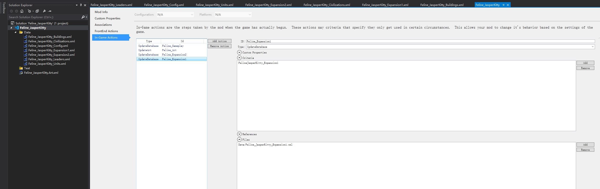
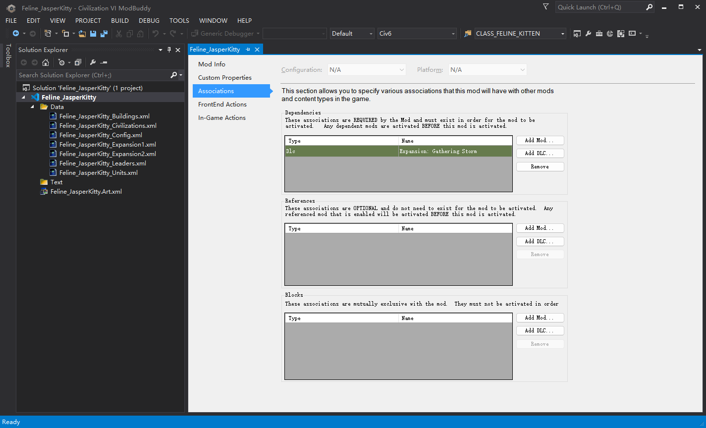
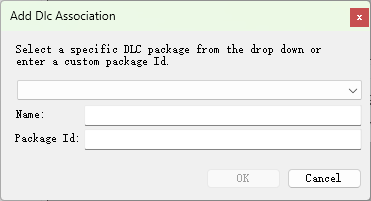
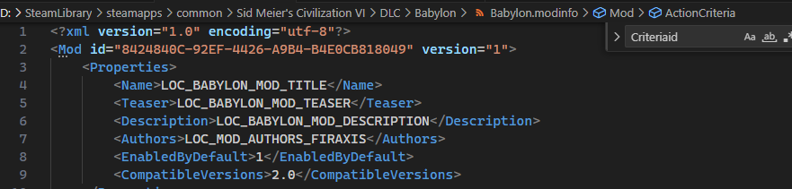
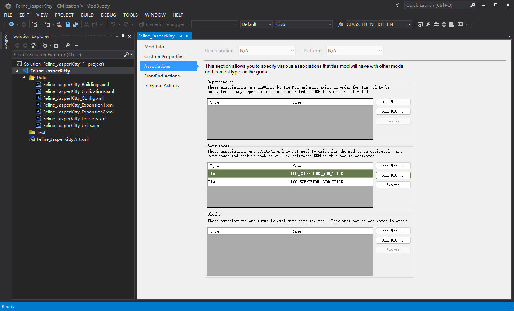

# 小优妮的文明6模组笔记

## 05 配置环境兼容性

至今为止，我们都在为风云变幻规则集编写我们的新模组。但这个模组的内容非常简单，除了特色建筑的忠诚度效果在标准规则集中并不存在以外，其它内容都可以在标准规则集游戏中正常工作。因此，到了这一步，我们的确可以开始思考使其在标准规则集下工作了。除了官方的规则集，有时候我们还希望它与其它模组也能够互相兼容，而这些问题都能在本章得到解答。

我们的目标是让这个模组能够兼容标准规则、迭起兴衰和风云变幻规则集。我们面临的关键问题有两个：

1. 标准规则集下没有忠诚度机制，因此我们必须调整猫砂盆建筑，使其固定产出4点文化，而不再产生忠诚度方面的效果。
2. 在标准规则集中，猫咪单位升级到游骑兵。但在风云变幻规则集中，我们希望它升级到散兵。

要解决这两个问题，第一步是确保游戏仅在某个规则集下才接收一部分指令（例如，为猫砂盆附挂一个增加忠诚度的效果）。这个过程是通过动作准则（action criteria）实现的，此前我们已经介绍过`LeaderPlayable`类型准则的效果。现在，我们要引入一个新的准则类型——`RuleSetInUse`，也即本局游戏正在使用的规则集。

```xml
    <ActionCriteriaData><![CDATA[<ActionCriteria><Criteria id="FelineJasperKitty"><LeaderPlayable>Players:StandardPlayers::LEADER_JASPER_KITTY,StandardPlayers::LEADER_JASPER_KITTY,Players:Expansion1_Players::LEADER_JASPER_KITTY,Players:Expansion2_Players::LEADER_JASPER_KITTY</LeaderPlayable><RuleSetInUse>RULESET_STANDARD,RULESET_EXPANSION_1,RULESET_EXPANSION_2</RuleSetInUse></Criteria><Criteria id="FelineJasperKitty_Expansion1"><LeaderPlayable>Players:Expansion1_Players::LEADER_JASPER_KITTY</LeaderPlayable><RuleSetInUse>RULESET_EXPANSION_1</RuleSetInUse></Criteria><Criteria id="FelineJasperKitty_Expansion2"><LeaderPlayable>Players:Expansion2_Players::LEADER_JASPER_KITTY</LeaderPlayable><RuleSetInUse>RULESET_EXPANSION_2</RuleSetInUse></Criteria></ActionCriteria>]]></ActionCriteriaData>
```

唔呃，真是一团怪物！还是先格式化它，让它好看懂一些吧。

```xml
<ActionCriteria>
    <Criteria id="FelineJasperKitty">
        <LeaderPlayable>Players:StandardPlayers::LEADER_JASPER_KITTY,StandardPlayers::LEADER_JASPER_KITTY,Players:Expansion1_Players::LEADER_JASPER_KITTY,Players:Expansion2_Players::LEADER_JASPER_KITTY</LeaderPlayable>
        <RuleSetInUse>RULESET_STANDARD,RULESET_EXPANSION_1,RULESET_EXPANSION_2</RuleSetInUse>
    </Criteria>
    <Criteria id="FelineJasperKitty_Expansion1">
        <LeaderPlayable>Players:Expansion1_Players::LEADER_JASPER_KITTY</LeaderPlayable>
        <RuleSetInUse>RULESET_EXPANSION_1</RuleSetInUse>
    </Criteria>
    <Criteria id="FelineJasperKitty_Expansion2">
        <LeaderPlayable>Players:Expansion2_Players::LEADER_JASPER_KITTY</LeaderPlayable>
        <RuleSetInUse>RULESET_EXPANSION_2</RuleSetInUse>
    </Criteria>
</ActionCriteria>
```

在此处，我们定义了三个准则：在任何情况下都会加载的`FelineJasperKitty`、仅在迭起兴衰规则集加载的`FelineJasperKitty_Expansion1`、仅在风云变幻规则集加载的`FelineJasperKitty_Expansion2`。

>**笔记笔记**：大于等于1
>
>在本例中，你也可以只创建一个准则，令其同时对XP1和XP2生效。一切取决于你的实际需求！
>
>```xml
><Criteria id="FelineJasperKitty_Expansion1AndBeyond"><LeaderPlayable>Players:Expansion1_Players::LEADER_JASPER_KITTY,Players:Expansion2_Players::LEADER_JASPER_KITTY</LeaderPlayable><RuleSetInUse>RULESET_EXPANSION_1,RULESET_EXPANSION_2</RuleSetInUse></Criteria>
>```

>**笔记笔记**：其它类型的准则
>
>`ModInUse`：某个模组/DLC启用时。具体参数是对应模组的GUID，例如9DE86512-DE1A-400D-8C0A-AB46EBBF76B9（大哥伦比亚玛雅包）。
>
>`ConfigurationValueMatches`：某个游戏设置开启时。最常见于游戏模式。
>
>`GameCoreInUse`：某个游戏核心DLL启用时。与`RuleSetInUse`的区别在于部分游戏场景，例如黑死病场景不属于风云变幻规则集，却使用风云变幻游戏核心。

>**最佳实践**：确定你的准则
>
>让你的模组文件仅在需要时加载，可以增强它的兼容性，也是社区礼节的一部分。尽量不要为其它模组添麻烦哦。

返回我们的工程文件，我们还需要为两个资料片配置不同的数据库指令，以及相对应的对局内动作（因为只有独立的动作才能被单独配置其准则）。



如何添加这些文件，我们不再赘述。接下来，我们重点观察要在游戏数值里做些什么。

资料片数值的加载应该在标准规则之后。对于侦察兵的升级单位问题，上一章节中我们保留了原版数值，因此我们只需要在`Expansion2.xml`中，额外增加将其升级单位改为散兵的数据库指令。其形式如下：

```xml
	<UnitUpgrades>
		<Update>
			<Where Unit="UNIT_FELINE_KITTEN"/>
			<Set>
				<UpgradeUnit>UNIT_SKIRMISHER</UpgradeUnit>
			</Set>
		</Update>
	</UnitUpgrades>
```

指令的字面意思是：在`UnitUpgrades`表中，更新所有`Unit`字段为`UNIT_FELINE_KITTEN`的的条目，使其`UpgradeUnit`改为`UNIT_SKIRMISHER`。显然符合条件的条目只有一条。

>**笔记笔记**：多选
>
>在例如`Building_YieldChanges`的表中，符合条件的条目则可能有多条。例如，某个建筑可能既提供信仰值，也提供科技值。这种情况下需要在`Where`后面填写更多信息，来使你的改动正确地覆盖在需要覆盖的数据上。

>**笔记笔记**：重写条目
>
>除了`Update`指令，还可以使用`Replace`指令彻底重写一条已在数据库中的条目，或者使用`Delete`指令删除符合条件的条目。

而此时，猫砂盆建筑的情况则更加复杂。原因有二，一是它的效果文本有所改变，因此需要为不同规则集指定不同的文本（我们可以设置：标准规则集下，效果描述为`LOC_BUILDING_LITTER_BOX_DESCRIPTION`；两个资料片规则集下，效果描述为`LOC_BUILDING_LITTER_BOX_DESCRIPTION_XP`）；二是之前我们把忠诚度相关的效果写在了在所有情况下加载，现在需要将它移动到仅在资料片激活时生效。

为此，我们需要调整`Buildings.xml`，将之前写的`BuildingModifiers`、`Modifiers`、`ModifierArguments`全部移到`Expansion1.xml``Expansion2.xml`文件，并在最前者中修改文化值产出为4：

`Buildings.xml`：

```xml
<?xml version="1.0" encoding="utf-8"?>
<GameData>
	<Types>
		<Row Type="BUILDING_LITTER_BOX" Kind="KIND_BUILDING" />
	</Types>
	<Buildings>
		<Row BuildingType="BUILDING_LITTER_BOX" Name="LOC_BUILDING_LITTER_BOX_NAME" Description="LOC_BUILDING_LITTER_BOX_DESCRIPTION" PrereqDistrict="DISTRICT_CITY_CENTER"  PurchaseYield="YIELD_GOLD" Cost="60" TraitType="TRAIT_CIVILIZATION_BUILDING_LITTER_BOX" AdvisorType="ADVISOR_CULTURE"/>
	</Buildings>
	<BuildingReplaces>
		<Row CivUniqueBuildingType="BUILDING_LITTER_BOX" ReplacesBuildingType="BUILDING_MONUMENT"/>
	</BuildingReplaces>
	<Building_YieldChanges>
		<Row BuildingType="BUILDING_LITTER_BOX" YieldType="YIELD_CULTURE" YieldChange="4"/>
	</Building_YieldChanges>
</GameData>
```

两个资料片 XML ：

```xml
	<Buildings>
		<Update>
			<Where BuildingType="BUILDING_LITTER_BOX" />
			<Set>
				<Description>LOC_BUILDING_LITTER_BOX_DESCRIPTION_XP</Description>
			</Set>
		</Update>
	</Buildings>
	<Building_YieldChanges>
		<Update>
			<Where BuildingType="BUILDING_LITTER_BOX" YieldType="YIELD_CULTURE"/>
			<Set>
				<YieldChange>2</YieldChange>
			</Set>
		</Update>
	</Building_YieldChanges>
	<BuildingModifiers>
		<Row BuildingType="BUILDING_LITTER_BOX" ModifierId="LITTER_BOX_LOYALTY"/>
		<Row BuildingType="BUILDING_LITTER_BOX" ModifierId="LITTER_BOX_CULTURE_AT_FULL_LOYALTY"/>
	</BuildingModifiers>
	<Modifiers>
		<Row>
			<ModifierId>LITTER_BOX_LOYALTY</ModifierId>
			<ModifierType>MODIFIER_SINGLE_CITY_ADJUST_IDENTITY_PER_TURN</ModifierType>
		</Row>
		<Row>
			<ModifierId>LITTER_BOX_CULTURE_AT_FULL_LOYALTY</ModifierId>
			<ModifierType>MODIFIER_SINGLE_CITY_ADJUST_YIELD_CHANGE</ModifierType>
			<SubjectRequirementSetId>MONUMENT_FULL_LOYALTY_REQUIREMENTS</SubjectRequirementSetId>
		</Row>
	</Modifiers>
	<ModifierArguments>
		<Row>
			<ModifierId>LITTER_BOX_LOYALTY</ModifierId>
			<Name>Amount</Name>
			<Value>2</Value>
		</Row>
		<Row>
			<ModifierId>LITTER_BOX_CULTURE_AT_FULL_LOYALTY</ModifierId>
			<Name>Amount</Name>
			<Value>2</Value>
		</Row>
		<Row>
			<ModifierId>LITTER_BOX_CULTURE_AT_FULL_LOYALTY</ModifierId>
			<Name>YieldType</Name>
			<Value>YIELD_CULTURE</Value>
		</Row>
	</ModifierArguments>
```

到这一步，我们已经配置了作品在标准规则集和迭起兴衰规则集的数值。但此时如果你切换到这两个规则集，则无法找到我们新写的领袖，我们需要在`Config.xml`中定义不同规则集的情况。尤其注意，猫砂盆建筑的描述在不同资料片中是不同的！由于进入游戏前后的文本在不同的环境内（分别在前端（FrontEnd）环境和对局内（InGame）环境），我们需要分别指定它们的调整。后者在刚才通过`Update`指令调整过，而前端环境则需要重新定义。经过这番改造，你的`Config.xml`会形如这样：

```xml
<?xml version="1.0" encoding="utf-8"?>
<GameData>
	<Players>
		<Row>
			<CivilizationType>CIVILIZATION_FELINE</CivilizationType>
			<LeaderType>LEADER_JASPER_KITTY</LeaderType>
			<CivilizationName>LOC_CIVILIZATION_FELINE_NAME</CivilizationName>
			<CivilizationIcon>ICON_CIVILIZATION_FELINE</CivilizationIcon>
			<LeaderName>LOC_LEADER_JASPER_KITTY_NAME</LeaderName>
			<LeaderIcon>ICON_LEADER_JASPER_KITTY</LeaderIcon>
			<CivilizationAbilityName>LOC_TRAIT_CIVILIZATION_FELINE_NAME</CivilizationAbilityName>
			<CivilizationAbilityDescription>LOC_TRAIT_CIVILIZATION_FELINE_DESCRIPTION</CivilizationAbilityDescription>
			<CivilizationAbilityIcon>ICON_CIVILIZATION_FELINE</CivilizationAbilityIcon>
			<LeaderAbilityName>LOC_TRAIT_LEADER_JASPER_KITTY_NAME</LeaderAbilityName>
			<LeaderAbilityDescription>LOC_TRAIT_LEADER_JASPER_KITTY_DESCRIPTION</LeaderAbilityDescription>
			<LeaderAbilityIcon>ICON_LEADER_JASPER_KITTY</LeaderAbilityIcon>
			<Portrait>LEADER_JASPER_KITTY_NEUTRAL</Portrait>
		</Row>
		<Row>
			<Domain>Players:Expansion1_Players</Domain>
			<CivilizationType>CIVILIZATION_FELINE</CivilizationType>
			<LeaderType>LEADER_JASPER_KITTY</LeaderType>
			<CivilizationName>LOC_CIVILIZATION_FELINE_NAME</CivilizationName>
			<CivilizationIcon>ICON_CIVILIZATION_FELINE</CivilizationIcon>
			<LeaderName>LOC_LEADER_JASPER_KITTY_NAME</LeaderName>
			<LeaderIcon>ICON_LEADER_JASPER_KITTY</LeaderIcon>
			<CivilizationAbilityName>LOC_TRAIT_CIVILIZATION_FELINE_NAME</CivilizationAbilityName>
			<CivilizationAbilityDescription>LOC_TRAIT_CIVILIZATION_FELINE_DESCRIPTION</CivilizationAbilityDescription>
			<CivilizationAbilityIcon>ICON_CIVILIZATION_FELINE</CivilizationAbilityIcon>
			<LeaderAbilityName>LOC_TRAIT_LEADER_JASPER_KITTY_NAME</LeaderAbilityName>
			<LeaderAbilityDescription>LOC_TRAIT_LEADER_JASPER_KITTY_DESCRIPTION</LeaderAbilityDescription>
			<LeaderAbilityIcon>ICON_LEADER_JASPER_KITTY</LeaderAbilityIcon>
			<Portrait>LEADER_JASPER_KITTY_NEUTRAL</Portrait>
		</Row>
		<Row>
			<Domain>Players:Expansion2_Players</Domain>
			<CivilizationType>CIVILIZATION_FELINE</CivilizationType>
			<LeaderType>LEADER_JASPER_KITTY</LeaderType>
			<CivilizationName>LOC_CIVILIZATION_FELINE_NAME</CivilizationName>
			<CivilizationIcon>ICON_CIVILIZATION_FELINE</CivilizationIcon>
			<LeaderName>LOC_LEADER_JASPER_KITTY_NAME</LeaderName>
			<LeaderIcon>ICON_LEADER_JASPER_KITTY</LeaderIcon>
			<CivilizationAbilityName>LOC_TRAIT_CIVILIZATION_FELINE_NAME</CivilizationAbilityName>
			<CivilizationAbilityDescription>LOC_TRAIT_CIVILIZATION_FELINE_DESCRIPTION</CivilizationAbilityDescription>
			<CivilizationAbilityIcon>ICON_CIVILIZATION_FELINE</CivilizationAbilityIcon>
			<LeaderAbilityName>LOC_TRAIT_LEADER_JASPER_KITTY_NAME</LeaderAbilityName>
			<LeaderAbilityDescription>LOC_TRAIT_LEADER_JASPER_KITTY_DESCRIPTION</LeaderAbilityDescription>
			<LeaderAbilityIcon>ICON_LEADER_JASPER_KITTY</LeaderAbilityIcon>
			<Portrait>LEADER_JASPER_KITTY_NEUTRAL</Portrait>
		</Row>
	</Players>
	<PlayerItems>
		<Row>
			<CivilizationType>CIVILIZATION_FELINE</CivilizationType>
			<LeaderType>LEADER_JASPER_KITTY</LeaderType>
			<Type>UNIT_FELINE_KITTEN</Type>
			<Name>LOC_UNIT_FELINE_KITTEN_NAME</Name>
			<Description>LOC_UNIT_FELINE_KITTEN_DESCRIPTION</Description>
			<Icon>ICON_UNIT_FELINE_KITTEN</Icon>
			<SortIndex>8</SortIndex>
		</Row>
		<Row>
			<CivilizationType>CIVILIZATION_FELINE</CivilizationType>
			<LeaderType>LEADER_JASPER_KITTY</LeaderType>
			<Type>BUILDING_LITTER_BOX</Type>
			<Name>LOC_BUILDING_LITTER_BOX_NAME</Name>
			<Description>LOC_BUILDING_LITTER_BOX_DESCRIPTION</Description>
			<Icon>ICON_BUILDING_LITTER_BOX</Icon>
			<SortIndex>10</SortIndex>
		</Row>
		<Row>
			<Domain>Players:Expansion1_Players</Domain>
			<CivilizationType>CIVILIZATION_FELINE</CivilizationType>
			<LeaderType>LEADER_JASPER_KITTY</LeaderType>
			<Type>UNIT_FELINE_KITTEN</Type>
			<Name>LOC_UNIT_FELINE_KITTEN_NAME</Name>
			<Description>LOC_UNIT_FELINE_KITTEN_DESCRIPTION</Description>
			<Icon>ICON_UNIT_FELINE_KITTEN</Icon>
			<SortIndex>8</SortIndex>
		</Row>
		<Row>
			<Domain>Players:Expansion1_Players</Domain>
			<CivilizationType>CIVILIZATION_FELINE</CivilizationType>
			<LeaderType>LEADER_JASPER_KITTY</LeaderType>
			<Type>BUILDING_LITTER_BOX</Type>
			<Name>LOC_BUILDING_LITTER_BOX_NAME</Name>
			<Description>LOC_BUILDING_LITTER_BOX_DESCRIPTION_XP</Description>
			<Icon>ICON_BUILDING_LITTER_BOX</Icon>
			<SortIndex>10</SortIndex>
		</Row>
		<Row>
			<Domain>Players:Expansion2_Players</Domain>
			<CivilizationType>CIVILIZATION_FELINE</CivilizationType>
			<LeaderType>LEADER_JASPER_KITTY</LeaderType>
			<Type>UNIT_FELINE_KITTEN</Type>
			<Name>LOC_UNIT_FELINE_KITTEN_NAME</Name>
			<Description>LOC_UNIT_FELINE_KITTEN_DESCRIPTION</Description>
			<Icon>ICON_UNIT_FELINE_KITTEN</Icon>
			<SortIndex>8</SortIndex>
		</Row>
		<Row>
			<Domain>Players:Expansion2_Players</Domain>
			<CivilizationType>CIVILIZATION_FELINE</CivilizationType>
			<LeaderType>LEADER_JASPER_KITTY</LeaderType>
			<Type>BUILDING_LITTER_BOX</Type>
			<Name>LOC_BUILDING_LITTER_BOX_NAME</Name>
			<Description>LOC_BUILDING_LITTER_BOX_DESCRIPTION_XP</Description>
			<Icon>ICON_BUILDING_LITTER_BOX</Icon>
			<SortIndex>10</SortIndex>
		</Row>
	</PlayerItems>
</GameData>
```

看起来很长，但大部分内容你已熟悉过，所以别担心！此时，你可以生成你的项目，查看它在不同规则集中是否都能正常工作。

但我们还有最后一件事情没有完成：我们在初创这个项目的时候，要求它依赖于风云变幻资料片。现在这个限制已经不再合适了。

启动项目属性，也就是我们此前配置加载动作的地方，然后选择关联（Association）选项卡。



在关联选项卡中，可以配置本模组的加载顺序和依赖情况。

>**小心脚下**：关于LoadOrder
>
>其它人可能建议你使用LoadOrder动作属性来调整某个文件加载的顺序，但这个属性仅适合用来处理项目内文件的冲突。如果你要确保某项内容一定在某个其它模组**之后**加载，你应当使用模组关联设置。如果加载顺序存在可能的冲突，后来者有责任声明自己在其它已知的模组之后加载。如果你的作品发布得比对方晚，无法保证对方能对自己的模组做出正确的改动，则你应该声明自己在它之后加载，并手工模拟出前者应当对你完成的改动。

`Dependencies`选项卡内定义的是本作品的**依赖项**。模组一定会在其依赖项之后加载，且如果依赖项没有启用，本模组也无法启用。

`References`选项卡内定义的是本作品的**参考项**。模组一定会在其参考项之后加载，但如果参考项没有启用，本模组也将继续正常工作。

`Blocks`选项卡定义的是本作品的**阻止项**。模组无法与任何一个阻止项同时启动。

现在，我们的模组在两个资料片中有额外的动作，但在没有资料片的环境下也能继续在标准规则集工作。因此，我们需要将两个资料片定义为参考项，而不是依赖项。

单击`References`选项卡中的`Add DLC...`按钮，即可看到以下界面。从下拉列表中分别选择两个资料片。由于ModBuddy的问题，它提供的`Name`并不正确，因此其他人在游戏界面中只能看到英文字样。我们需要自己修改它。打开对应资料片的modinfo文件，从文件的开头几行找到`Name`，然后把具体值填入。



>**笔记笔记**：不在列表的DLC
>
>对于不在列表中的DLC，则需打开对应DLC的modinfo文件，从中寻找这个DLC的名字和包ID。如下图所示，巴比伦DLC的名字为`LOC_BABYLON_MOD_TITLE`，ID为`8424840C-92EF-4426-A9B4-B4E0CB818049`。
>
>

>**笔记笔记**：依赖模组的名称
>
>其它模组的名称不存在于游戏原始文件中。由于Firaxis在此处犯了个傻，你的模组内定义的本地化变量无法在关联项这一部分中读取，因此如果这个未启用的模组你没有安装，就无法显示对应的本地化变量。建议改为填写其名字的英文版本。

完成后，你的关联选项卡界面看起来会像这样：



至此，你已完成了本领袖的所有游戏数值配置。生成你的作品，简单地玩一局，看看它的效果是否正常吧！当然，相信你更加迫不及待地想填补目前仍然缺失的文本和美术。我们很快就能提到它们了！