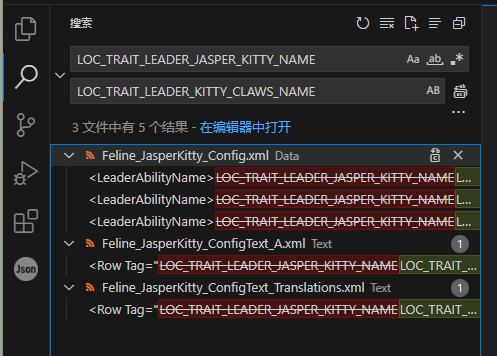

# 小优妮的文明6模组笔记

## 06 文本与本地化

我们的新文明和领袖已经备妥特性，但现在所有特性内容都还没有写成文字——如果就这么放着，久而久之连自己都会忘记它们的效果，不是吗？这也是为什么我们需要编写游戏内文本。与此同时，既然游戏本身支持多种语言，我们也有必要让我们的文本能以多种语言呈现。在先前的教程中，我们已经一定程度上见过何为本地化变量——用以转变成不同语言版本的文本的变量。但是为了让我们的变量真正被赋予我们需要的文字，我们需要编写文本文件。

让我们重新打开我们的工程文件。这次我们要在工程中新建一个文件夹，并建立足足6个XML文件。


哇，6个！他们的作用分别如下：

名字带有`ConfigText`的两个文件，和`Config.xml`一样，用于游戏开局之前（这部分游戏界面也称为“前端界面”（frontend））就需要的文本内容。和后者的区别在于，这些文字往往在游戏局内同样被需要，因此在我们执行对局内（In-game）的更新文本（`UpdateText`）动作的时候，也要加上这些文件。

名字中只有`Text`的两个文件，仅在对局内加载。

名字带有`PackageText`的两个文件则最为特殊——他们即便在这个模组没有启用的时候也会加载到前端界面！很神奇，对吧？我们稍后会介绍如何让它们生效。

从另一个角度解析这些文件的名字。

`A.xml`存放的是英语文本。为什么是`A`？这是为了让使用了你没有编写对应的文本的其它语言的玩家（比如，法语、西班牙语）能够看到你准备的英语文本。如果你编写了英语文本，则最好应该像这样单独放置。

`Translations.xml`，顾名思义，则是其它语言的内容。

>**小道消息**：可恶的版本更新
>
>文明6在发售后一段时间才登陆Epic游戏商店。在上架Epic商店之前，文明6游戏数据库内维护了一个语言回落顺序表，使得某一种语言缺失的时候，系统会根据这个顺序表自动往下选择语言。在上架Epic商店以后，由于不同商店的语言API不同，Firaxis重写了本地化支持功能，从那以后在语言文件缺失时游戏只会优先挑选文件名靠前的文件里面的文本。

>**小心脚下**：字体加载
>
>使用西文语言（官方命名为“英法意德西”（EFIGS），但其实也包括其它使用拉丁字母的波兰语、葡萄牙语和使用西里尔字母的俄语）进行游戏时，游戏不会加载中日韩越统一表意文字（CJKV Unified Ideographs）的字体。这意味着**汉字和其它许许多多特殊字符在西文语言玩家眼中只会显示成方框中的叉号**，因为他们没有加载所需的字体！

建立文件后，我们打开项目属性，让我们的模组加载这些文本文件。从前端动作（FrontEnd Actions）开始（忘记该如何做时，请参见我们过去的章节）。这次我们新建一个`Feline_ConfigText`动作，动作类型更新文本（`UpdateText`），然后加入两个文件。就像这样：


然后是对局内动作，就像这样：


好奇的人可能会问：我们是否要为不同资料片下使用的不同文本分别设置动作准则呢？可以这么做，但一般不如此做。更常见的做法是，将文本写在同一个文件内，但赋予不同的本地化变量，并在游戏数据库中使用`Update`语句选用适合的那一条本地化变量（而非Update同一格变量的文本内容）。这样做也更加便于查错。

我们保存项目并关闭，因为再下一步内容ModBuddy并不支持。用文本编辑器打开工程文件，开始调整我们的`PackageText`。

在文件中，你可以找到这样的几行内容（其中两个`Guid`是随机生成的，一般不要手动改动它）：

```xml
    <Name>My Custom Mod</Name>
    <Guid>88c1f270-7aed-4ed8-a844-0274426e8b0c</Guid>
    <ProjectGuid>ff067c02-5923-4f11-9fd7-bbc538a809f8</ProjectGuid>
    <ModVersion>1</ModVersion>
    <Teaser>This is a brief description of the mod.</Teaser>
    <Description>This is a brief description of the mod.</Description>
    <Authors>（用户名）</Authors>
```

其中，`Name`、`Teaser`、`Description`、`Authors`四项将是我们会需要进行本地化的内容：模组的名字、鼠标停在模组上时的提示文字、点开后显示的详细描述，以及模组作者。

和之前的其它需要本地化文本的地方一样，我们把它改写成本地化文本，使其变成这样：

```xml
    <Name>LOC_FELINE_JASPER_KITTY_MOD_TITLE</Name>
    <Guid>88c1f270-7aed-4ed8-a844-0274426e8b0c</Guid>
    <ProjectGuid>ff067c02-5923-4f11-9fd7-bbc538a809f8</ProjectGuid>
    <ModVersion>1</ModVersion>
    <Teaser>LOC_FELINE_JASPER_KITTY_MOD_TEASER</Teaser>
    <Description>LOC_FELINE_JASPER_KITTY_MOD_DESCRIPTION</Description>
    <Authors>LOC_FELINE_JASPER_KITTY_MOD_AUTHORS</Authors>
```

然后，我们在`InGameActionData`和`FrontEndActionData`之间，加入一行`LocalizedTextData`：

```xml
    <LocalizedTextData><![CDATA[<LocalizedText><File>Text/Feline_JasperKitty_PackageText_A.xml</File><File>Text/Feline_JasperKitty_PackageText_Translations.xml</File></LocalizedText>]]></LocalizedTextData>
```

和之前两个动作的写法一样，同样是一种CDATA。其中包含了我们刚刚创建的两个`PackageText`。完成后，你的工程文件看起来会像这样：


我们保存退出。

现在我们就可以在`PackageText`中填写模组的名字了。这里我们先以英文为例：

`Feline_JasperKitty_PackageText_A.xml`：

```xml
<?xml version="1.0" encoding="utf-8"?>
<GameData>
	<LocalizedText>
		<Row Tag="LOC_FELINE_JASPER_KITTY_MOD_TITLE" Language="en_US">
			<Text>Feline Pack</Text>
		</Row>
		<Row Tag="LOC_FELINE_JASPER_KITTY_MOD_TEASER" Language="en_US">
			<Text>New Civilization and Leader - Jasper Kitty of the Felines</Text>
		</Row>
		<Row Tag="LOC_FELINE_JASPER_KITTY_MOD_DESCRIPTION" Language="en_US">
			<Text>Contains a new civilization and leader.</Text>
		</Row>
		<Row Tag="LOC_FELINE_JASPER_KITTY_MOD_AUTHORS" Language="en_US">
			<Text>Proud Little Yuni</Text>
		</Row>
	</LocalizedText>
</GameData>
```

和之前编写的数据库指令很像，对吧？区别在于这些文本都位于`LocalizedText`表。`Language`字段表示了它的语言，英语是`en_US`，简体中文是`zh_Hans_CN`。

然后是翻译文本。

`Feline_JasperKitty_PackageText_Translations.xml`：

```xml
<?xml version="1.0" encoding="utf-8"?>
<GameData>
	<LocalizedText>
		<Row Tag="LOC_FELINE_JASPER_KITTY_MOD_TITLE" Language="zh_Hans_CN">
			<Text>猫猫族包</Text>
		</Row>
		<Row Tag="LOC_FELINE_JASPER_KITTY_MOD_TEASER" Language="zh_Hans_CN">
			<Text>新文明和领袖——猫猫族的猫咪贾斯伯</Text>
		</Row>
		<Row Tag="LOC_FELINE_JASPER_KITTY_MOD_DESCRIPTION" Language="zh_Hans_CN">
			<Text>包含1个新文明和领袖。</Text>
		</Row>
		<Row Tag="LOC_FELINE_JASPER_KITTY_MOD_AUTHORS" Language="zh_Hans_CN">
			<Text>自豪的小优妮</Text>
		</Row>
	</LocalizedText>
</GameData>
```

接下来要做的这一步工作，与其使用ModBuddy，更适合使用现代的文本编辑器完成。我们以Visual Studio Code为例，使用它打开工程文件夹，就像这样：


还记得多文件查找的基本操作吗？这次我们需要在所有.xml文件中搜索`LOC_`——如此我们就可以知道我们有哪些东西要补充完成！其中，Config.xml中的本地化变量，自然需要在`ConfigText`中记录。剩下的本地化变量，则可以写到`Text`的两个文件中。

此时，你可能会注意到：我们之前为前端配置的领袖特性名称是`LOC_TRAIT_LEADER_JASPER_KITTY_NAME`，但对局内设置的却是`LOC_TRAIT_LEADER_KITTY_CLAWS_NAME`——前者是我们还没有做出领袖特性设置的时候留作占位的变量名。从理论上讲，让它们保持不同是没有问题，但现在处于减少混乱，是时候让它们的内容保持一致了。实际上，一开始就不设置两个不同的本地化变量是更好的选择，不过我们既然在教程开始的时候做出了这个分歧，那么现在正好向大家展示如何将它们统一起来。对了，千万要小心——本地化变量也不能重复定义。如果你在日志中发现UNIQUE constraint failed错误，记得删掉你多写的重复条目。

一种方式是替换本地化变量。我们希望领袖特性的名字的本地化变量全部保持为`LOC_TRAIT_LEADER_KITTY_CLAWS_NAME`。因此我们搜索全部的`LOC_TRAIT_LEADER_JASPER_KITTY_NAME`，并将其替换为`LOC_TRAIT_LEADER_KITTY_CLAWS_NAME`。



全部替换将会立即对所有涉及文件实施替换，并且不可撤销，因此千万不要写错了。点击替换栏右侧的全部替换按钮。对领袖特性的描述和文明特性的名字、描述我们也做类似操作，使其统一为`LOC_TRAIT_LEADER_KITTY_CLAWS_DESCRIPTION`、`LOC_TRAIT_CIVILIZATION_CAT_LIKE_REFLEXES_NAME`以及`LOC_TRAIT_CIVILIZATION_CAT_LIKE_REFLEXES_DESCRIPTION`。在模组制作过程中，发生这样的差错是难免的。与其谨小慎微不敢写下代码，掌握在开发过程中及时修正流程中留下的不一致的方法更为重要。

>**笔记笔记**：另一种方式
>
>另一种方式是引用相关文本。虽然不推荐在现在使用，但它也有用武之地。它类似这样：
>
>```xml
>		<Row Tag="LOC_TRAIT_LEADER_KITTY_CLAWS_NAME" Language="zh_Hans_CN">
>			<Text>{LOC_TRAIT_LEADER_JASPER_KITTY_NAME}</Text>
>		</Row>
>```
>
>大括号表示引用这个本地化变量的文本。在这个例子中，这也就意味着让两个本地化变量的内容变得一致。无论如何，一般而言，不要将相同的内容分别写在不同的本地化变量中，否则后续修改时很容易遗漏。

修正本地化变量中潜在的风险因素之后，我们再介绍几个在编写时会使用到的特殊做法吧。

1. 使用形如`[ICON_Science]`的写法，可以在文本中加入大小合适的小图标。例如，`[ICON_Science]`就表示科技值图标。在文明6的文本规范中，无论是汉语还是英语，图标都放置在其文本前。例如：`[ICON_Science] 科技值`。可使用的图标可以参考游戏官方文本的写法，你也可以自行将22×22分辨率的图标定义为文本中图标（我们将在将来介绍如何添加我们自己的图标）。
2. 使用`[NEWLINE]`可以换行。如果需要连续换行两次，在两段文本间插入一个空行的话，可以直接写`[NEWLINE][NEWLINE]`。
3. 部分修正支持将其数值传递给本地化引擎，可以使用形如`{1_Amount}`的写法承接。不过，具体写法高度依赖于每一条修正的自身特性，因此能用上这个功能的地方不多。此外有些文本内容会随着对象的性、数和格发生变化（英语中，性几乎不复存在，格仅剩人称代词遗留宾格，数也只分单数和复数，但偶尔仍要考虑），这时则写为形如这种格式：`{1_Num : plural 1?tile; other?tiles;}`（英语：数量为1时，显示tile；其他时候，显示为tiles），以根据引擎传来的参数调整文本。对于单词变形更加复杂的语言，敬请参阅官方文本文件中的写法。
4. 使用`[颜色]`或者`[COLOR:颜色图册名]`和`[ENDCOLOR]`可以指定区间内的文本颜色。务必在上色结束的地方写有`[ENDCOLOR]`，以免颜色混乱。可使用的颜色可以在官方文件的`Base\Assets\UI\Colors\Colors.xml`，颜色图册名可以在`Base\Assets\UI\Civ6_ColorAtlas.xml`查找。举例：`[COLOR_GREEN]绿色文本[ENDCOLOR]`。
5. 

空谈就到这里，现在填写文本。我们不会在这份文字教程中一句一句地编写所有文本，如有需要参考自己是否缺了什么东西，可以翻看我们一并提供的参考工程文件——啊，特别需要指出的是，我们先前的草稿中的文本并非正式文本，可不要直接复制粘贴，建议你先自行尝试编写正式的文本，再看看参考工程中的写法。而当你初步掌握了文字的基础添加方法之后，接下来要了解的是当你自己给自己的模组编写文本内容的时候，应当注意的事项。

>**最佳实践**：文本编写
>
>1. 保持术语准确。在编写文本时多参照官方的写法，确保同一个游戏概念保持一致的说法。例如：科技值（Science）、单元格（tile）。有些术语在官方的简体中文版中翻译是错误的，这时则需要灵活考虑。例如：“特色区域”（Specialty District，可译为“专业化区域”或“专职区域”）、“帝国”（Empire，游戏内概念，官方在苏格兰等文明中错写为“王国”）。
>2. 注意文本风格。遵循游戏的文本范式，不要在游戏属性的描述内容中加入过多风味文本。许多虚构角色作品经常增加过多且编写糟糕的风味文本（说你呢，二次元）。此外，比起使用“其中X为……”（where X is...）的说法，不妨使用“数额等于……”（equal to...）。
>3. 注意字符，尤其是西文文本。全角（汉语）符号在西文语言下无法正常显示。

好，现在笔者可以假装你已经写完了文本。参考答案就请你自行查阅咯。恭喜！现在要做的是进入游戏测试你新写的文本是否符合你的预期，以及做好进入下一步的准备：我们会开始接触基础的美术素材添加流程。如果到这一步你还没有失去耐心的话，还有更多让我们的这个领袖/文明变得丰满的要素，例如颜色、议程、AI倾向、城市名、人名和地名、百科词条和引言、加载台词、外交文本、忠诚度图标、音乐和领袖语音……