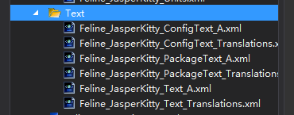
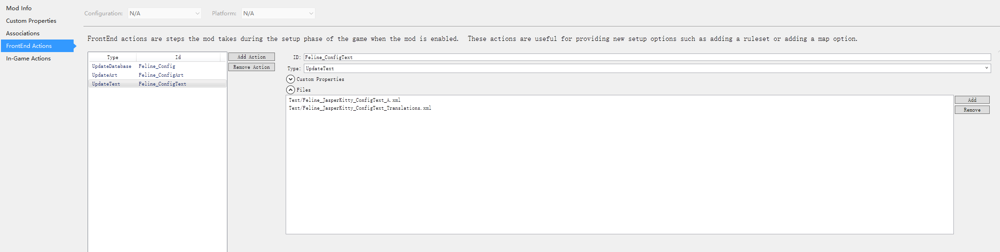
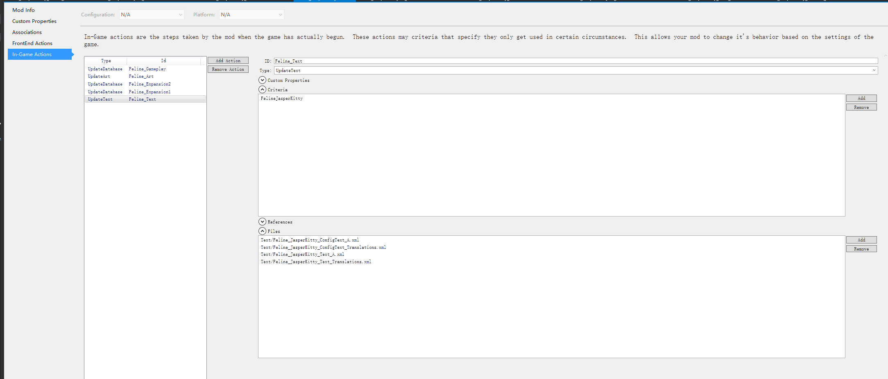
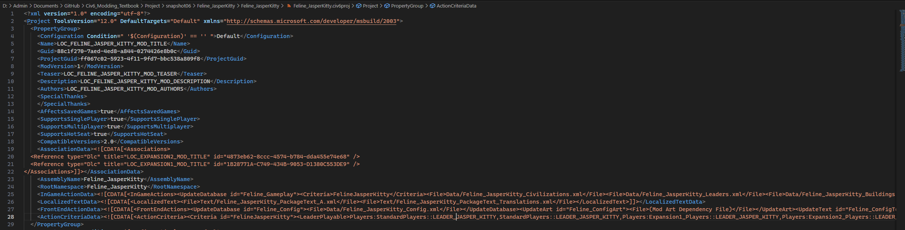
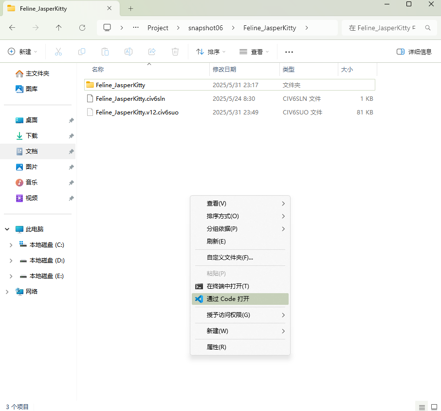

# 小优妮的文明6模组笔记

## 06 文本与本地化

我们的新文明和领袖已经备妥特性，但现在所有特性内容都还没有写成文字——如果就这么放着，久而久之连自己都会忘记它们的效果，不是吗？这也是为什么我们需要编写游戏内文本。与此同时，既然游戏本身支持多种语言，我们也有必要让我们的文本能以多种语言呈现。在先前的教程中，我们已经一定程度上见过何为本地化变量——用以转变成不同语言版本的文本的变量。但是为了让我们的变量真正被赋予我们需要的文字，我们需要编写文本文件。

让我们重新打开我们的工程文件。这次我们要在工程中新建一个文件夹，并建立足足6个XML文件。



哇，6个！他们的作用分别如下：

名字带有`ConfigText`的两个文件，和`Config.xml`一样，用于游戏开局之前（这部分游戏界面也称为“前端界面”（frontend））就需要的文本内容。和后者的区别在于，这些文字往往在游戏局内同样被需要，因此在我们执行对局内（In-game）的更新文本（`UpdateText`）动作的时候，也要加上这些文件。

名字中只有`Text`的两个文件，仅在对局内加载。

名字带有`PackageText`的两个文件则最为特殊——他们即便在这个模组没有启用的时候也会加载到前端界面！很神奇，对吧？我们稍后会介绍如何让它们生效。

从另一个角度解析这些文件的名字。

`A.xml`存放的是英语文本。为什么是`A`？这是为了让使用了你没有编写对应的文本的其它语言的玩家（比如，法语、西班牙语）能够看到你准备的英语文本。如果你编写了英语文本，则最好应该像这样单独放置。

`Translations.xml`，顾名思义，则是其它语言的内容。

>**小道消息**：可恶的版本更新
>
>文明6在发售后一段时间才登陆Epic游戏商店。在上架Epic商店之前，文明6游戏数据库内维护了一个语言回落顺序表，使得某一种语言缺失的时候，系统会根据这个顺序表自动往下选择语言。在上架Epic商店以后，由于不同商店的语言API不同，Firaxis重写了本地化支持功能，从那以后在语言文件缺失时游戏只会优先挑选文件名靠前的文件里面的文本。

>**小心脚下**：字体加载
>
>使用西文语言（官方命名为“英法意德西”（EFIGS），但其实也包括其它使用拉丁字母的波兰语、葡萄牙语和使用西里尔字母的俄语）进行游戏时，游戏不会加载中日韩越统一表意文字（CJKV Unified Ideographs）的字体。这意味着**汉字和其它许许多多特殊字符在西文语言玩家眼中只会显示成方框中的叉号**，因为他们没有加载所需的字体！

建立文件后，我们打开项目属性，让我们的模组加载这些文本文件。从前端动作（FrontEnd Actions）开始（忘记该如何做时，请参见我们过去的章节）。这次我们新建一个`Feline_ConfigText`动作，动作类型更新文本（`UpdateText`），然后加入两个文件。就像这样：



然后是对局内动作，就像这样：



好奇的人可能会问：我们是否要为不同资料片下使用的不同文本分别设置动作准则呢？可以这么做，但一般不如此做。更常见的做法是，将文本写在同一个文件内，但赋予不同的本地化变量，并在游戏数据库中使用`Update`语句选用适合的那一条本地化变量（而非Update同一格变量的文本内容）。这样做也更加便于查错。

我们保存项目并关闭，因为再下一步内容ModBuddy并不支持。用文本编辑器打开工程文件，开始调整我们的`PackageText`。

在文件中，你可以找到这样的几行内容（其中两个`Guid`是随机生成的，一般不要手动改动它）：

```xml
    <Name>My Custom Mod</Name>
    <Guid>88c1f270-7aed-4ed8-a844-0274426e8b0c</Guid>
    <ProjectGuid>ff067c02-5923-4f11-9fd7-bbc538a809f8</ProjectGuid>
    <ModVersion>1</ModVersion>
    <Teaser>This is a brief description of the mod.</Teaser>
    <Description>This is a brief description of the mod.</Description>
    <Authors>（用户名）</Authors>
```

其中，`Name`、`Teaser`、`Description`、`Authors`四项将是我们会需要进行本地化的内容：模组的名字、鼠标停在模组上时的提示文字、点开后显示的详细描述，以及模组作者。

和之前的其它需要本地化文本的地方一样，我们把它改写成本地化文本，使其变成这样：

```xml
    <Name>LOC_FELINE_JASPER_KITTY_MOD_TITLE</Name>
    <Guid>88c1f270-7aed-4ed8-a844-0274426e8b0c</Guid>
    <ProjectGuid>ff067c02-5923-4f11-9fd7-bbc538a809f8</ProjectGuid>
    <ModVersion>1</ModVersion>
    <Teaser>LOC_FELINE_JASPER_KITTY_MOD_TEASER</Teaser>
    <Description>LOC_FELINE_JASPER_KITTY_MOD_DESCRIPTION</Description>
    <Authors>LOC_FELINE_JASPER_KITTY_MOD_AUTHORS</Authors>
```

然后，我们在`InGameActionData`和`FrontEndActionData`之间，加入一行`LocalizedTextData`：

```xml
    <LocalizedTextData><![CDATA[<LocalizedText><File>Text/Feline_JasperKitty_PackageText_A.xml</File><File>Text/Feline_JasperKitty_PackageText_Translations.xml</File></LocalizedText>]]></LocalizedTextData>
```

和之前两个动作的写法一样，同样是一种CDATA。其中包含了我们刚刚创建的两个`PackageText`。完成后，你的工程文件看起来会像这样：



我们保存退出。

现在我们就可以在`PackageText`中填写模组的名字了。这里我们先以英文为例：

`Feline_JasperKitty_PackageText_A.xml`：

```xml
<?xml version="1.0" encoding="utf-8"?>
<GameData>
	<LocalizedText>
		<Row Tag="LOC_FELINE_JASPER_KITTY_MOD_TITLE" Language="en_US">
			<Text>Feline Pack</Text>
		</Row>
		<Row Tag="LOC_FELINE_JASPER_KITTY_MOD_TEASER" Language="en_US">
			<Text>New Civilization and Leader - Jasper Kitty of the Felines</Text>
		</Row>
		<Row Tag="LOC_FELINE_JASPER_KITTY_MOD_DESCRIPTION" Language="en_US">
			<Text>Contains a new civilization and leader.</Text>
		</Row>
		<Row Tag="LOC_FELINE_JASPER_KITTY_MOD_AUTHORS" Language="en_US">
			<Text>Proud Little Yuni</Text>
		</Row>
	</LocalizedText>
</GameData>
```

和之前编写的数据库指令很像，对吧？区别在于这些文本都位于`LocalizedText`表。`Language`字段表示了它的语言，英语是`en_US`，简体中文是`zh_Hans_CN`。

然后是翻译文本。

`Feline_JasperKitty_PackageText_Translations.xml`：

```xml
<?xml version="1.0" encoding="utf-8"?>
<GameData>
	<LocalizedText>
		<Row Tag="LOC_FELINE_JASPER_KITTY_MOD_TITLE" Language="zh_Hans_CN">
			<Text>猫猫族包</Text>
		</Row>
		<Row Tag="LOC_FELINE_JASPER_KITTY_MOD_TEASER" Language="zh_Hans_CN">
			<Text>新文明和领袖——猫猫族的猫咪贾斯伯</Text>
		</Row>
		<Row Tag="LOC_FELINE_JASPER_KITTY_MOD_DESCRIPTION" Language="zh_Hans_CN">
			<Text>包含1个新文明和领袖。</Text>
		</Row>
		<Row Tag="LOC_FELINE_JASPER_KITTY_MOD_AUTHORS" Language="zh_Hans_CN">
			<Text>自豪的小优妮</Text>
		</Row>
	</LocalizedText>
</GameData>
```

接下来要做的这一步工作，与其使用ModBuddy，更适合使用现代的文本编辑器完成。我们以Visual Studio Code为例，使用它打开工程文件夹，就像这样：



还记得多文件查找的基本操作吗？这次我们需要在所有.xml文件中搜索`LOC_`——如此我们就可以知道我们有哪些东西要补充完成！其中，Config.xml中的本地化变量，自然需要在`ConfigText`中记录。剩下的本地化变量，则可以写到`Text`的两个文件中。

（要点：文本中的图标、引用其它本地化变量）