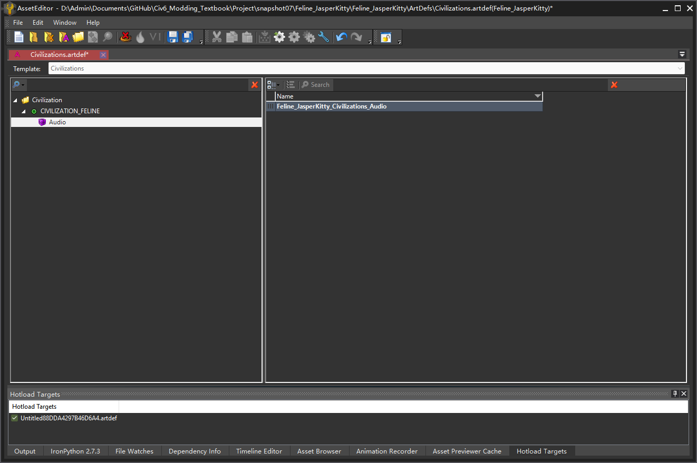

# 小优妮的文明6模组笔记

## 07 美术配置初步：第一个图标

在先前的章节中，我们已经介绍过更新美术动作——前端动作`Feline_ConfigArt`和对局内动作`Feline_Art`，它们都加载了“模组美术依赖文件”（Mod Art Dependency File——实际上它就是大多数mod中存在的`.dep`文件）但目前为止，我们还没有定义或者导入任何图标。在本章中，我们将要涉足美术配置，包括如何导入美术文件，以及如何配置它们。我们很快就能开始导入第一批图标进入游戏，但在那之前，我们要先从美术依赖文件（.dep）以及它所要引用的美术定义文件（`.ArtDef`）以及XLP文件。

>**小道消息**：什么是XLP？
>
>尽管许多模组好手都会告诉你XLP文件是导入素材到游戏的基础，但是XLP这个缩写具体代表什么则似乎不可考。ModBuddy会将XLP文件和美术素材打包为BLP文件，我们只能猜测B指的是Binary——二进制（不以人类易读形式存储）。

要开始美术配置的旅途，必不可少却常常令人恼怒的工具是Firaxis提供的素材编辑器（Asset Editor）。许多老玩家都积累了上千字的对它以及其开发者的辱骂文案，但很遗憾它仍然是我们最好的帮手，而且没有之一。在ModBuddy中找到“工具”（TOOLS），然后选择“运行素材编辑器…”（Launch Asset Editor...）。注意，如果你此前没有配置好正确的开发素材包位置，你可能无法启动它。


素材编辑器可以用来编辑美术依赖文件（`.dep`）的前身——以`.art.xml`为后缀的美术指定文件（art specification document）（以后我们也会称作Art.xml文件）、美术定义文件（`.ArtDef`，以后我们也称作ArtDef文件）以及XLP文件，以及其它被导入到工程文件中的素材。我们将要做的事情原则上看非常简单——只是先加入几个图标而已，但如果你在此前已经初步了解过怎么把图标导入进工程里的XLP文件的话，此时你会发现你的图标并未被放入生成的模组成品中！

这是文明6美术配置的第一个怪癖：如果你没有配置任何`.ArtDef`文件，那么所有美术都不会生成成品。好吧，看来我们还是从`.ArtDef`开始。鉴于我们生成的模组是一个文明/领袖，我们不妨从配置与文明配置相关的`Civilizations.artdef`开始。

从工具栏中选择“新建”按钮（左起第一个），然后选择“ArtDef”。


这样就建立了一个空的美术定义文件，如图所示。


建立一个美术定义文件之后，第一件要做的事情是选择它的模板（Template）。在保存的时候，非常建议将其文件名设为和其模板一致。


选中之后，现在即可保存。路径设置为你的模组工程文件下的ArtDefs文件夹。


然后，我们右击左侧面板的Civilization目录，右键选择“添加元素”（Add Element）。


选择新生成的元素，在右侧面板中将元素命名为你的文明内部变量名，此处也即`CIVILIZATION_FELINE`。选择`Audio`子项，右键新建元素。此时你会看到这样的画面。



但这是个bug——如果子项的内容是空的，新建的元素只显示出第一列。我们点击左侧面板上的任何一个其它节点，然后重新选中`Audio`。

将我们创建的第一个元素的`Name`改为`Entry`，`XrefName`改为`England`，保存。

下一步，我们打开官方的美术素材包，在里面寻找`Civ6\pantry\Civ6.Art.xml`。打开它，然后搜索`Civilizations.artdef`。


文件中一共出现了5个结果，说明官方将`Civilizations.artdef`的内容应用到了5个素材用户（`consumer`）中：它们分别是：`Landmarks`、`Civilizations`、`Cultures`、`WorldView_Translate`以及`Audio`。

>**笔记笔记**：查找所需的素材用户项
>
>自行填写每个美术定义文件需要应用到哪些素材用户中常常极为痛苦。因此，我们应该尽量参考官方做好的配置。除了`Civ6\pantry\Civ6.Art.xml`，`Civ6\DLC\`目录下的四个DLC内容的美术依赖文件也可以用来参考。在找不到可参考的地方的情况下，还可以参考其他人写好的作品。当你在Art.xml中搜索某个artdef时，只需要向上几行，便可知道它所在的素材用户。如图所示，这表示`Civilizations.artdef`需要存在于`Landmarks`素材用户中。
>
>

因此，我们依葫芦画瓢。

回到素材编辑器。选择左起第五个图标，“打开现有的美术指定文件”（Open an existing art specification document）。找到你的工程文件中的`Mod工程名.art.xml`。


结果如下。


从左侧的“素材用户”（Art Consumers）列表中，选中`Landmarks`。


然后点击`ArtDefs`右侧的白色按钮（实际上它是`Add...`，但因为bug难以看清文字），选择我们之前保存的`Civilizations.artdef`。

对我们需要调整的另外四个素材用户做同样的操作，然后保存。

你会看到这样一个警告。它提醒说，这些改动需要重启素材编辑器生效。我们稍后就会如此做，现在点击确定，暂时无视它。


所有的美术定义文件（ArtDef）都会属于一个或多个素材用户（art consumer）。与之对应的，所有的XLP文件都会属于一个素材库（Library）。很快我们就会开始新建XLP文件并在`art.xml`中引用它们。下一个需要注意的项目是依赖（Dependencies）。这是文明6的美术素材编辑系统的第二个怪癖：无论你的模组支持哪一个规则集什么时候，你都应当在制作时选择Expansion2。但是，在生成的成品中，除非你的模组只能在风云变幻资料片下运行，否则又应该无论何时都保持成品不依赖任何内容，否则它将在没有资料片的情况下不显示任何美术。在你预备发布你的作品的时候，需要手动修改生成完成的`.dep`文件。万幸的是，这个文件在搭建完成模组的基本框架之后就不需要再改动，因此可以备份一份，每次生成完成后粘贴一遍——或者更好的办法是使用版本控制系统保持它在调好的状态。

>**笔记笔记**：清除美术依赖
>
>制作时必须依赖，做好了必须不依赖，文明6的美术系统就是这么令人疯狂。前往游戏的本地模组文件夹（`文档\My Games\Sid Meier's Civilization VI\Mods\`），找到你新生成的成品模组，然后打开它的`.dep`文件
>
>
>
>然后将
>
>```xml
>	<RequiredGameArtIDs>
>		<Element>
>			<name text="Expansion2"/>
>			<id text="b1b63999-6b16-4dd2-a5b6-eb19794aa8ca"/>
>		</Element>
>	</RequiredGameArtIDs>
>```
>
>替换为
>
>```xml
>	<RequiredGameArtIDs/>
>```
>
>保存。如果你希望你的作品在没有风云变幻资料片时也能工作，务必在作品发布前修复你的`.dep`文件。

在开始导入图标之前，先生成你的作品，进入游戏建立第一座城市。如果此时你能听到英国的背景音乐，那么说明你到这一步为止的配置已经成功，接下来我们正式进入图标导入。

>**小道消息**：关于音乐……
>
>是的，在刚才的操作中，我们通过在`Civilizations.artdef`中定义了文明的`Audio`属性来引用了游戏官方的文明音乐。如果你打算引用游戏内其它文明的音乐（越南和葡萄牙除外，无法直接引用葡萄牙和越南的文明音乐），都可以使用这个办法。
>
>这种方法的缺点是无法导入更多自己的音乐，且不影响领袖外交面板的背景音乐（外交面板音乐通过`Leaders.artdef`，但它又和加载过程中的语音绑定。由于官方音频配置的问题，加载语音（官方称作 Dawn of Man 语音）的实现极其困难且不同模组无法相互兼容，一种有希望实现的兼容手段也必须重写加载界面）。
>
>若你要导入自己的音乐，则应该回过头来删除刚才我们在`Audio`下建立的`Entry`元素（选择`Entry`，然后点击工具栏上的按钮，如图所示——要在素材编辑器中删除元素时，点击右键不一定可行，选中后点击工具栏按钮更容易成功），然后遵循为模组添加自定义音乐的步骤。
>
>

导入图片的第一步显然是要有图片。我们在这里先不详述如何制作这些美术素材，你可以在其他人的教程中学到这部分知识。当你完成某一款图标的制作之后，将其保存为PNG格式。如果你暂时没有图标，我们在素材文件夹中准备了一部分供你尝试的图标。不同的游戏内元素需要准备图标的不同分辨率版本，举例：领袖头像需要这几个大小（长宽一致）：32、45、48、50、55、64、80、256。

>**小心脚下**：留有余量
>
>尽量要让你的美术素材保留一个高分辨率版本。尽管文明图标看似最大只需要256×256大小，实际上你需要一张512大小的图标用来制作其他素材！


>**笔记笔记**：图像格式
>
>文明6只支持DirectX纹理（DDS）格式。DDS格式有多种制式，难以自行处理。所幸，素材编辑器可以导入PNG格式的图片，并帮助我们处理完剩下的工作。

>**小道消息**：不打包的图像格式
>
>贴图不一定需要打包为BLP也能够被游戏读取（只需要在模组中放入DDS图像）。然而，定义图标也会更加麻烦。如今，几乎没有模组还使用这种方式。

纯图片素材通常需要被导入到XLP中。是时候启动素材编辑器，新建我们的第一个DDS。从工具栏中选择“新建”按钮（左起第一个），然后选择“XLP”。

界面如此：


下一步，我们将其配置为图标。为此，最好能够参照某一个现成的模板。如果你没有一个适合学习的样板，现在应该打开官方素材包中的文件——Icons.xlp。从命令栏中选择左起第三个图标打开一个XLP文件，然后找到素材包`\Civ6\pantry\XLPs\Icons.xlp`。

>**笔记笔记**：万变不离其宗
>
>绝大多数模组需要配置的美术定义文件（`.ArtDef`）以及XLP文件都高度相似。完成一次之后，便可以作为模板供你以后的作品参考。别忘了`Art.xml`！

>**笔记笔记**：别人家的东西
>
>如果你打开的XLP或者ArtDef不属于你现有的工程，素材编辑器将会以只读模式打开它。

你看到的界面会像这样：


我们的要点在于上半部分。


我们也正在配置图标，因此需要将包名（Package Name）和XLP类（XLP Class）配置逐一复制到我们新建的XLP中。下方的多选框，只需选中Windows即可。这可以让你的模组不需要配备双份重复的美术素材。macOS玩家可以在获得模组后将文件内的Windows字样全部替换为MacOS使其正常工作。由于几乎没有任何人使用macOS玩游戏，几乎没有必要为这一小群人牺牲其它平台的广大玩家。无论设置为何，素材编辑器最多只会生成两个版本的BLP包，非Windows玩家都必须做相同的处理，才能正常运行所有模组。完成后，你的素材编辑器看起来会像这样。


将它保存到工程文件的XLPs文件夹，命名为Icons.xlp。下一步是仿照我们之前在ArtDef中学过的手法，在Art.xml中配置新的XLP。图标需要放在`UITexture`库（library）中。注意到，我们添加新做的XLP之后，它显示为包名（UI/Icons），而非`Icons.xlp`，如图所示。


保存退出再重新打开素材编辑器，然后回到你的XLP文件。接下来我们需要处理的是“条目”（Entries）选项卡，也即界面中部的内容。从5个图标中选择第2个，也即“添加新项目”（Add New），然后选择“添加源文件...”（Add Source File...）。选择你要导入的图片。我们的截图中提供有对本作品的其它美术素材的剧透，但我们先选择领袖头像和文明头像吧。此步完成后，界面如下。


在“导出类”（Exporting Class）中选择`UserInterface`（别管另一个选项了，从来没有用到过），然后点击“应用到选择项”（Apply to Selected）。这样，准备导入的所有素材都会被设置为这一类。


点击“导入”（Import），然后保存。


XLP的部分的配置到此为止，最后一块拼图在ModBuddy中——图标定义的数据库指令。

在Data目录下新建一个新的XML文件：Feline_JasperKitty_Icons.xml，文件内容如下：

```xml
<?xml version="1.0" encoding="utf-8"?>
<GameData>
	<IconTextureAtlases>
		<Row Filename="Feline256" IconsPerColumn="1" IconsPerRow="1" IconSize="256" Name="ICON_ATLAS_FELINE"/>
		<Row Filename="Feline128" IconsPerColumn="1" IconsPerRow="1" IconSize="128" Name="ICON_ATLAS_FELINE"/>
		<Row Filename="Feline80" IconsPerColumn="1" IconsPerRow="1" IconSize="80" Name="ICON_ATLAS_FELINE"/>
		<Row Filename="Feline64" IconsPerColumn="1" IconsPerRow="1" IconSize="64" Name="ICON_ATLAS_FELINE"/>
		<Row Filename="Feline50" IconsPerColumn="1" IconsPerRow="1" IconSize="50" Name="ICON_ATLAS_FELINE"/>
		<Row Filename="Feline48" IconsPerColumn="1" IconsPerRow="1" IconSize="48" Name="ICON_ATLAS_FELINE"/>
		<Row Filename="Feline45" IconsPerColumn="1" IconsPerRow="1" IconSize="45" Name="ICON_ATLAS_FELINE"/>
		<Row Filename="Feline44" IconsPerColumn="1" IconsPerRow="1" IconSize="44" Name="ICON_ATLAS_FELINE"/>
		<Row Filename="Feline36" IconsPerColumn="1" IconsPerRow="1" IconSize="36" Name="ICON_ATLAS_FELINE"/>
		<Row Filename="Feline32" IconsPerColumn="1" IconsPerRow="1" IconSize="32" Name="ICON_ATLAS_FELINE"/>
		<Row Filename="Feline30" IconsPerColumn="1" IconsPerRow="1" IconSize="30" Name="ICON_ATLAS_FELINE"/>
		<Row Filename="Feline22" IconsPerColumn="1" IconsPerRow="1" IconSize="22" Name="ICON_ATLAS_FELINE"/>
		<Row Filename="JasperKitty32" IconsPerColumn="1" IconsPerRow="1" IconSize="32" Name="ICON_ATLAS_JASPER_KITTY"/>
		<Row Filename="JasperKitty45" IconsPerColumn="1" IconsPerRow="1" IconSize="45" Name="ICON_ATLAS_JASPER_KITTY"/>
		<Row Filename="JasperKitty48" IconsPerColumn="1" IconsPerRow="1" IconSize="48" Name="ICON_ATLAS_JASPER_KITTY"/>
		<Row Filename="JasperKitty50" IconsPerColumn="1" IconsPerRow="1" IconSize="50" Name="ICON_ATLAS_JASPER_KITTY"/>
		<Row Filename="JasperKitty55" IconsPerColumn="1" IconsPerRow="1" IconSize="55" Name="ICON_ATLAS_JASPER_KITTY"/>
		<Row Filename="JasperKitty64" IconsPerColumn="1" IconsPerRow="1" IconSize="64" Name="ICON_ATLAS_JASPER_KITTY"/>
		<Row Filename="JasperKitty80" IconsPerColumn="1" IconsPerRow="1" IconSize="80" Name="ICON_ATLAS_JASPER_KITTY"/>
		<Row Filename="JasperKitty256" IconsPerColumn="1" IconsPerRow="1" IconSize="256" Name="ICON_ATLAS_JASPER_KITTY"/>
	</IconTextureAtlases>
	<IconDefinitions>
		<Row Name="ICON_CIVILIZATION_FELINE" Atlas="ICON_ATLAS_FELINE" Index="0"/>
		<Row Name="ICON_LEADER_JASPER_KITTY" Atlas="ICON_ATLAS_JASPER_KITTY" Index="0"/>
	</IconDefinitions>
</GameData>
```

我们来解读一下这份文件。第一个表，`IconTextureAtlases`，将我们导入游戏中的图标整理成图册（Atlases，单数Atlas）。第二个表`IconDefinitions`，定义了图表需要从哪一个图册的哪一部分截取。

图册的意义，一是在于可以组合一张图像的多个分辨率版本，这样这么多分辨率的图标都可以用“使用`ICON_ATLAS_FELINE`图册”一言蔽之。这是不言自明的。第二个意义则需要理解：用来切割一张图像文件中的多个图标。这是依靠每列图标数`IconsPerColumn`、每行图标数`IconsPerRow`、图标大小`IconSize`，以及第二个表`IconDefinitions`中的编号`Index`字段实现的。

在我们现在的版本中，`Feline256`是一张256×256大小的图像，而所需的图像切块刚好就是这么大。因此它被“切分”为：每256×256一块（`IconSize="256"`）、每行每列各切成一块（`IconsPerColumn="1" IconsPerRow="1"`）。

如果我们同时要做四个文明，则可以导入一张256×1024的图，规定`IconsPerColumn="1" IconsPerRow="4"`，或者512×512的图（`IconsPerColumn="2" IconsPerRow="2"`）。这时候，`IconDefinitions`中的`Index`字段就能派上用场了。它将这些被切分的图块编号，方式是从左到右，填满后换行，从上到下。这么说可能不太好理解，用图来解释吧！图上的数字即是`Index`的序号。

`IconsPerColumn="4" IconsPerRow="1"`：


`IconsPerColumn="1" IconsPerRow="4"`：


`IconsPerColumn="2" IconsPerRow="2"`：


打开项目属性，回到我们熟悉的两个动作选项卡，这次我们需要增加的是更新图标（UpdateIcons）动作。完成效果如下，请自行尝试完成吧。


大部分图标的导入方式都是以这种方式导入的，例如单位建筑和改良的图标，抑或是单位的肖像等，我们在此处不再赘述如何导入图标，单纯导入游戏内已有的图标以加深大家对图册机制和`Index`的理解，大家可以参照其它制作良好且开源的模组作品或官方文件学习：

```xml
	<IconDefinitions>
		<Row Name="ICON_BUILDING_LITTER_BOX" Atlas="ICON_ATLAS_BUILDINGS" Index="0"/>
		<Row Name="ICON_BUILDING_LITTER_BOX_FOW" Atlas="ICON_ATLAS_BUILDINGS_FOW" Index="0"/>
		<Row Name="ICON_UNIT_FELINE_KITTEN" Atlas="ICON_ATLAS_UNITS" Index="19"/>
		<Row Name="ICON_UNIT_FELINE_KITTEN_FOW" Atlas="ICON_ATLAS_UNITS_FOW" Index="19"/>
		<Row Name="ICON_UNIT_FELINE_KITTEN_PORTRAIT" Atlas="ICON_ATLAS_UNIT_PORTRAITS" Index="17"/>
	</IconDefinitions>
</GameData>
```

官方文件中建筑和单位均有战争迷雾版（FOW）图标（实际上几乎没有用到，但如果可以，最好也预留一个位置），单位还有肖像（Portrait）。

生成你的项目并测试吧，如果你成功了，此时领袖选择面板会像这样，加载界面也会看到你的图标。如果没有成功，记得检查下有没有把UpdateIcons动作类型写错了：


恭喜！不过显而易见，前路还很漫长。基础知识完成后，我们将继续完善这个作品。下一步，我们将会介绍游戏的颜色系统。嗯，还有领袖肖像（立绘）！