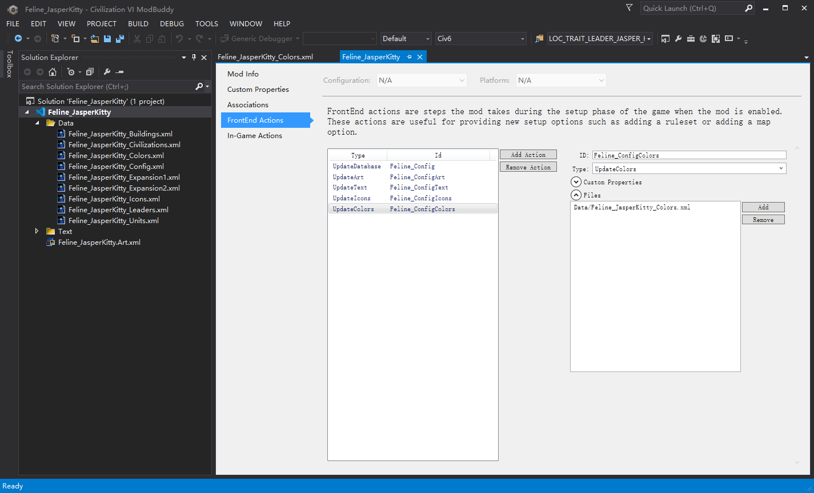
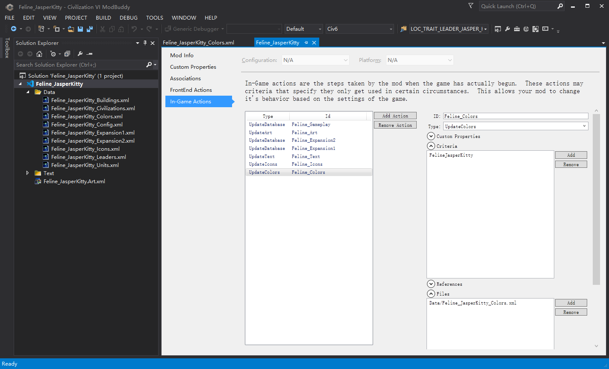

# 小优妮的文明6模组笔记

## 07 美术配置：第二节

接下来我们还将继续完善我们的美术素材。先前我们已经介绍过如何制作新的ArtDef和XLP文件，并在Art.xml中令它们被游戏使用，现在我们需要建立一批ArtDef和XLP文件，我们很快就会用得上它们。

## ArtDef：

除非另有说明，所有ArtDef文件使用的模板（Template）均与文件名相同。

Buildings.artdef：指定建筑使用的模型。如果你制作了新的建筑模型，需要在Landmarks.artdef中先行建立模型组件，然后在这里引用。

Cultures.artdef：指定单位和建筑的人种和地区风格。

FallbackLeaders.artdef：指定2D领袖肖像（如果动态领袖设置为关闭或者没有定义3D领袖，则使用这个肖像）（Template：`LeaderFallback`）

Leaders.artdef：指定领袖的基础信息及其3D领袖模型。

Overlay.artdef：配置叠加层，主要是忠诚度相关的图标（加载这些美术素材都不会导致问题，可以放心加入）。

StrategicView.artdef：配置战略视图使用的美术。

Units.artdef：配置单位造型及文明的单位配色。

## XLP：

### LeaderFallbacks.xlp：用于导入2D领袖肖像。

包名（Package Name）：`LeaderFallbacks`

XLP类（XLP Class）：`LeaderFallback`

### Shell_Loading.xlp：用于加载界面背景。

Package Name：`UI/Shell_Loading`

XLP Class：`UITexture`

### UI_LeaderScenes.xlp：用于外交界面背景。

Package Name：`UI_LeaderScenes`

XLP Class：`UITexture`

### UI_PrideMoments.xlp：用于时代得分图像（无论是否有资料片，加载这些美术素材都不会导致问题，可以放心加入）。

Package Name：`UI/PrideMoments`

XLP Class：`UITexture`

### UILeaders.xlp：用于领袖选择界面的领袖肖像。

Package Name：`UILeaders`

XLP Class：`UITexture`

### UILensModels.xlp：用于UI滤镜使用的模型，例如忠诚度图标等。

Package Name：`UILensAssets`

XLP Class：`UILensAsset`

### StrategicView_UILenses.xlp：用于战略视图下UI滤镜使用的图标素材，例如忠诚度图标等。

Package Name：`strategicview/strategicview_uilenses`

XLP Class：`StrategicView_Sprite`

### Leader_LightRigs.xlp：用于3D领袖的光照效果。

Package Name：`leaders/light_rigs`

XLP Class：`LeaderLighting`

### leader_jasperkitty.xlp：用于3D领袖。命名规则：leader_领袖名字小写。

Package Name：`/leaders/leader_jasperkitty`

XLP Class：`Leader`

## Art.xml：

素材用户（ArtConsumer）：

`WorldView_Translate`：`Buildings.artdef`、`Cultures.artdef`

`StrategicView_Translate`：`Buildings.artdef`

`Units`：`Cultures.artdef`、`Units.artdef`

`Landmarks`：`Cultures.artdef`

`Cultures`：`Cultures.artdef`

`LeaderFallback`：`FallbackLeaders.artdef`

`Audio`：`Leaders.artdef`

`LeaderLighting`：`Leaders.artdef`

`Leaders`：`Leaders.artdef`

`UILensAsset`：`Overlay.artdef`

`Overlay`：`Overlay.artdef`

`StrategicView_Properties`：`StrategicView.artdef`

`StrategicView_Sprite`：`StrategicView.artdef`

`StrategicView_Route`：`StrategicView.artdef`

`StrategicView_TerrainType`：`StrategicView.artdef`

`StrategicView_TerrainBlendCorners`：`StrategicView.artdef`

`StrategicView_TerrainBlend`：`StrategicView.artdef`

素材库（Library）：

`LeaderFallback`：`LeaderFallbacks.xlp`

`UITexture`：`Shell_Loading.xlp`、`UI_LeaderScenes.xlp`、`UI_PrideMoments.xlp`、`UILeaders.xlp`

`UILensAsset`：`UILensModels.xlp`

`StrategicView_Sprite`：`StrategicView_UILenses.xlp`

`LeaderLighting`：`Leader_LightRigs.xlp`

`Leader`：`leader_jasperkitty.xlp`

>**笔记笔记**：领袖语音
>
>要播放领袖语音，你需要制作一个3D领袖，哪怕它是不动的。

>**小心脚下**：素材上限
>
>由于文明6游戏引擎的技术限制，如果游戏导入了过多3D模型，将导致3D引擎运行不正常，游戏内模型会错乱，甚至导致游戏崩溃。请不要毫无节制地加入大量3D模型。

考虑到这是一篇面向文明6模组制作新手的教程，我们正在制作的这个模组不涉及自定义模型（关于如何建立模型，请参阅其它教材），也没有设计特色区域和特色改良设施，制作它们可能需要导入更多的ArtDef和XLP文件。不过不要紧，我们在此前的课程中已经介绍过这种情况下该如何做，因此你只需要寻找一个以往其他人（最好是官方DLC）做过的范例并仿照做即可。

建立以上内容之后，我们还需要增加指定你的文明的颜色的文件。回到ModBuddy，在`\Data\`文件夹下新建`Feline_JasperKitty_Colors.xml`。并在前端动作和对局内动作中新建更新颜色（UpdateColors）动作。

