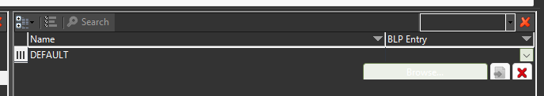

# 小优妮的文明6模组笔记

## 08 美术配置：第二节 基础游戏素材

接下来我们还将继续完善我们的美术素材。先前我们已经介绍过如何制作新的ArtDef和XLP文件，并在Art.xml中令它们被游戏使用，现在我们需要建立一批ArtDef和XLP文件，我们很快就会用得上它们。

## ArtDef：

除非另有说明，所有ArtDef文件使用的模板（Template）均与文件名相同。

Buildings.artdef：指定建筑使用模型的方式。

Landmarks.artdef：引用已有的游戏内元素模型，配置建筑和区域模型的配合，以及不同文化和文明的特色模型。如果要使用自制的模型，需要先导入模型组件，然后在这里引用。

Cultures.artdef：指定单位和建筑的人种和地区风格。

FallbackLeaders.artdef：指定2D领袖肖像（如果动态领袖设置为关闭或者没有定义3D领袖，则使用这个肖像）（Template：`LeaderFallback`）

Leaders.artdef：指定领袖的基础信息及其3D领袖模型。

Overlay.artdef：配置叠加层，主要是忠诚度相关的图标（加载这些美术素材都不会导致问题，可以放心加入）。

StrategicView.artdef：配置战略视图使用的美术。

Units.artdef：配置单位造型及文明的单位配色。

## XLP：

### LeaderFallbacks.xlp：用于导入2D领袖肖像。

包名（Package Name）：`LeaderFallbacks`

XLP类（XLP Class）：`LeaderFallback`

### Shell_Loading.xlp：用于加载界面背景。

Package Name：`UI/Shell_Loading`

XLP Class：`UITexture`

### UI_LeaderScenes.xlp：用于外交界面背景。

Package Name：`UI_LeaderScenes`

XLP Class：`UITexture`

### UI_PrideMoments.xlp：用于时代得分图像（无论是否有资料片，加载这些美术素材都不会导致问题，可以放心加入）。

Package Name：`UI/PrideMoments`

XLP Class：`UITexture`

### UILeaders.xlp：用于领袖选择界面的领袖肖像。

Package Name：`UILeaders`

XLP Class：`UITexture`

### UILensModels.xlp：用于UI滤镜使用的模型，例如忠诚度图标等。

Package Name：`UILensAssets`

XLP Class：`UILensAsset`

### StrategicView_UILenses.xlp：用于战略视图下UI滤镜使用的图标素材，例如忠诚度图标等。

Package Name：`strategicview/strategicview_uilenses`

XLP Class：`StrategicView_Sprite`

### Leader_LightRigs.xlp：用于3D领袖的光照效果。

Package Name：`leaders/light_rigs`

XLP Class：`LeaderLighting`

### leader_jasperkitty.xlp：用于3D领袖。命名规则：leader_领袖名字小写。

Package Name：`/leaders/leader_jasperkitty`

XLP Class：`Leader`

## Art.xml：

素材用户（ArtConsumer）：

`WorldView_Translate`：`Buildings.artdef`、`Landmarks.artdef`、`Cultures.artdef`

`StrategicView_Translate`：`Buildings.artdef`、`Landmarks.artdef`

`Units`：`Cultures.artdef`、`Units.artdef`

`Landmarks`：`Cultures.artdef`、`Landmarks.artdef`

`Cultures`：`Cultures.artdef`

`LeaderFallback`：`FallbackLeaders.artdef`

`Audio`：`Leaders.artdef`、`Landmarks.artdef`

`LeaderLighting`：`Leaders.artdef`

`Leaders`：`Leaders.artdef`

`UILensAsset`：`Overlay.artdef`

`Overlay`：`Overlay.artdef`

`StrategicView_Properties`：`StrategicView.artdef`、`Landmarks.artdef`

`StrategicView_Sprite`：`StrategicView.artdef`、`Landmarks.artdef`

`StrategicView_Route`：`StrategicView.artdef`、`Landmarks.artdef`

`StrategicView_TerrainType`：`StrategicView.artdef`、`Landmarks.artdef`

`StrategicView_TerrainBlendCorners`：`StrategicView.artdef`、`Landmarks.artdef`

`StrategicView_TerrainBlend`：`StrategicView.artdef`、`Landmarks.artdef`

`Units`：`Landmarks.artdef`

`Farms`：`Landmarks.artdef`

`Terrain`：`Landmarks.artdef`

`Terrains`：`Landmarks.artdef`

`Features`：`Landmarks.artdef`

`Resources`：`Landmarks.artdef`

`Improvements`：`Landmarks.artdef`

`VFX`：`Landmarks.artdef`

`IndirectGrid`：`Landmarks.artdef`

`UnitSimulation`：`Landmarks.artdef`

（就你最多事，`Landmarks.artdef`！）

素材库（Library）：

`LeaderFallback`：`LeaderFallbacks.xlp`

`UITexture`：`Shell_Loading.xlp`、`UI_LeaderScenes.xlp`、`UI_PrideMoments.xlp`、`UILeaders.xlp`

`UILensAsset`：`UILensModels.xlp`

`StrategicView_Sprite`：`StrategicView_UILenses.xlp`

`LeaderLighting`：`Leader_LightRigs.xlp`

`Leader`：`leader_jasperkitty.xlp`

>**笔记笔记**：领袖语音
>
>要播放领袖语音，你需要制作一个3D领袖，哪怕它是不动的。

>**小心脚下**：素材上限
>
>由于文明6游戏引擎的技术限制，如果游戏导入了过多3D模型，将导致3D引擎运行不正常，游戏内模型会错乱，甚至导致游戏崩溃。请不要毫无节制地加入大量3D模型。

考虑到这是一篇面向文明6模组制作新手的教程，我们正在制作的这个模组不涉及自定义模型（关于如何建立模型，请参阅其它教材。这些模型还需要在Landmarks、Unit_Bins或者Clutters等ArtDef中定义），也没有设计特色区域和特色改良设施，制作它们可能需要导入更多的ArtDef和XLP文件。不过不要紧，我们在此前的课程中已经介绍过这种情况下该如何做，因此你只需要寻找一个以往其他人（最好是官方DLC）做过的范例并仿照做即可。

建立以上内容之后，我们还需要增加指定你的文明的颜色的文件。回到ModBuddy，在`\Data\`文件夹下新建`Feline_JasperKitty_Colors.xml`。并在前端动作和对局内动作中新建更新颜色（UpdateColors）动作。


现在，我们正式开始配置颜色。第一部分是领袖的颜色，也是在大部分游戏内UI中为玩家上的颜色。非常容易注意到做法：

将注意力放回`Colors.xml`，然后填入类似这样的内容

```xml
	<PlayerColors>
		<Row>
			<Type>LEADER_JASPER_KITTY</Type>
			<Usage>Unique</Usage>
			<PrimaryColor>COLOR_STANDARD_AQUA_LT</PrimaryColor>
			<SecondaryColor>COLOR_STANDARD_WHITE_LT</SecondaryColor>
			<Alt1PrimaryColor>COLOR_STANDARD_WHITE_LT</Alt1PrimaryColor>
			<Alt1SecondaryColor>COLOR_STANDARD_AQUA_LT</Alt1SecondaryColor>
			<Alt2PrimaryColor>COLOR_STANDARD_BLUE_MD</Alt2PrimaryColor>
			<Alt2SecondaryColor>COLOR_STANDARD_WHITE_LT</Alt2SecondaryColor>
			<Alt3PrimaryColor>COLOR_STANDARD_BLUE_MD</Alt3PrimaryColor>
			<Alt3SecondaryColor>COLOR_STANDARD_WHITE_DK</Alt3SecondaryColor>
		</Row>
	</PlayerColors>
```

这将为你的领袖配置四套可替换的颜色。每一套颜色都由一个主要颜色和第二颜色构成，你可以使用两种方式定义领袖的颜色：

1. 使用游戏自带的颜色列表。在能够使用自带的颜色实现设计目的的时候，应当优先使用自带的颜色。可以在`\Base\Assets\UI\Colors\PlayerStandardColors.xml`文件中查阅可使用的颜色清单。

优点：

- 简单方便
- 能够支持游戏内的防撞色功能
- 能够支持色盲辅助色

缺点：

- 选择较有限，不一定能配置出好看的颜色

2. 自定义颜色。在`Colors`表中添加自己定义的其它颜色，然后就可以在`PlayerColors`表中引用。这种方式的优缺点和第一种方法相反，此处不再赘述。

```xml
	<Colors>
		<Row>
			<Type>COLOR_JASPER_KITTY_WHITE_LT</Type>
			<Color>245,245,245,255</Color>
		</Row>
    </Colors>
```

其中，`Color`字段的四个数字分别是RGBA通道的数值，最大值为255。一般Alpha通道（透明度）需要保持为255，另外三个通道的颜色可以自行配置。

第二部分则受到许多人的忽视——单位的颜色。单位的颜色和文明绑定，如果你的文明绑定了多个领袖，则可以选择一个你最喜欢的领袖的颜色作为其颜色组合。使用素材编辑器打开Units.artdef，然后找到UnitTintTypes目录，右键新建元素。将新建的元素取名为你的文明的内部名称，本例中是`CIVILIZATION_FELINE`。

然后，选择其下的`Colors`，同样新建两个元素。名称不重要，点击三点按钮挑选自己需要的颜色。完成后，效果如图所示。


此外，还需要处理的是Cultures.artdef。Cultures.artdef中指定了本文明建筑和单位使用的模型风格，也是配置单位颜色的必要条件。

打开先前创建的Cultures.artdef。它的做法和其他artdef文件不太一样，新建的元素名称应该是风格的类型。风格类型可以参照官方的Cultures.artdef取得，在此我们也展示出来。


其中，UnitCulture可以任选一个；Culture中，三个Ancient可以任选一个，分别代表远古、古典时代的木制、土制和砖制建筑；ModernGlass可以微调现代建筑的风格；剩下的大多数都会在中古时代到启蒙时代生效，可以任选一个；Colonial和RowHouse比较特殊，会微调中古时代建筑的造型，可以按需使用。

选择好想要的城市和单位造型后，把它添加到你的Cultures.artdef中，然后在它们的值（Value）中添加你的文明。如果你无法填入你自己的文明，请检查Civilizations.artdef是否在前一章教程中正确配置。每一个你新填入的选项都要加入你的文明，完成后的效果如图所示。


接下来，生成一次你的项目试试看你的成果吧。大部分文化特色模型都会在此时被应用完毕，但如果你想要一些文明专属的模型，还可以在Landmarks.artdef中进一步配置。


我们继续添加更多内容。这次是领袖肖像——“立绘”。在目前阶段，我们先添加2D的领袖肖像。如果要配置领袖语音，你需要3D领袖肖像，后者将会复杂得多，因此我们也会在以后再提及。将外交界面使用的肖像命名为`FALLBACK_NEUTRAL_JASPER_KITTY`（FALLBACK_NEUTRAL_领袖内部名），其他地方使用的则命名为`LEADER_JASPER_KITTY_NEUTRAL`（LEADER_领袖内部名_NEUTRAL），然后分别导入到`LeaderFallbacks.xlp`和`UILeaders.xlp`中，方法和之前导入其他图标基本相同，区别在于`LeaderFallbacks.xlp`不需要再专门设置导出类（Exporting Class）。

>**最佳实践**：领袖肖像
>
>领袖肖像的大小一般是1024高，不要超过800宽，两侧不留白。在领袖选择界面，这张肖像是左对齐的，因此如果你的角色的正脸在画面右侧，就会出现头在太右边甚至只能显示半个脑袋的情况。尽量不要让这种事情发生。外交界面肖像也可以使用一样大的图像，不过对画面内容的要求没有那么高。当然，你可以给两处肖像用相同的图，只不过需要导入两次就是了。


保存，然后在`FallbackLeaders.artdef`中新建一个元素，命名为`LEADER_JASPER_KITTY`（LEADER_领袖的内部名）。向下打开`Animations`条目，新建一个元素，名字是`DEFAULT`，然后点击BLP条目（BLP Entry），再点击那个新出现的向下箭头，选择“浏览…”（Browse...）（图上最大的那个按钮，文字有时无法正常显示）。



在筛选（Filter）框中填入`FALLBACK_NEUTRAL_JASPER_KITTY`，找到我们新加的那个肖像。


保存并生成项目，确保一切已经工作正常。


继续努力，添加领袖选择加载时的背景和外交界面的背景。加载界面的领袖背景放置在`Shell_Loading.xlp`中，命名为`LEADER_JASPER_KITTY_BACKGROUND`（LEADER_领袖的内部名_BACKGROUND）即可。


不用做其他操作，游戏会自动读取正确的名字。外交背景则需要做两步操作。第一步是回到Leaders.xml中，在`Leaders`表里配置外交背景的层数。找到我们先前写下的定义：

```xml
	<Leaders>
		<Row>
			<LeaderType>LEADER_JASPER_KITTY</LeaderType>
			<Name>LOC_LEADER_JASPER_KITTY_NAME</Name>
			<InheritFrom>LEADER_DEFAULT</InheritFrom>
		</Row>
	</Leaders>
```

增加一行内容，使其变为：

```xml
	<Leaders>
		<Row>
			<LeaderType>LEADER_JASPER_KITTY</LeaderType>
			<Name>LOC_LEADER_JASPER_KITTY_NAME</Name>
			<SceneLayers>4</SceneLayers>
			<InheritFrom>LEADER_DEFAULT</InheritFrom>
		</Row>
	</Leaders>
```

这表示它的外交背景一共有4层。所有官方领袖都使用4层外交背景，其中第四层是固定的`BARBAROSSA_4`，后三层则另有图像。它们将被导入到`UI_LeaderScenes.xlp`中。我们先导入前三层图像，它们的命名必须是*不带*“LEADER_”字样的领袖内部名称加上层数。比如在本例中，最底层到第三层分别是：`JASPER_KITTY_1`、`JASPER_KITTY_2`、`JASPER_KITTY_3`。然后，我们选择条目一栏中的第一个按钮（导入已有项），寻找`BARBAROSSA_4`并导入。


将其条目ID（Entry ID）改为`JASPER_KITTY_4`。


保存，生成项目测试。

再下一步，我们配置特色建筑和特色单位的模型引用。

分别打开`Buildings.artdef`和`Units.artdef`。

特色建筑部分，我们在此引用纪念碑建筑的模型。导入自己的模型以后，配置自己的模型也需要相同的步骤。

在`Buildings.artdef`中的Building目录下新建条目，命名为特色建筑的内部名`BUILDING_LITTER_BOX`，然后从官方Artdef文件中找到`BUILDING_MONUMENT`条目，将其内容复制过来。


（Audio目录为空）

这些参数影响了建筑在游戏内（3D界面和战略视图）的显示方式。接下来是`Landmarks.artdef`，这里的内容要复杂得多。我们需要先在Districts目录下建立建筑所在区域的条目，`DISTRICT_CITY_CENTER`（注意这一条目的参数必须和官方配置一致，否则会影响所有这个区域的正常显示）。


然后从它的`BuildingSets`开始填起。先打开官方的文件参照（文件巨大，多等等）：


在刚才，我们在`Buildings.artdef`配置了一座新的建筑，别忘了保存——这样现在我们便能够在`Landmarks.artdef`的`BuildingSets`中添加那座建筑。注意到官方文件中涉及`MONUMENT`（纪念碑）的建筑组合一共有4组，将他们都复制到我们的`Landmarks.artdef`中，并把`MONUMENT`改为`LITTER_BOX`，对应的条目内的建筑也一样作改动。


然后我们切换到BaseVariant（地基变体），点击Set_HeroBuildings列进行排序，这样我们就可以选出所有和纪念碑有关的地基，作相同做法。


然后再切换到BuildingVariat（建筑变体），按Tag_HeroBuilding排序，选择喜欢的建筑模型并贴上，保存。


市中心地基尤其特殊，它受到运河的影响，因此确实要更加痛苦一些。从这个表中不难看出游戏如何配置模型的选用，并有一个优先级系统在冲突时做出选择。如此这般，我们便终于引用了特色建筑的模型。如果要加入自己的模型，就需要自己制作3D美术的素材（Asset）。将来我们会制作一个相对简单的。

测试你的成果吧。


之后是特色单位，我们给它套用侦察兵的模型。出于教学方便考虑，我们先试用狗狗侦察兵。笔者可以猜到，会有读者询问“那猫咪单位不该使用猫咪侦察兵吗？”这是个好问题！由于这种情形多半涉及版权问题，关于如何引用已经打包好的BLP包中的素材，我们留给读者作为习题。打开之前我们做过些许改动的Units.artdef，同时也打开官方的作为参照。将Units目录下的UNIT_SCOUT复制到你的artdef中，并改名。


这些配置，诸如成员阵型（Formation）、单位战斗模式（UnitCombat）、护送阵型（EscortFormation）、登船时使用的模型（EmbarkedUnit）等，可以根据你的需要自由调整。

Members条目配置了这种单位由哪些模型构成。它们在下方的UnitMemberTypes中被定义，而每个成员模型又进一步由散件构成，这些散件的定义可见于Unit_Bins.artdef。

Audio条目配置了战略视图和部分条件下（例如选中时）播放的音效。由于游戏音频系统的限制，我们很难自行添加正确播放的音效。一部分modder会使用lua脚本补充选中音效，考虑到lua脚本的天地非常广阔且不适合新手，这里我们也留作习题。

完成配置后保存。然后是测试！


好，以上就是本节内容，下一节我们将介绍资料片中额外增加的两组美术素材：忠诚度图标和时代得分图像，并顺便介绍关于3D模型的一些要求。