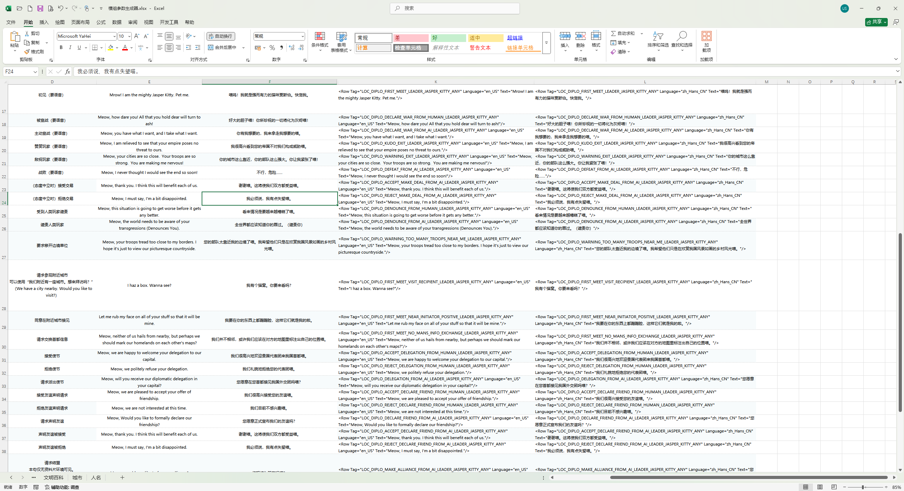
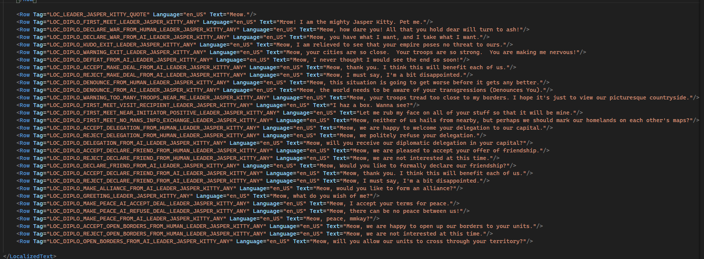
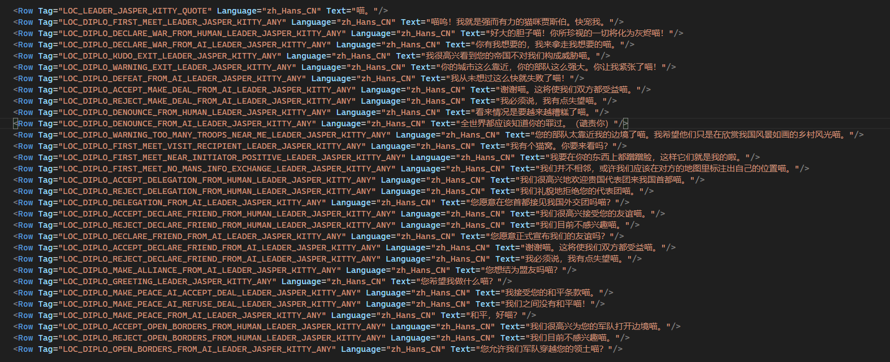
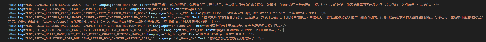

# 小优妮的文明6模组笔记

## 10 完善配置

现在，我们的领袖的配置已经初具雏形。我们拥有了（基本上）能运作的领袖能力，配置了美术文件，但它现在距离完整还有一大段！本章中我们将继续完善文明和领袖的配置。

让我们回到`Leaders.xml`，来为我们的领袖增加议程和AI偏好。既然我们的领袖是只基米，那我们就让它哈哈气！

议程：耄耋 Territorial

喜欢远离自己的文明，敌视与自己相邻的文明。

这是一个与随机议程中的“偏执狂”相似的议程，因此我们接下来还会定义令它不要和这个随机议程同时出现——接着往下看就能看到。

本质上，议程的效果是通过一个新设的特性（Trait）生效的，因此我们首先需要先定义这个特性。

```xml
	<Types>
		<Row Type="TRAIT_AGENDA_TERRITORIAL_CAT" Kind="KIND_TRAIT"/>
	</Types>

	<Traits>
		<Row TraitType="TRAIT_AGENDA_TERRITORIAL_CAT" />
	</Traits>
```

然后我们定义它的效果。


```xml
	<TraitModifiers>
		<Row TraitType="TRAIT_AGENDA_TERRITORIAL_CAT" ModifierId="AGENDA_TERRITORIAL_CAT_NEIGHBORS"/>
		<Row TraitType="TRAIT_AGENDA_TERRITORIAL_CAT" ModifierId="AGENDA_TERRITORIAL_CAT_NOT_NEIGHBORS"/>
	</TraitModifiers>
	<Modifiers>
		<Row>
			<ModifierId>AGENDA_TERRITORIAL_CAT_NEIGHBORS</ModifierId>
			<ModifierType>MODIFIER_PLAYER_DIPLOMACY_SIMPLE_MODIFIER</ModifierType>
			<SubjectRequirementSetId>PLAYERS_ARE_NEIGHBORS</SubjectRequirementSetId>
		</Row>
		<Row>
			<ModifierId>AGENDA_TERRITORIAL_CAT_NOT_NEIGHBORS</ModifierId>
			<ModifierType>MODIFIER_PLAYER_DIPLOMACY_SIMPLE_MODIFIER</ModifierType>
			<SubjectRequirementSetId>PLAYERS_ARE_NOT_NEIGHBORS</SubjectRequirementSetId>
		</Row>
	</Modifiers>
	<ModifierArguments>
		<Row>
			<ModifierId>AGENDA_TERRITORIAL_CAT_NEIGHBORS</ModifierId>
			<Name>InitialValue</Name>
			<Value>-8</Value>
		</Row>
		<Row>
			<ModifierId>AGENDA_TERRITORIAL_CAT_NEIGHBORS</ModifierId>
			<Name>StatementKey</Name>
			<Value>LOC_DIPLO_WARNING_EXIT_LEADER_JASPER_KITTY_ANY</Value>
		</Row>
		<Row>
			<ModifierId>AGENDA_TERRITORIAL_CAT_NEIGHBORS</ModifierId>
			<Name>SimpleModifierDescription</Name>
			<Value>LOC_DIPLO_MODIFIER_TERRITORIAL_CAT_NEIGHBOR</Value>
		</Row>
		<Row>
			<ModifierId>AGENDA_TERRITORIAL_CAT_NOT_NEIGHBORS</ModifierId>
			<Name>InitialValue</Name>
			<Value>8</Value>
		</Row>
		<Row>
			<ModifierId>AGENDA_TERRITORIAL_CAT_NOT_NEIGHBORS</ModifierId>
			<Name>StatementKey</Name>
			<Value>LOC_DIPLO_KUDO_EXIT_LEADER_JASPER_KITTY_ANY</Value>
		</Row>
		<Row>
			<ModifierId>AGENDA_TERRITORIAL_CAT_NOT_NEIGHBORS</ModifierId>
			<Name>SimpleModifierDescription</Name>
			<Value>LOC_DIPLO_MODIFIER_TERRITORIAL_CAT_NOT_NEIGHBOR</Value>
		</Row>
	</ModifierArguments>
	<ModifierStrings>
		<Row ModifierId="AGENDA_TERRITORIAL_CAT_NEIGHBORS" Context="Sample" Text="LOC_TOOLTIP_SAMPLE_DIPLOMACY_ALL"/>
		<Row ModifierId="AGENDA_TERRITORIAL_CAT_NOT_NEIGHBORS" Context="Sample" Text="LOC_TOOLTIP_SAMPLE_DIPLOMACY_ALL"/>
	</ModifierStrings>
```

这个议程使用的两个修正（Modifiers）的类型是最简单最普适的——`MODIFIER_PLAYER_DIPLOMACY_SIMPLE_MODIFIER`，这是一个专用于议程的修正类型，能够比较好地正常工作（遗憾的是它使用的条件集（RequirementSet）则基本上专用于外交场合，无法用于其它效果）。`ModifierStrings`的作用在于让外交面板正确显示外交关系变化的原因（如果没有正确配置，则会显示为“未知原因”），具体显示的文字；它的`Text`部分则不需要改动，而是保留现状。`ModifierArguments`方面，具体显示的原因分别由两个修正的`SimpleModifierDescription`定义。`StatementKey`的用处则是定义议程生效时显示的台词。`InitialValue`字面意思是“初值”，由于我们设置的是一个简单的外交态度变化，因此没有其它变化量，其它具体参数可以从游戏文件中供读者慢慢探寻。

第三部分定义了议程的其它细节：

```xml
	<Agendas>
		<Row AgendaType="AGENDA_TERRITORIAL_CAT" Name="LOC_AGENDA_TERRITORIAL_CAT_NAME" Description="LOC_AGENDA_TERRITORIAL_CAT_DESCRIPTION"/>
	</Agendas>

	<HistoricalAgendas>
		<Row LeaderType="LEADER_JASPER_KITTY" AgendaType="AGENDA_TERRITORIAL_CAT"/>
	</HistoricalAgendas>

	<AgendaTraits>
		<Row AgendaType="AGENDA_TERRITORIAL_CAT" TraitType="TRAIT_AGENDA_TERRITORIAL_CAT"/>
	</AgendaTraits>

	<ExclusiveAgendas>
		<Row AgendaOne="AGENDA_TERRITORIAL_CAT" AgendaTwo="AGENDA_PARANOID"/>
	</ExclusiveAgendas>
```

从上到下分别定义了一种议程，将这种议程绑定到一个领袖身上（注意，在刚才我们没有把我们编写的议程特质通过`LeaderTraits`表绑定给领袖。议程特质需要先绑定给一个议程，然后再将这个议程绑给领袖。），定义了议程对应的特质，以及与它属性相近或相反的议程（以免随机议程相互抵消或者效果相同）。

下一步是补充文本。示例内容如下：

```xml
		<Row Tag="LOC_AGENDA_TERRITORIAL_CAT_NAME" Language="en_US">
			<Text>Territorial</Text>
		</Row>
		<Row Tag="LOC_AGENDA_TERRITORIAL_CAT_DESCRIPTION" Language="en_US">
			<Text>Likes civilizations who settle at a distance. Dislikes any civilizations encroaching on Feline territory.</Text>
		</Row>
		<Row Tag="LOC_DIPLO_MODIFIER_TERRITORIAL_CAT_NEIGHBOR" Language="en_US">
			<Text>Jasper Kitty is disturbed by you settling near one of his cities.</Text>
		</Row>
		<Row Tag="LOC_DIPLO_MODIFIER_TERRITORIAL_CAT_NOT_NEIGHBOR" Language="en_US">
			<Text>Jasper Kitty is pleased that you settled far away from his empire.</Text>
		</Row>

		<Replace Tag="LOC_AGENDA_TERRITORIAL_CAT_NAME" Language="zh_Hans_CN">
			<Text>耄耋</Text>
		</Replace>
		<Replace Tag="LOC_AGENDA_TERRITORIAL_CAT_DESCRIPTION" Language="zh_Hans_CN">
			<Text>喜欢在远方定居的文明；讨厌蚕食猫猫族领土的文明。</Text>
		</Replace>
		<Replace Tag="LOC_DIPLO_MODIFIER_TERRITORIAL_CAT_NEIGHBOR" Language="zh_Hans_CN">
			<Text>猫咪贾斯伯不满你在他的城市附近定居</Text>
		</Replace>
		<Replace Tag="LOC_DIPLO_MODIFIER_TERRITORIAL_CAT_NOT_NEIGHBOR" Language="zh_Hans_CN">
			<Text>猫咪贾斯伯很高兴您远离他的帝国定居</Text>
		</Replace>
```

（很遗憾，虽然贾斯伯是公猫，但我们提供的素材包给了他一套女装。）

>**笔记笔记**：女性
>
>`Leaders`表中提供一个`Sex`字段，可以指定领袖是男性或女性。这一字段仅在迭起兴衰和风云变幻资料片中正确定义，且对目前版本的游戏毫无意义。在早期版本中，领袖有可能获得喜欢异性或喜欢同性的随机议程，这个字段便是在此时起效的。你可以不为你的领袖填写性别（若不填写，默认为男），这不会影响没有安装其它模组的游戏。不过，一些模组可能会重新使用这个信息，因此填写它也不是件坏事。

那么议程生效的台词呢？别担心，我们接下来就会和其它台词一并处理。在那之前，我们先前往需要在`Leaders.xml`处理完毕的另一个话题：AI偏好。

合理地设置AI偏好可以让AI的表现稍微提升一些，也能够让它更容易做出符合领袖性格的行为（尽管不得不承认，文明6的AI非常糟糕，因而难以真正达成这一点）。大体上，调整AI的行为可以分为两种路径：“偏好”和“伪产出系数”。这两种方式分别对应于不同的领域——大部分领域都只能通过偏好调整，这之中又分为正偏好和副偏好；而对于伪产出系统（PseudoYields），则可以通过一个系数调整AI对某一种游戏内元素的重视程度。

大部分官方领袖都为其领袖AI定义了偏好的科技、市政和奇观，有些还定义了伪产出（其中又有一部分不是直接绑定给领袖，而是通过偏好特质予以间接绑定的）。下面我们来试着做一做。

```xml
	<AiListTypes>
		<Row ListType="JasperKittyTechs"/>
		<Row ListType="JasperKittyCivics"/>
		<Row ListType="JasperKittyWonders"/>
	</AiListTypes>

	<AiLists>
		<Row ListType="JasperKittyTechs" LeaderType="TRAIT_LEADER_KITTY_CLAWS" System="Technologies"/>
		<Row ListType="JasperKittyWonders" LeaderType="TRAIT_LEADER_KITTY_CLAWS" System="Buildings"/>
		<Row ListType="JasperKittyCivics" LeaderType="TRAIT_LEADER_KITTY_CLAWS" System="Civics"/>
	</AiLists>

	<AiFavoredItems>
		<Row ListType="JasperKittyTechs" Item="TECH_ANIMAL_HUSBANDRY" Favored="true"/>
		<Row ListType="JasperKittyCivics" Item="CIVIC_EARLY_EMPIRE" Favored="true"/>
		<Row ListType="JasperKittyWonders" Item="BUILDING_PYRAMIDS" Favored="true"/>
	</AiFavoredItems>
```

声明、定义、具体配置，一气呵成。

对于科技、市政这样的系统（System），设置`Favored="true"`可以提高AI在权重相同时优先选择的概率。颇为讽刺的是，科技和市政的选择权重几乎永远也不会相同（在AI日志文件中可以查看），因此正如你现在想的那样——这些设置很少真正发挥作用。

对于建筑（主要是奇观）或者区域等系统，这个AI偏好系统依然起不了太多作用，区别在于虽然`Favored="true"`只会略微提升AI的建造量，但`Favored="false"`会显著减少AI建造的概率，甚至经常完全阻止它选择建造。

对于外交动作（DiplomaticActions）这样的例子，这个系统起的作用稍明显一些，会使AI变得明显更容易或更不容易发起或接受某种外交动作（例如宣布友谊或发起突袭战争）。

关于伪产出系统，我们则再来看一个范本，如果你喜欢的话也可以将其放入你的代码中：

```xml
	<AiListTypes>
		<Row ListType="JasperKittyNukePreference"/>
	</AiListTypes>

	<AiLists>
		<Row ListType="JasperKittyNukePreference" LeaderType="TRAIT_LEADER_KITTY_CLAWS" System="PseudoYields"/>
	</AiLists>
	
	<AiFavoredItems>
		<Row ListType="JasperKittyNukePreference" Item="PSEUDOYIELD_NUCLEAR_WEAPON" Value="20"/>
	</AiFavoredItems>
```

这组指令将拥有对应特质的领袖的核弹偏好提高20%。如果一枚核弹在其它AI眼中价值25点产出，那么在它眼中就价值30点。伪产出完整的清单则可以通过数据库的`PseudoYields`表查看，或者在官方文件中搜索所有和`PseudoYields`有关的指令查阅。

另一种改变AI偏好的方法是为其绑定通用的领袖特质。例如：

```xml
	<LeaderTraits>
		<Row LeaderType="LEADER_JASPER_KITTY" TraitType="TRAIT_LEADER_SCIENCE_MAJOR_CIV"/>
	</LeaderTraits>
```

这将指定它成为一个偏好科技的领袖。类似的特质还有：TRAIT_LEADER_EXPANSIONIST（偏好扩张）、TRAIT_LEADER_NONRELIGIOUS_MAJOR_CIV（不追求宗教胜利）、TRAIT_LEADER_RELIGIOUS_MAJOR_CIV（偏好信仰）、TRAIT_LEADER_CULTURAL_MAJOR_CIV（偏好文化）、TRAIT_LEADER_AGGRESSIVE_MILITARY（好战）等。它们实际上也通过AI List影响AI的表现。例如，TRAIT_LEADER_SCIENCE_MAJOR_CIV为领袖增加了`FavorScienceVictory`AI List，调整了AI的策略（Strategies）系统，使其更重视科技胜利。

在Leaders.xml还有最后一件小事：领袖的语录。

```xml
	<LeaderQuotes>
		<Row LeaderType="LEADER_JASPER_KITTY" Quote="LOC_LEADER_JASPER_KITTY_QUOTE" QuoteAudio="FELI_JK_MISC_PEP_TALK_A"/>
	</LeaderQuotes>
```

`LeaderQuotes`指定了领袖在文明百科中显示的语录及其对应语音。我们将来会配置正确的语音的，但目前我们得先完成XML部分。

完成了我们在Leaders.xml的所有工作（可以小小庆贺一下！）之后，接下来我们切换回文本部分。先前我们提过议程生效时显示的文本，现在我们就要和其它领袖一起处理。领袖文本由一个自动化规则统一处理，因此我们不需要专门定义如何引用它，只需要填写本地化标签（Tag）合适的文本内容就可以了。我们专门为官方领袖使用的文本建立了一个表，列举了你可能需要事先准备的所有语句！这张表并不是台词系统的全部，如果你想让你的领袖表现出更加丰富多样的文本，你还可以自行探索它的具体用法。但现在，让我们聚焦在这些语句中吧。



我们的辅助用表附带了一些便于你填入游戏文本的公式，你可以将它们整段复制进你的游戏文本文件。完成后的结果类似于这样：





到这一步，你可以开始测试一切是否正常工作，不过别忘了，这次你的领袖位于AI位，你应该换用不同的领袖。目前，领袖会在与你见面时保持静音不动数秒，这个停顿时间是为领袖音频做准备的，将来我们再处理它。现在，你可以点击鼠标右键或Esc跳过静止画面。记得你的重点是检查台词和语音是否正常！

我们继续完成领袖的文本收尾工作。填写领袖的文明百科和领袖加载台词。顺带，一并处理完文明的百科和特色建筑单位的百科吧。和领袖台词一样，百科也是自动处理的，因此只要确保它的章节和对应的条目名一致即可。例如，`LOC_PEDIA_UNITS_PAGE_UNIT_FELINE_KITTEN_CHAPTER_HISTORY_PARA_1`表示这是单位章节的猫咪单位的历史资料的第一段。我们的目的不是在这里认真介绍什么是猫，所以让我们快一点通过！



>**最佳实践**：关于加载台词
>
>加载台词一般采用四段式。首先，喊出领袖的名字并高呼万岁；其次，引用领袖拥有的能力，介绍领袖的功绩；接着，讲下领袖的目标，继续紧贴他的能力；最后，鼓励玩家勇敢地开始征途。

接下来，我们将要重返`Civilizations.xml`，继续增补关于我们文明的相关信息。

首先是`Civilizations`表。我们在原来的基础上，额外增加2个字段。

```xml
	<Civilizations>
		<Row>
			<CivilizationType>CIVILIZATION_FELINE</CivilizationType>
			<Name>LOC_CIVILIZATION_FELINE_NAME</Name>
			<Description>LOC_CIVILIZATION_FELINE_DESCRIPTION</Description>
			<Adjective>LOC_CIVILIZATION_FELINE_ADJECTIVE</Adjective>
			<StartingCivilizationLevelType>CIVILIZATION_LEVEL_FULL_CIV</StartingCivilizationLevelType>
			<RandomCityNameDepth>10</RandomCityNameDepth>
			<Ethnicity>ETHNICITY_EURO</Ethnicity>
		</Row>
	</Civilizations>
```

其中，`RandomCityNameDepth`表示在建立新城市的时候，城市的名称会如何取用。大多数文明都采用随机深度10，这也就意味着当他们建立一座新城市的时候，他们先从未使用的城市名称清单中取用前10个，按照越往前概率越大的方式随机挑选一个。在下一步中，我们会配置一个很容易看出城市名称顺序的城市名称清单（具体说来就是分城1、分城2……），以便你在试验中了解这种随机选择的规律。

`Ethnicity`是单位头像使用的种族。可选项：留空（默认）、ETHNICITY_SOUTHAM（南美）、ETHNICITY_MEDIT（地中海）、ETHNICITY_EURO（欧洲）、ETHNICITY_ASIAN（亚洲）、ETHNICITY_AFRICAN（非洲）。

接下来这些则是新的表。我们继续往下。

`CityNames`表为你的文明指定了城市的名称。一般情况下，不要忘了把各领袖使用的首都也加入其中。一个文明也可以借用已有的城市名称，这种情况下，这个名称的城市在地图上将只会出现一次。我们长话短说：

```xml
	<CityNames>
		<Row CivilizationType="CIVILIZATION_FELINE" CityName="LOC_CITY_NAME_PAWTIMORE"/>
		<Row CivilizationType="CIVILIZATION_FELINE" CityName="LOC_CITY_NAME_CITY_1"/>
		<Row CivilizationType="CIVILIZATION_FELINE" CityName="LOC_CITY_NAME_CITY_2"/>
		<Row CivilizationType="CIVILIZATION_FELINE" CityName="LOC_CITY_NAME_CITY_3"/>
		<Row CivilizationType="CIVILIZATION_FELINE" CityName="LOC_CITY_NAME_CITY_4"/>
		<Row CivilizationType="CIVILIZATION_FELINE" CityName="LOC_CITY_NAME_CITY_5"/>
		<Row CivilizationType="CIVILIZATION_FELINE" CityName="LOC_CITY_NAME_CITY_6"/>
		<Row CivilizationType="CIVILIZATION_FELINE" CityName="LOC_CITY_NAME_CITY_7"/>
		<Row CivilizationType="CIVILIZATION_FELINE" CityName="LOC_CITY_NAME_CITY_8"/>
		<Row CivilizationType="CIVILIZATION_FELINE" CityName="LOC_CITY_NAME_CITY_9"/>
		<Row CivilizationType="CIVILIZATION_FELINE" CityName="LOC_CITY_NAME_CITY_10"/>
		<Row CivilizationType="CIVILIZATION_FELINE" CityName="LOC_CITY_NAME_CITY_11"/>
		<Row CivilizationType="CIVILIZATION_FELINE" CityName="LOC_CITY_NAME_CITY_12"/>
		<Row CivilizationType="CIVILIZATION_FELINE" CityName="LOC_CITY_NAME_CITY_13"/>
		<Row CivilizationType="CIVILIZATION_FELINE" CityName="LOC_CITY_NAME_CITY_14"/>
		<Row CivilizationType="CIVILIZATION_FELINE" CityName="LOC_CITY_NAME_CITY_15"/>
		<Row CivilizationType="CIVILIZATION_FELINE" CityName="LOC_CITY_NAME_CITY_16"/>
		<Row CivilizationType="CIVILIZATION_FELINE" CityName="LOC_CITY_NAME_CITY_17"/>
		<Row CivilizationType="CIVILIZATION_FELINE" CityName="LOC_CITY_NAME_CITY_18"/>
		<Row CivilizationType="CIVILIZATION_FELINE" CityName="LOC_CITY_NAME_CITY_19"/>
		<Row CivilizationType="CIVILIZATION_FELINE" CityName="LOC_CITY_NAME_CITY_20"/>
		<Row CivilizationType="CIVILIZATION_FELINE" CityName="LOC_CITY_NAME_CITY_21"/>
		<Row CivilizationType="CIVILIZATION_FELINE" CityName="LOC_CITY_NAME_CITY_22"/>
		<Row CivilizationType="CIVILIZATION_FELINE" CityName="LOC_CITY_NAME_CITY_23"/>
		<Row CivilizationType="CIVILIZATION_FELINE" CityName="LOC_CITY_NAME_CITY_24"/>
		<Row CivilizationType="CIVILIZATION_FELINE" CityName="LOC_CITY_NAME_CITY_25"/>
		<Row CivilizationType="CIVILIZATION_FELINE" CityName="LOC_CITY_NAME_CITY_26"/>
		<Row CivilizationType="CIVILIZATION_FELINE" CityName="LOC_CITY_NAME_CITY_27"/>
		<Row CivilizationType="CIVILIZATION_FELINE" CityName="LOC_CITY_NAME_CITY_28"/>
		<Row CivilizationType="CIVILIZATION_FELINE" CityName="LOC_CITY_NAME_CITY_29"/>
	</CityNames>
```

在本例中，我们为后面的29座城市取名叫城市1到城市29（听起来是很随便的名字！当你自己编写的时候，别忘了取一个好名字，类似我们的首都）。别忘了这些是本地化变量，我们还要补充其对应的真正的文字（不过，首都的名字我们先前已写过，别重复了）。使用本教程素材包中附带的生成器，有助于你快速编写城市清单（注意它会使用InsertOrIgnore而不是Row，前者代表如果出错则不报错直接放弃编写。对于可能会重名的城市名称而言，这样做能够减少一些麻烦）。此时不妨也试试！完成的效果可以参考我们的参考工程。

`CivilizationCitizenNames`的情况也和上一个表类似。区别在于，Female字段和Modern字段分别定义的这个名字是否是女名，以及是否仅在游戏后期出现。

```xml
	<CivilizationCitizenNames>
		<Row CivilizationType="CIVILIZATION_FELINE" CitizenName="LOC_CITIZEN_FELINE_MALE_1"/>
		<Row CivilizationType="CIVILIZATION_FELINE" CitizenName="LOC_CITIZEN_FELINE_MALE_2"/>
		<Row CivilizationType="CIVILIZATION_FELINE" CitizenName="LOC_CITIZEN_FELINE_MALE_3"/>
		<Row CivilizationType="CIVILIZATION_FELINE" CitizenName="LOC_CITIZEN_FELINE_MALE_4"/>
		<Row CivilizationType="CIVILIZATION_FELINE" CitizenName="LOC_CITIZEN_FELINE_MALE_5"/>
		<Row CivilizationType="CIVILIZATION_FELINE" CitizenName="LOC_CITIZEN_FELINE_MALE_6"/>
		<Row CivilizationType="CIVILIZATION_FELINE" CitizenName="LOC_CITIZEN_FELINE_MALE_7"/>
		<Row CivilizationType="CIVILIZATION_FELINE" CitizenName="LOC_CITIZEN_FELINE_MALE_8"/>
		<Row CivilizationType="CIVILIZATION_FELINE" CitizenName="LOC_CITIZEN_FELINE_MALE_9"/>
		<Row CivilizationType="CIVILIZATION_FELINE" CitizenName="LOC_CITIZEN_FELINE_MALE_10"/>
		<Row CivilizationType="CIVILIZATION_FELINE" CitizenName="LOC_CITIZEN_FELINE_MODERN_MALE_1" Modern="true"/>
		<Row CivilizationType="CIVILIZATION_FELINE" CitizenName="LOC_CITIZEN_FELINE_MODERN_MALE_2" Modern="true"/>
		<Row CivilizationType="CIVILIZATION_FELINE" CitizenName="LOC_CITIZEN_FELINE_MODERN_MALE_3" Modern="true"/>
		<Row CivilizationType="CIVILIZATION_FELINE" CitizenName="LOC_CITIZEN_FELINE_MODERN_MALE_4" Modern="true"/>
		<Row CivilizationType="CIVILIZATION_FELINE" CitizenName="LOC_CITIZEN_FELINE_MODERN_MALE_5" Modern="true"/>
		<Row CivilizationType="CIVILIZATION_FELINE" CitizenName="LOC_CITIZEN_FELINE_MODERN_MALE_6" Modern="true"/>
		<Row CivilizationType="CIVILIZATION_FELINE" CitizenName="LOC_CITIZEN_FELINE_MODERN_MALE_7" Modern="true"/>
		<Row CivilizationType="CIVILIZATION_FELINE" CitizenName="LOC_CITIZEN_FELINE_MODERN_MALE_8" Modern="true"/>
		<Row CivilizationType="CIVILIZATION_FELINE" CitizenName="LOC_CITIZEN_FELINE_MODERN_MALE_9" Modern="true"/>
		<Row CivilizationType="CIVILIZATION_FELINE" CitizenName="LOC_CITIZEN_FELINE_MODERN_MALE_10" Modern="true"/>
		<Row CivilizationType="CIVILIZATION_FELINE" CitizenName="LOC_CITIZEN_FELINE_FEMALE_1" Female="true"/>
		<Row CivilizationType="CIVILIZATION_FELINE" CitizenName="LOC_CITIZEN_FELINE_FEMALE_2" Female="true"/>
		<Row CivilizationType="CIVILIZATION_FELINE" CitizenName="LOC_CITIZEN_FELINE_FEMALE_3" Female="true"/>
		<Row CivilizationType="CIVILIZATION_FELINE" CitizenName="LOC_CITIZEN_FELINE_FEMALE_4" Female="true"/>
		<Row CivilizationType="CIVILIZATION_FELINE" CitizenName="LOC_CITIZEN_FELINE_FEMALE_5" Female="true"/>
		<Row CivilizationType="CIVILIZATION_FELINE" CitizenName="LOC_CITIZEN_FELINE_FEMALE_6" Female="true"/>
		<Row CivilizationType="CIVILIZATION_FELINE" CitizenName="LOC_CITIZEN_FELINE_FEMALE_7" Female="true"/>
		<Row CivilizationType="CIVILIZATION_FELINE" CitizenName="LOC_CITIZEN_FELINE_FEMALE_8" Female="true"/>
		<Row CivilizationType="CIVILIZATION_FELINE" CitizenName="LOC_CITIZEN_FELINE_FEMALE_9" Female="true"/>
		<Row CivilizationType="CIVILIZATION_FELINE" CitizenName="LOC_CITIZEN_FELINE_FEMALE_10" Female="true"/>
		<Row CivilizationType="CIVILIZATION_FELINE" CitizenName="LOC_CITIZEN_FELINE_MODERN_FEMALE_1" Modern="true" Female="true"/>
		<Row CivilizationType="CIVILIZATION_FELINE" CitizenName="LOC_CITIZEN_FELINE_MODERN_FEMALE_2" Modern="true" Female="true"/>
		<Row CivilizationType="CIVILIZATION_FELINE" CitizenName="LOC_CITIZEN_FELINE_MODERN_FEMALE_3" Modern="true" Female="true"/>
		<Row CivilizationType="CIVILIZATION_FELINE" CitizenName="LOC_CITIZEN_FELINE_MODERN_FEMALE_4" Modern="true" Female="true"/>
		<Row CivilizationType="CIVILIZATION_FELINE" CitizenName="LOC_CITIZEN_FELINE_MODERN_FEMALE_5" Modern="true" Female="true"/>
		<Row CivilizationType="CIVILIZATION_FELINE" CitizenName="LOC_CITIZEN_FELINE_MODERN_FEMALE_6" Modern="true" Female="true"/>
		<Row CivilizationType="CIVILIZATION_FELINE" CitizenName="LOC_CITIZEN_FELINE_MODERN_FEMALE_7" Modern="true" Female="true"/>
		<Row CivilizationType="CIVILIZATION_FELINE" CitizenName="LOC_CITIZEN_FELINE_MODERN_FEMALE_8" Modern="true" Female="true"/>
		<Row CivilizationType="CIVILIZATION_FELINE" CitizenName="LOC_CITIZEN_FELINE_MODERN_FEMALE_9" Modern="true" Female="true"/>
		<Row CivilizationType="CIVILIZATION_FELINE" CitizenName="LOC_CITIZEN_FELINE_MODERN_FEMALE_10" Modern="true" Female="true"/>
	</CivilizationCitizenNames>
```

此处，市民名称的本地化变量中包含了文明的名字以免出现冲突。

>**最佳实践**：城市数量和人名数量
>
>推荐为你的文明准备至少30个城市名和40个人名。前期男、前期女、后期男、后期女各10个。

`CivilizationInfo`表显示在文明百科中，是你的文明页面中显示的资料卡。通常，文明的资料卡有位置、大小、人口和首都四项内容。

```xml
	<CivilizationInfo>
		<Row CivilizationType="CIVILIZATION_FELINE" Header="LOC_CIVINFO_LOCATION" Caption="LOC_CIVINFO_FELINE_LOCATION" SortIndex="10"/>
		<Row CivilizationType="CIVILIZATION_FELINE" Header="LOC_CIVINFO_SIZE" Caption="LOC_CIVINFO_FELINE_SIZE" SortIndex="20"/>
		<Row CivilizationType="CIVILIZATION_FELINE" Header="LOC_CIVINFO_POPULATION" Caption="LOC_CIVINFO_FELINE_POPULATION" SortIndex="30"/>
		<Row CivilizationType="CIVILIZATION_FELINE" Header="LOC_CIVINFO_CAPITAL" Caption="LOC_CIVINFO_FELINE_CAPITAL" SortIndex="40"/>
	</CivilizationInfo>
```

其中，`Header`是标题，`Caption`则是内文。`SortIndex`则是顺序。

同样别忘了文本。

`StartBiasResources`、`StartBiasTerrains`以及`StartBiasFeatures`是文明的出生关联。我们举一例：

```xml
	<StartBiasTerrains>
		<Row CivilizationType="CIVILIZATION_FELINE" TerrainType="TERRAIN_PLAINS_HILLS" Tier="2"/>
	</StartBiasTerrains>
```

这条指令将我们的猫猫文明绑定给平原丘陵，绑定优先级是2。优先级一般可选用1到5，数字越小关联越紧密。

`Civilizations.xml`的最后一项内容是`CivilizationAudioTags`表，指示游戏在可用时优先使用以模组方式导入的背景音乐。没错，背景音乐终于要来了！它将在下一章节中被我们详述。

```xml
	<CivilizationAudioTags>
		<Row CivilizationType="CIVILIZATION_FELINE" MusicOverride="true"/>
	</CivilizationAudioTags>
```

这段配置会让我们此前在Artdef中配置的背景音乐失效。

除此之外，在风云变幻资料片中，你可能还想为你的文明绑定特殊地名。这内容部分需要写在`Expansion2.xml`中。在本例里，我们绑定一个山脉名和河流名给这个文明，沙漠、湖泊、海洋、火山等则留给读者自行探索，此处不再赘述：

```xml
	<Types>
		<Row Type="NAMED_MOUNTAIN_KITTY_MOUNTAINS" Kind="KIND_NAMED_MOUNTAIN"/>
		<Row Type="NAMED_RIVER_FELINE_RIVER" Kind="KIND_NAMED_RIVER"/>
	</Types>

	<NamedMountains>
		<InsertOrIgnore NamedMountainType="NAMED_MOUNTAIN_KITTY_MOUNTAINS" Name="LOC_NAMED_MOUNTAIN_KITTY_MOUNTAINS_NAME"/>
	</NamedMountains>
	<NamedRivers>
		<InsertOrIgnore NamedRiverType="NAMED_RIVER_FELINE_RIVER" Name="LOC_NAMED_RIVER_FELINE_RIVER_NAME"/>
	</NamedRivers>

	<NamedMountainCivilizations>
		<InsertOrIgnore NamedMountainType="NAMED_MOUNTAIN_KITTY_MOUNTAINS" CivilizationType="CIVILIZATION_FELINE"/>
	</NamedMountainCivilizations>
	<NamedRiverCivilizations>
		<InsertOrIgnore NamedRiverType="NAMED_RIVER_FELINE_RIVER" CivilizationType="CIVILIZATION_FELINE"/>
	</NamedRiverCivilizations>
```

三块代码分别声明、定义了知名地名，并将其与文明关联。该文明附近的对应地名将优先采用被关联的名字。啊，别忘了文本！

```xml
		<Row Tag="LOC_NAMED_MOUNTAIN_KITTY_MOUNTAINS_NAME" Language="zh_Hans_CN" Text="基米山脉"/>
		<Row Tag="LOC_NAMED_RIVER_FELINE_RIVER_NAME" Language="zh_Hans_CN" Text="哈基川"/>
```

呼哈。现在，定义领袖和文明的最后拼图也被完成。

然后我们要进入最后的挑战。

音频。