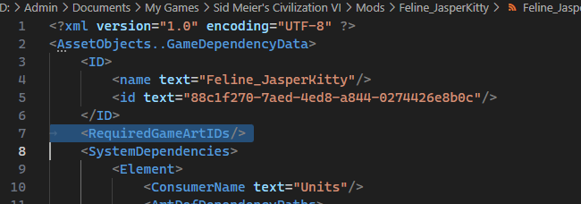
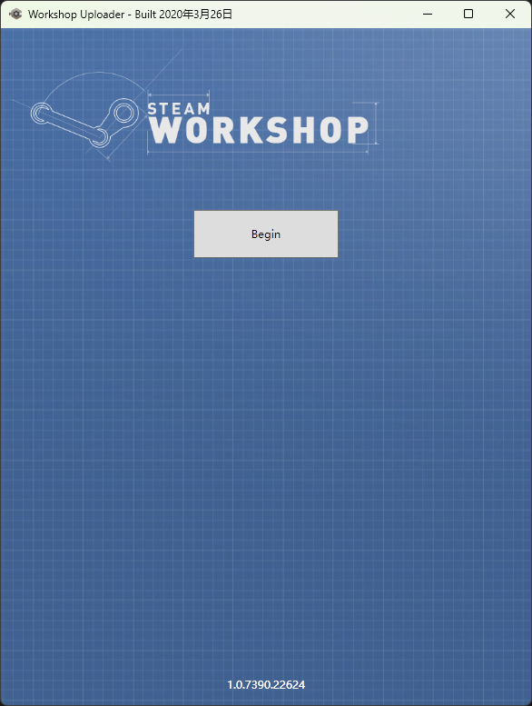
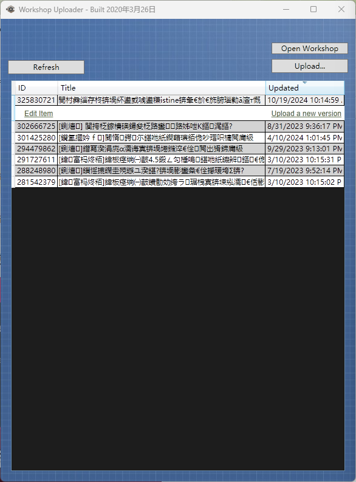
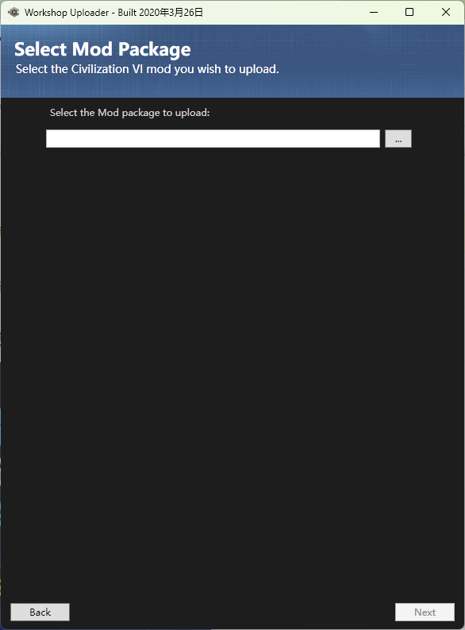
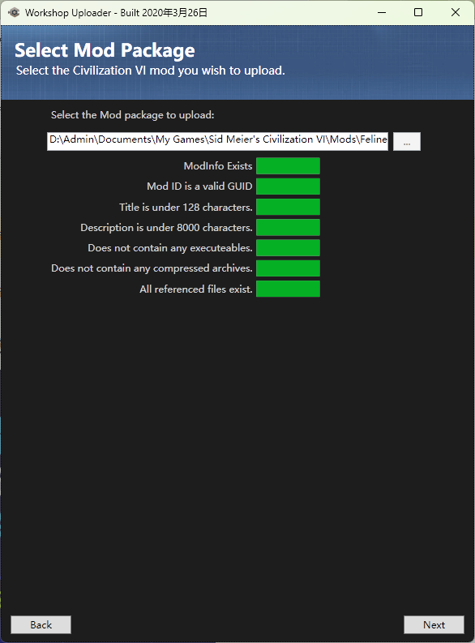
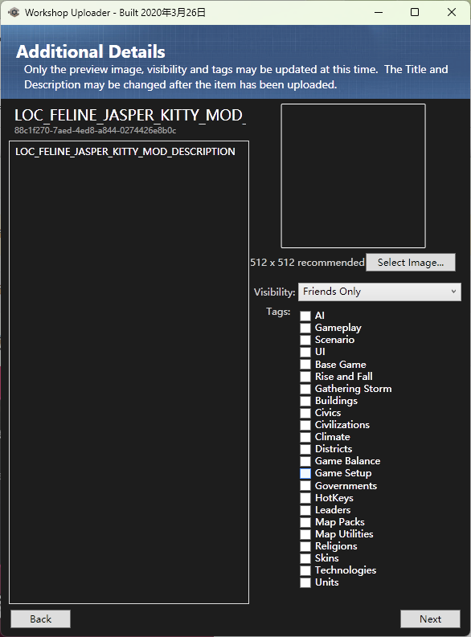
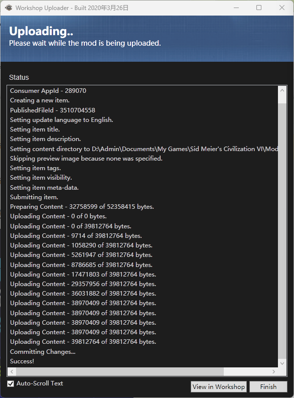
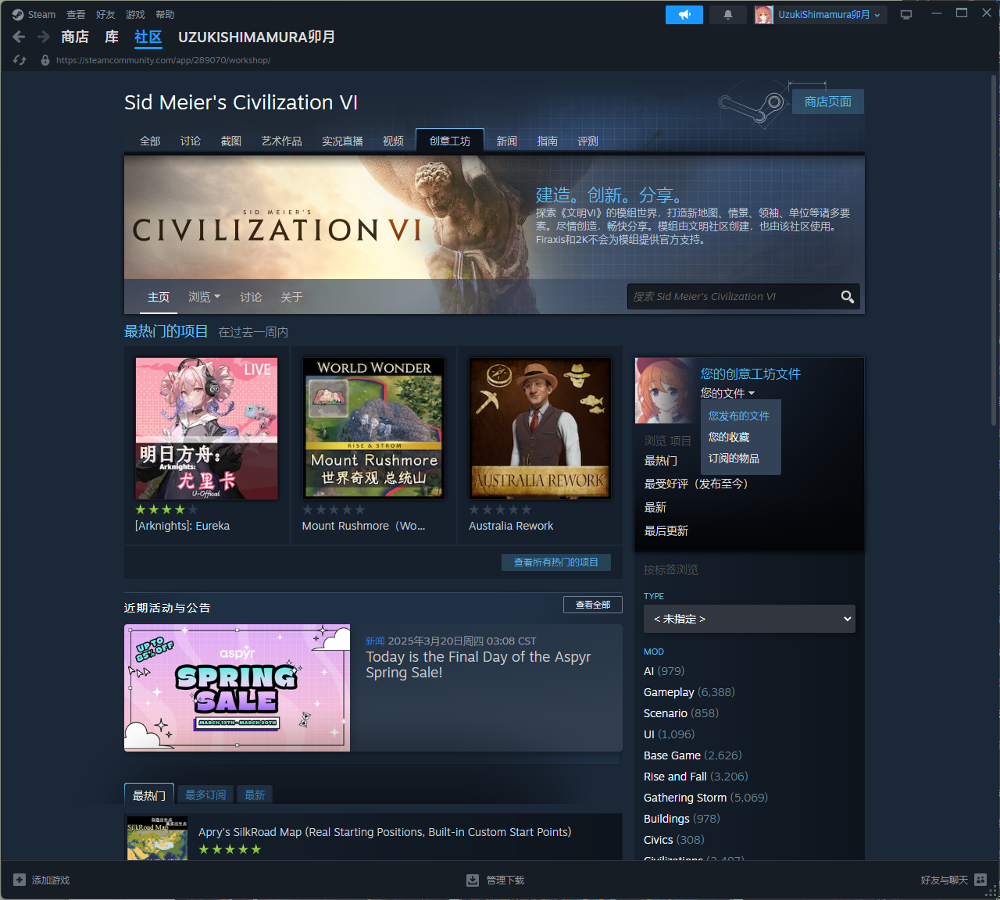
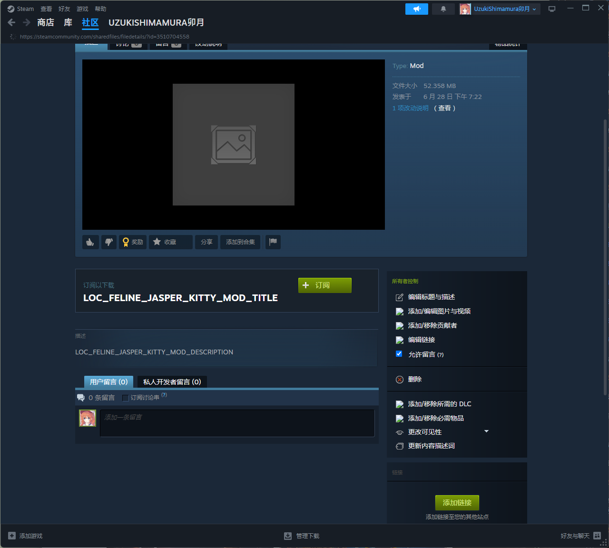

# 小优妮的文明6模组笔记

## 12 最后的征途

你的领袖已经正式制作完毕！现在你就可以前往你的本地模组文件夹将其分享到其他地方，但你可能更想做的是将它上传到创意工坊！

最后的操作并不困难，但仍有一些值得提醒的地方。本教程假设你没有使用经过第三方修改的上传器，它们一般修复了一些原版上传器存在的问题。

在登录Steam的情况下，启动开发SDK，然后选择Steam创意工坊上传器（Steam Workshop Uploader）。

推荐你将Steam语言改为英文，因为它对其它语言的支持非常糟糕，且不支持非ASCII字符（比如汉字）——传上去之后会变成乱码，而且在上传过程中还会把文字覆盖到你正在使用的语言版本的说明上。 如果你使用英语，就减少了重复修改工坊上的文字说明的工作量。

在发布前，请确认你做好了最后的检查。容易被忘记的是dep的依赖——如果你的模组在没有风云变幻资料片时也能运行，一定不要忘了这一步！

我们先前提过它。

点击“开始”（Begin）按钮。

如果你打算更新一个已有的模组，就在列表中选择它并点击“上传新版本”（Upload a New Version）。

如果你想上传一个新的模组，则点击右上角的“上传…”（Upload...）。

点击三点浏览按钮选择你做好的模组成品的modinfo文件。

模组上传有几个要求，需要满足：

1. Modinfo文件存在。显然满足。

2. Mod ID是有效的GUID。如果你通过这个教程制作你的模组，那么它显然满足。

3. 标题小于128字符。如果你通过这个教程制作你的模组，那么它极大概率是满足的。

4. 描述少于8000字符。如果你通过这个教程制作你的模组，那么它几乎不可能不满足。

5. 不包含可执行程序。如果你通过这个教程制作你的模组，那么它显然满足。

6. 不包含压缩包。如果你通过这个教程制作你的模组，那么它显然满足。

7. 没有声明引用但并不存在的文件。如果你通过这个教程制作你的模组，那么它显然满足。

点击下一步（Next）。

标题和文本描述需要在上传后调整。目前我们能做的是选择一张封面图，设置其公开属性，以及模组标签。

封面图宜选用512×512大小的图像，公开属性视情况而定，绝大多数人会选择将其公开，标签则根据情况自选，本例中你可以选择：文明（Civilizations）、领袖（Leaders）。

点击下一步，出现的是“修改内容总结”。这里不方便填，直接点击上传（Upload）。

等待，直到显示Success。

有时上传器会卡在提交更改（Committing Changes），这时可以在工坊中检查你的模组是否已经上传成功（看最后更新时间）。如果最后更新时间就在刚才，那么你已经成功了，可以直接关闭上传器。可以在“您的文件-您发布的文件”找到你的mod。

接下来你可以调整它的可见性、前置条件、编辑标题描述，以及添加截图等等！

>**笔记笔记**：额外文本格式
>
>编写工坊上的文字说明时可以使用额外的格式，详见 https://steamcommunity.com/comment/Recommendation/formattinghelp 。

好了！那么这个教程……终于可以结束了。笔者原本想过在结束时说很多很多……但，模组设计的广阔天地将是属于你们的。再会了！如果你有更多问题，并且已经真的读完了这份教程……你可以前往QQ群711403691，寻求其他人的帮助。